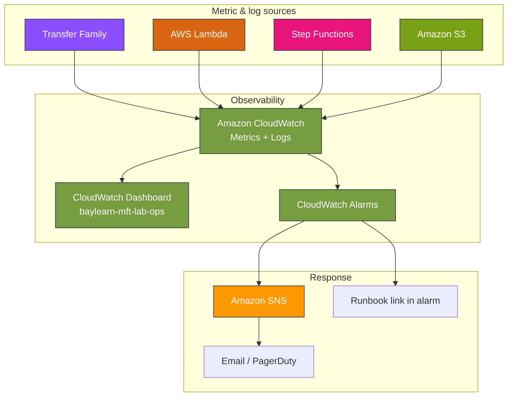
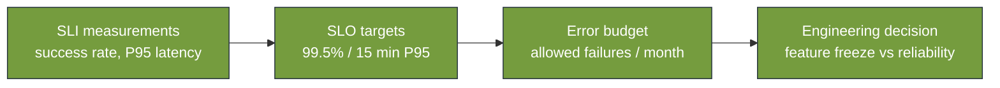
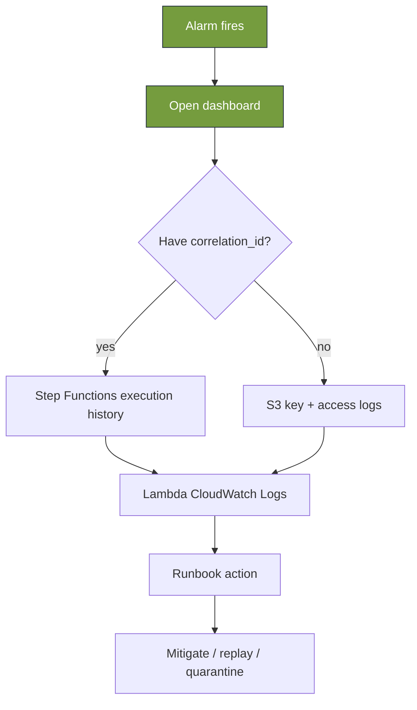
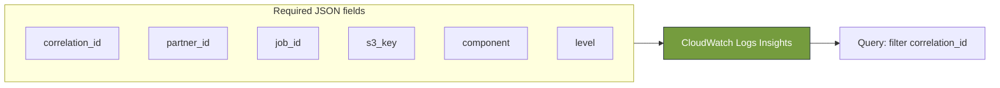

# Module 7 — AWS stencil diagrams: Operations & observability

**Module:** [week-07.md](../modules/week-07.md) · **Lab:** [Lab 7](../labs/lab-07-observability.md)

---

## Diagram 1 — Observability stack (lab)

---

## Diagram 2 — SLI → SLO → error budget

---

## Diagram 3 — Incident triage flow

---

## Diagram 4 — Structured log fields (searchable)

---

## Diagram 5 — Cost drivers (MFT on AWS)

```mermaid
flowchart TB
  C1["Transfer Family server<br/>~hourly while ONLINE"]
  C2["S3 storage + requests"]
  C3["Lambda invocations"]
  C4["Step Functions transitions"]
  C5["KMS API calls<br/>mitigate with bucket key"]
  C6["ECS Fargate<br/>per task second only"]
  STOP["./scripts/stop_stack.sh<br/>destroys billable lab resources"]

  classDef transfer fill:#8C4FFF,stroke:#232F3E,color:#fff
  classDef storage fill:#7AA116,stroke:#232F3E,color:#fff
  classDef compute fill:#D86613,stroke:#232F3E,color:#fff
  class C1 transfer
  class C2 storage
  class C3,C4,C6 compute
  class STOP mgmt
  classDef mgmt fill:#759C3E,stroke:#232F3E,color:#fff
```

---

**Editable stencil:** [week-07-observability.drawio](week-07-observability.drawio)
