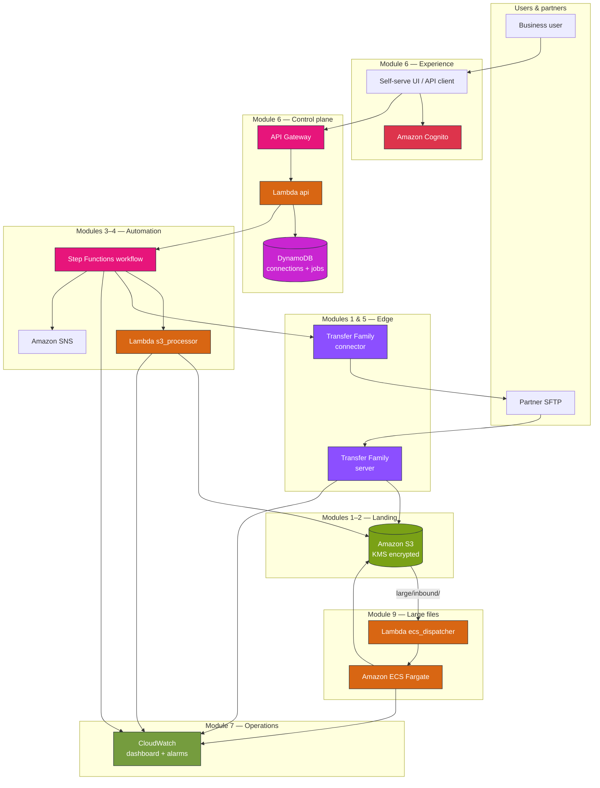
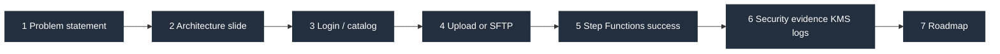
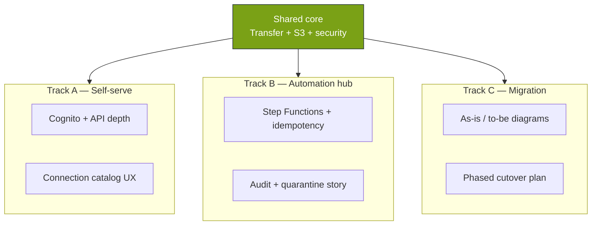
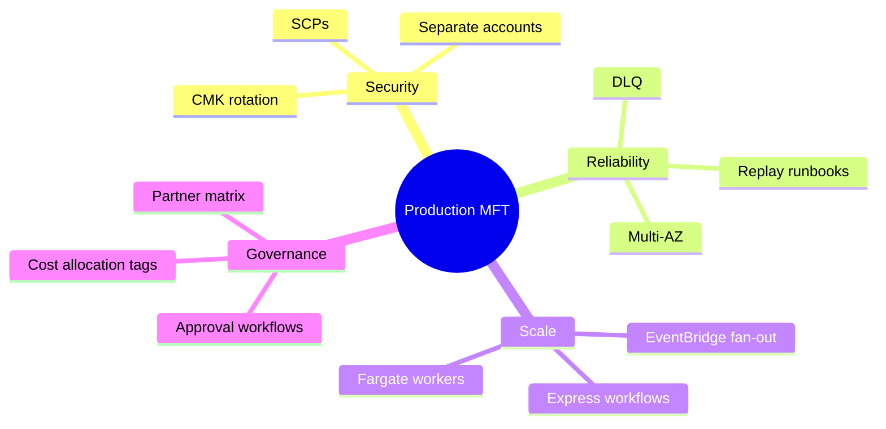

# Module 8 — AWS stencil diagrams: Capstone full platform

**Module:** [week-08.md](../modules/week-08.md) · **Capstone:** [capstone.md](../capstone.md)

---

## Diagram 1 — End-to-end reference architecture (all modules)

This is the **target picture** for capstone demos and stakeholder decks.

---

## Diagram 2 — Capstone demo path (10-minute narrative)

---

## Diagram 3 — Capstone tracks A / B / C focus

---

## Diagram 4 — Production hardening checklist (beyond lab)

---

**Editable stencil:** [week-08-capstone-platform.drawio](week-08-capstone-platform.drawio) · **Full lab wiring:** [lab-stack-reference.drawio](lab-stack-reference.drawio)
