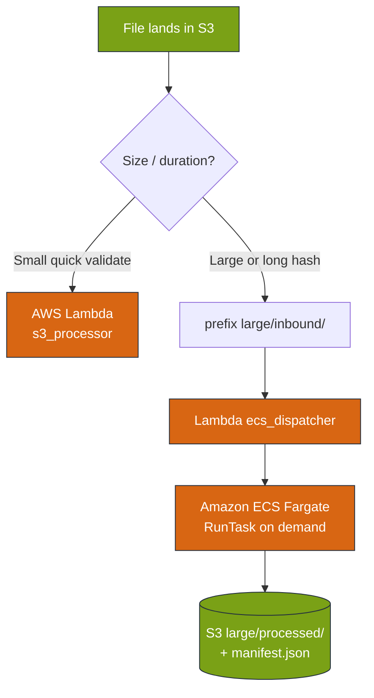
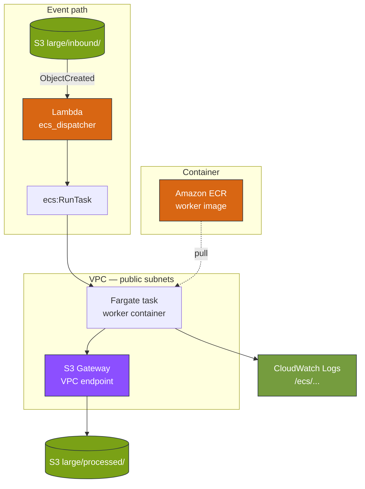
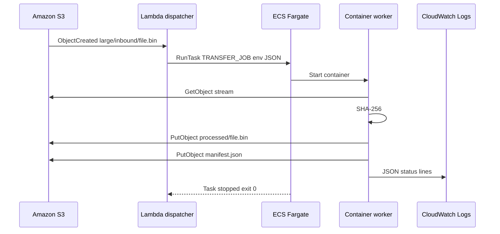
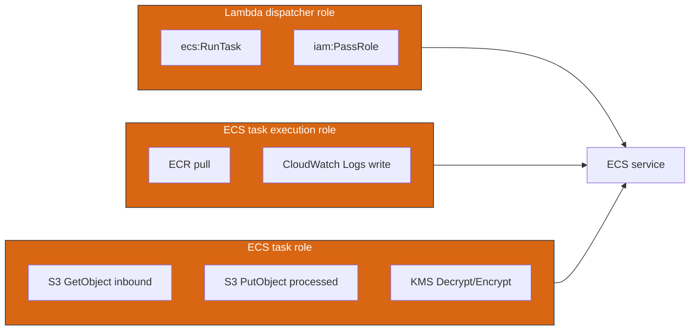
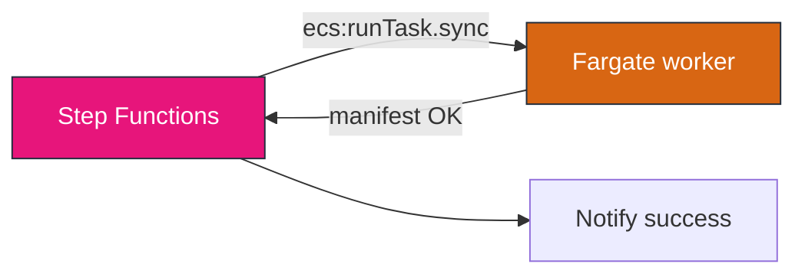

# Module 9 — AWS stencil diagrams: ECS Fargate large files

**Module:** [week-09-ecs-fargate.md](../modules/week-09-ecs-fargate.md) · **Lab:** [Lab 9](../labs/lab-09-ecs-fargate-large-files.md)

---

## Diagram 1 — Lambda vs Fargate decision

---

## Diagram 2 — Lab 9 architecture (VPC + endpoints)

**No NAT gateway** in lab — task uses public IP + S3 endpoint.

---

## Diagram 3 — Worker task sequence

---

## Diagram 4 — IAM roles (execution vs task)

---

## Diagram 5 — Step Functions sync integration (future)

---

**Editable stencil:** [week-09-ecs-fargate.drawio](week-09-ecs-fargate.drawio)
