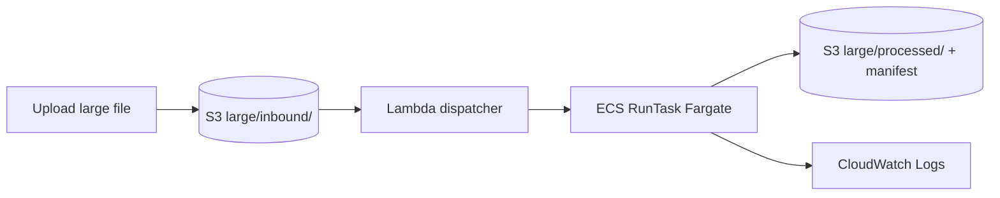

# Lab 9 — ECS Fargate for large file transfers

**Stretch lab (Week 5+) · Estimated time: 4 hours**  
**Teach after:** Labs 3–4 (Lambda limits) and Week 5 (connectors)

> **Terraform:** VPC, ECR, ECS cluster, Fargate task definition, S3-triggered dispatcher Lambda.  
> **Cost:** Fargate bills **only while the task runs** (~minutes per demo). No always-on ECS service.

## Learning objectives

1. Explain when **Lambda** is insufficient for large/long file processing.
2. Run a **Fargate task** on demand with S3/KMS access via task IAM role.
3. Trace flow: **large file upload → dispatcher → RunTask → worker logs → processed output**.
4. Compare **Step Functions `.sync` RunTask** pattern (conceptual) vs event-driven dispatch.

## Architecture



| Path | Purpose |
|------|---------|
| `partners/demo/large/inbound/` | Drop zone — triggers Fargate (not Lambda processor) |
| `partners/demo/large/processed/` | Worker output + `.manifest.json` (SHA-256, bytes) |

Regular files under `partners/demo/inbound/` still use **Lab 3 Lambda** (≤100MB validation path).

## Prerequisites

- Labs 1–4 stack running: `./scripts/start_stack.sh --yes`
- **Docker** installed (for `build_ecs_worker.sh` on first deploy)
- ~1 GB free disk for optional 100MB demo file

## Instructor demo (10 min)

```bash
# 1. Ensure stack + image
./scripts/start_stack.sh --yes

# 2. Small demo file (10MB) for classroom Wi‑Fi
LAB_LARGE_FILE_MB=10 ./scripts/demo_ecs_large_file.sh

# 3. Tail logs
aws logs tail $(terraform -chdir=infra/environments/lab output -raw ecs_worker_log_group) --since 15m --follow
```

## Student steps

### 1. Confirm Lab 9 resources

```bash
terraform -chdir=infra/environments/lab output ecs_cluster_name
terraform -chdir=infra/environments/lab output ecr_repository_url
aws ecs list-task-definitions --family-prefix baylearn-mft-lab-fargate --query 'taskDefinitionArns[-1]'
```

### 2. Build worker image (if not done by start_stack)

```bash
./scripts/build_ecs_worker.sh
```

### 3. Run automated demo

```bash
LAB_LARGE_FILE_MB=25 ./scripts/demo_ecs_large_file.sh
```

Expected: manifest at `partners/demo/large/processed/<file>.manifest.json` with `sha256` and `bytes`.

### 4. Manual RunTask (optional)

```bash
# Upload your own file first
aws s3 cp mylarge.zip s3://$(terraform -chdir=infra/environments/lab output -raw landing_bucket)/partners/demo/large/inbound/mylarge.zip

# Or run task directly
./scripts/run_ecs_worker.sh partners/demo/large/inbound/mylarge.zip
```

### 5. Verify manifest

```bash
BUCKET=$(terraform -chdir=infra/environments/lab output -raw landing_bucket)
aws s3 ls s3://${BUCKET}/partners/demo/large/processed/
aws s3 cp s3://${BUCKET}/partners/demo/large/processed/<yourfile>.manifest.json -
```

### 6. Failure injection

Upload a **zero-byte** file or discuss worker exit code 1 in CloudWatch — link to runbook.

## Deliverables

Submit in `submissions/week-09/` (or `submissions/lab-09/`):

| # | Item |
|---|------|
| 1 | `README.md` — architecture paragraph: why Fargate vs Lambda |
| 2 | Screenshot — ECS task **Stopped** with exit 0 |
| 3 | Copy of `.manifest.json` from S3 |
| 4 | CloudWatch log excerpt with `correlation_id` |

## Rubric (10 pts)

| Criterion | Points |
|-----------|--------|
| Large file processed to `large/processed/` | 4 |
| Valid manifest with sha256 | 3 |
| README explains Lambda vs Fargate tradeoff | 2 |
| Log screenshot | 1 |

## Cost tips

- Use `LAB_LARGE_FILE_MB=10` in class, not 500.
- Fargate task uses **1024 CPU / 2048 MB** (configurable in `terraform.tfvars`).
- `./scripts/stop_stack.sh --yes` removes VPC, ECR, cluster — no idle Fargate service fees.

## Extension exercises

1. Add Step Functions **RunTask.sync** state after `CheckValid` when `size > 100MB`.
2. Stream SHA-256 without full local disk (worker code change).
3. Send manifest to SNS on completion.

## Reference

- Module: [Module 9 — ECS Fargate](../modules/week-09-ecs-fargate.md)
- Worker source: `app/workers/fargate/worker.py`
- Dispatcher: `app/lambdas/ecs_dispatcher/handler.py`
