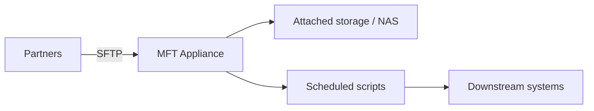
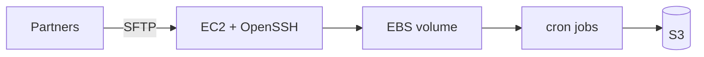
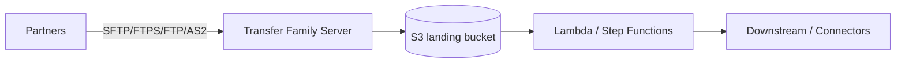
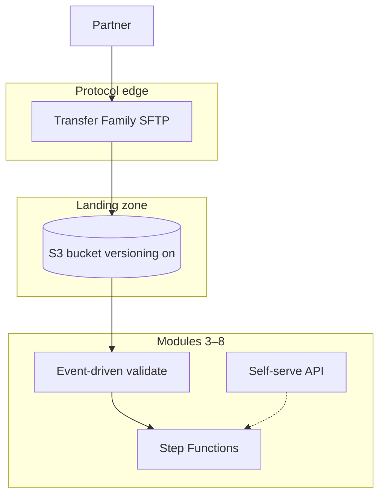
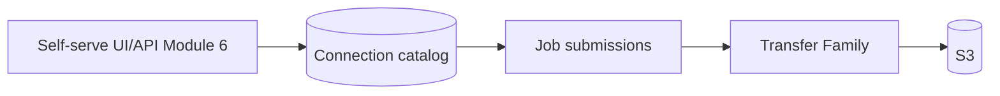

# Module 1 — Enterprise MFT on AWS

**Week 1 · Instructional module (full content)**  
**Time:** 2.5–3 hours instruction + 3 hours lab  
**Lab:** [Lab 1 — Transfer Family SFTP](../labs/lab-01-transfer-family-sftp.md)  
**AWS stencil diagrams:** [Module 1 diagrams](../diagrams/week-01.md) · [draw.io](../diagrams/week-01-transfer-edge.drawio)

---

## 1.1 Module overview

Enterprise integration is not only APIs and streaming events. A large share of B2B data still moves as **files**—fixed-width payroll, CSV extracts, EDI envelopes, ZIP archives of images—often over **SFTP** or similar protocols that partners have used for decades.

This module establishes the **business and technical vocabulary** for modernizing managed file transfer (MFT) on AWS. You will understand why organizations migrate from appliances and scripts, how **AWS Transfer Family** fits the edge of your architecture, and why **Amazon S3** is the usual system of record for landed files.

By the end of this module you can explain the difference between a **transfer endpoint** (protocol edge) and a **processing pipeline** (business logic), and you will have deployed your first SFTP server writing to S3.

---

## 1.2 Learning objectives

After completing this module, you will be able to:

1. Describe typical enterprise file-exchange requirements: volume, SLAs, partner diversity, audit, and retention.
2. Compare **legacy MFT appliances**, **self-managed SFTP on EC2**, and **AWS Transfer Family**.
3. Explain **push vs. pull**, **hub-and-spoke**, and **landing zone** patterns.
4. Position **S3 prefixes** as partner isolation and lifecycle boundaries—not “folders” in the POSIX sense.
5. Deploy Transfer Family SFTP with **service-managed users** and an IAM access role to S3.
6. Trace a file from **partner client → SFTP → S3 object** for troubleshooting and audit narratives.

---

## 1.3 Why file transfer still matters

### 1.3.1 Volume and criticality

| Dimension | Typical enterprise reality |
|-----------|----------------------------|
| **Partner count** | Dozens to thousands of B2B relationships |
| **File sizes** | Kilobytes to multi-gigabyte batches |
| **Frequency** | Real-time-ish (minutes) to monthly batches |
| **Failure cost** | Missed payroll, rejected claims, regulatory penalties |
| **Audit** | “Who sent what, when, and was it consumed?” |

Files are **batch boundaries**: a single object often represents a **business transaction** (one claim file, one inventory snapshot). That makes idempotency, checksums, and lineage essential—topics we deepen in Modules 3–4.

### 1.3.2 Why teams delay migration

- **Protocol inertia:** Partners refuse to change from SFTP.
- **Tribal knowledge:** Scripts on a VM nobody wants to touch.
- **Perceived risk:** “If we change the endpoint, payroll stops.”
- **License sunk cost:** Existing MFT dashboards and adapters.

Your AWS designs must offer **parity** (same protocol, similar paths) plus **incremental value** (scale, audit, automation).

---

## 1.4 Legacy MFT vs. cloud-native transfer

### 1.4.1 Legacy MFT appliance (conceptual)



**Strengths:** Mature protocol support, operator UI, bundled scheduling.  
**Weaknesses:** Vertical scaling limits, DR complexity, per-partner licensing, slow change management, weak API/integration story.

### 1.4.2 DIY SFTP on EC2



**Strengths:** Full control, familiar SSH administration.  
**Weaknesses:** You own patching, HA, scaling, key rotation, and availability zones. Becomes **undifferentiated heavy lifting**.

### 1.4.3 AWS Transfer Family + S3



**Strengths:** Managed protocol edge, IAM-scoped S3 access, integration with AWS automation and logging.  
**Weaknesses:** Hourly server cost when online; learning curve for IAM paths and connectors (Module 5).

### 1.4.4 Comparison table

| Criterion | MFT appliance | EC2 SFTP | Transfer Family + S3 |
|-----------|---------------|----------|----------------------|
| Ops burden | Medium (vendor) | High (you) | Low at edge |
| Scale-out | Limited | Manual | S3 scale |
| Audit integration | Varies | DIY | CloudTrail, S3 logs |
| Automation hooks | Adapters | Scripts | Native AWS events |
| Protocol breadth | High | SSH only | SFTP, FTPS, FTP, AS2 |
| Self-serve APIs | Rare | Rare | You build (Module 6) |

---

## 1.5 Enterprise integration patterns

### 1.5.1 Push vs. pull

| Pattern | Who initiates | Example | AWS sketch |
|---------|---------------|---------|------------|
| **Push (inbound)** | Partner uploads to you | Vendor catalog drop | SFTP server → S3 `inbound/` |
| **Pull (outbound)** | You fetch from partner | Bank pulls statement | Connector / scheduled job (Module 5) |
| **Push (outbound)** | You send to partner | Payroll to bank | S3 → connector → partner SFTP |

Confusion arises when teams say “pull” but mean **your** scheduler copying from a partner drop zone you don’t control—clarify **TCP connection direction** vs. **business data flow**.

### 1.5.2 Hub-and-spoke landing zone

A **hub** account or bucket receives files from many partners; **spokes** are processing systems (ERP, data lake, claims engine).

Recommended prefix convention (example):

```
s3://company-transfer-landing/
  partners/
    {partner_id}/
      inbound/      # partner → you
      outbound/     # you → partner (staging)
      quarantine/   # failed validation
      archive/      # processed, lifecycle to Glacier
  internal/
    processing/
    audit/
```

**Why prefixes matter:** IAM policies, lifecycle rules, and event notifications are **prefix-aware**. Design prefixes early; renaming later breaks partner documentation.

### 1.5.3 Logical reference architecture (Week 1 target)



This course intentionally separates **edge** (Week 1–2) from **automation** (Week 3–4) from **experience** (Week 6) so security and operations remain visible—not bolted on at the end.

---

## 1.6 AWS Transfer Family deep dive

### 1.6.1 Components

| Component | Purpose |
|-----------|---------|
| **Server** | Listens for protocols; public or VPC-hosted endpoint |
| **User** | Identity with role/home directory (service-managed or API/custom IdP) |
| **Access role** | IAM role Transfer assumes to reach S3 (or EFS) |
| **Workflow** | Optional: on-upload trigger (advanced; not required Week 1) |
| **Connector** | Outbound/inbound over remote SFTP/FTPS (Module 5) |

### 1.6.2 Protocols (awareness)

| Protocol | Typical use |
|----------|-------------|
| **SFTP** | Default for B2B; SSH-based |
| **FTPS** | Legacy retail/banking |
| **FTP** | Legacy only; avoid on internet |
| **AS2** | EDI with signing/encryption |

Week 1 lab focuses on **SFTP + S3**.

### 1.6.3 Service-managed users and home directory

For S3 storage, the **logical home directory** maps to S3 keys. A common pattern:

- **Home directory:** `/{bucket_name}/partners/demo/inbound`
- **IAM policy:** Allow `ListBucket` on bucket with `s3:prefix` = `partners/demo/*`; object CRUD on `arn:.../partners/demo/*`

When the partner uploads `file.csv`, the object key might be:

`s3://bucket/partners/demo/inbound/file.csv`

**Common mistake:** Home directory missing leading bucket segment or mismatched prefix vs. IAM—upload succeeds in UI tests but fails at SFTP with “permission denied.”

### 1.6.4 IAM trust for the access role

Transfer assumes your access role using `sts:AssumeRole` with principal `transfer.amazonaws.com`. Minimum trust (illustrative):

```json
{
  "Version": "2012-10-17",
  "Statement": [{
    "Effect": "Allow",
    "Principal": { "Service": "transfer.amazonaws.com" },
    "Action": "sts:AssumeRole",
    "Condition": {
      "StringEquals": {
        "aws:SourceAccount": "111122223333"
      }
    }
  }]
}
```

Module 2 tightens conditions, KMS, and logging. If you see **Unable to AssumeRole**, verify trust, role ARN on the user, and account ID.

### 1.6.5 Public vs. VPC endpoint

| Endpoint type | When to use |
|---------------|-------------|
| **Public** | Sandboxes, pilots, partners needing internet SFTP |
| **VPC** | Private connectivity, IP allow lists via NLB/security groups |

Production often uses **VPC + fixed egress** for connectors; inbound public SFTP may still exist with IP allow listing at the network layer.

---

## 1.7 Amazon S3 as the landing system of record

### 1.7.1 Why S3 instead of EFS

| Factor | S3 | EFS |
|--------|----|-----|
| Cost at rest | Lower for large cold volume | Higher |
| Event integration | Native notifications | Possible but less common |
| Cross-account patterns | Strong | More complex |
| POSIX semantics | Object API | File semantics |

Most greenfield **MFT modernization** targets S3; EFS remains valid for apps that require true filesystem semantics on the edge.

### 1.7.2 Versioning and audit

Enable **versioning** on landing buckets early. Overwrites become visible; delete markers can be analyzed. Pair with **CloudTrail data events** (Module 2) for API-level proof.

### 1.7.3 Lifecycle (preview)

| Prefix | Lifecycle idea |
|--------|----------------|
| `inbound/` | Transition to IA after 30 days |
| `archive/` | Glacier at 90 days |
| `quarantine/` | Short retention + alert |

Define lifecycle only after validation rules exist—don’t archive files you still need for reprocessing.

---

## 1.8 Metadata and audit questions

Every landed file should eventually answer:

| Question | Stored where (evolving) |
|----------|-------------------------|
| Who sent it? | Transfer user, source IP, CloudTrail |
| When? | S3 `LastModified`, SFTP logs |
| Original name? | Object key |
| Size / hash? | S3 metadata, Lambda-computed SHA256 (Module 3) |
| Business partner ID? | Prefix or sidecar `.manifest.json` |
| Processing status? | DynamoDB job record (Module 6) |

Week 1 deliverable diagram should label **where** each answer will live—even if not implemented yet.

---

## 1.9 Case study — Retail vendor inbound

**Scenario:** 400 vendors upload daily catalog CSVs between 02:00–06:00 UTC.

| Requirement | Design choice |
|-------------|---------------|
| Isolation | Prefix per `vendor_id` |
| Spike traffic | S3 scales; Transfer server sized for concurrent sessions |
| Bad files | Later: Lambda → `quarantine/` (Module 3) |
| Re-upload same name | Versioning + idempotency (Module 3) |

**Week 1 scope:** One vendor prefix, SFTP upload, manual listing in S3 console/CLI.

---

## 1.10 BayAreaLa8s framing — edge + self-serve

Enterprise programs fail when they deploy **only** SFTP without **visibility** for operations and product teams. BayAreaLa8s **BayServe**-style platforms expose a **connection catalog** and job history; **BayRelay**-style platforms orchestrate transfers with governance.

Week 1 builds the **edge** your future control plane will govern:



Learners should sketch this on the Week 1 architecture deliverable—even if APIs come later.

---

## 1.11 Hands-on alignment (Lab 1)

### Lab steps mapped to concepts

| Lab step | Concept reinforced |
|----------|-------------------|
| Create bucket + versioning | Landing zone, audit |
| IAM role + trust | Transfer access model |
| Create server + user | Edge deployment |
| SFTP upload | Push inbound pattern |
| S3 list | Prefix verification |

### Troubleshooting guide

| Symptom | Likely cause |
|---------|----------------|
| Auth failure | Wrong username/key; user not on server |
| Permission denied on put | Home directory vs. IAM prefix mismatch |
| File not visible in S3 | Wrong bucket; uploaded to different path |
| AssumeRole error | Trust policy or wrong role ARN |

---

## 1.12 Knowledge checks

**1.** Why is S3 often preferred over EFS for MFT landing zones?  
<details><summary>Answer</summary>Lower cost at scale, native events, strong cross-account patterns, and integration with serverless processing.</details>

**2.** In push inbound pattern, who initiates the TCP connection?  
<details><summary>Answer</summary>The partner (client) connects to your SFTP server.</details>

**3.** What does Transfer Family assume to access S3?  
<details><summary>Answer</summary>An IAM access role attached to the Transfer user, trusted by transfer.amazonaws.com.</details>

**4.** Name two audit questions a landing zone should answer.  
<details><summary>Answer</summary>Examples: who sent the file, when, original filename, size/hash, partner ID, processing status.</details>

**5.** What is the difference between Transfer server and connector?  
<details><summary>Answer</summary>Server accepts partner connections to your endpoint; connector initiates transfers to/from remote SFTP endpoints (Module 5).</details>

---

## 1.13 Discussion facilitator notes

1. **SFTP vs. API-first:** Many orgs use SFTP for partners with low tech maturity; APIs for strategic partners. Hybrid is normal.  
2. **Metadata:** Push teams to list **regulatory** vs. **operational** metadata—drives retention and encryption in Module 2.

---

## 1.14 Key takeaways

- File transfer remains **business-critical**; cloud migration must preserve protocol parity while enabling automation.
- **Transfer Family** is the managed **protocol edge**; **S3** is the usual **system of record**.
- **Prefix design** is a security and lifecycle boundary—plan `partners/{id}/inbound` early.
- Separate **edge**, **processing**, and **self-serve** layers in architecture diagrams.
- Week 1 proves the **golden path**: partner upload → S3 object you can see and audit.

---

## 1.15 Further reading

- [What is AWS Transfer Family?](https://docs.aws.amazon.com/transfer/latest/userguide/what-is-aws-transfer-family.html)
- [Create SFTP-enabled server](https://docs.aws.amazon.com/transfer/latest/userguide/create-server-sftp.html)
- [IAM requirements for Transfer](https://docs.aws.amazon.com/transfer/latest/userguide/requirements-roles.html)
- Course: [`COURSE.md`](../../COURSE.md) §3 Enterprise use cases

---

## 1.16 Deliverables checklist

- [ ] Architecture diagram: partner → SFTP → S3 → future processing  
- [ ] Lab 1 complete: screenshot + `submissions/week-01/README.md`  
- [ ] Quiz 1 attempted (LMS)

**Next module:** [Module 2 — Security, encryption & governance](week-02.md)
