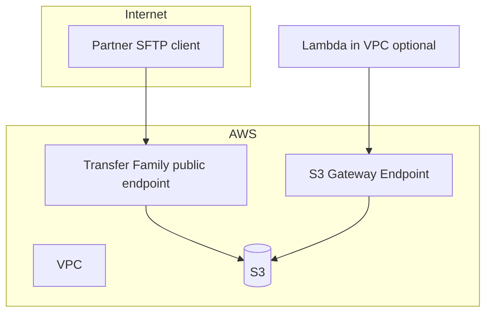

# Module 2 — Security, encryption & governance

**Week 2 · Instructional module (full content)**  
**Time:** 2.5–3 hours instruction + 3 hours lab  
**Lab:** [Lab 2 — Security hardening](../labs/lab-02-security-hardening.md)

---

## 2.1 Module overview

A working SFTP endpoint is not production-ready. Module 2 builds the **security and governance layer** every enterprise stakeholder asks about: encryption, least privilege, network placement, and **provable audit**.

You will harden the Week 1 environment with **AWS KMS**, tighten **IAM** scopes, enable **logging evidence**, and complete a **security baseline checklist** you can reuse in capstone and customer proposals.

---

## 2.2 Learning objectives

1. Construct a lightweight **threat model** for B2B file transfer.
2. Apply **least-privilege IAM** for Transfer users and automation roles.
3. Configure **SSE-KMS** on landing buckets and explain key policy implications.
4. Use **S3 Block Public Access** and bucket policies defensively.
5. Enable **access logging** and relate **CloudTrail** to compliance narratives.
6. Describe **VPC endpoints** and when private connectivity is required.
7. Frame HIPAA/PCI/SOC2 as **control families**—not certification promises.

---

## 2.3 Threat model (STRIDE-lite)

| Threat | Example in MFT | Mitigation (this module) |
|--------|----------------|-------------------------|
| **Spoofing** | Stolen SFTP credentials | Key rotation, IP allow lists, short-lived creds where possible |
| **Tampering** | Man-in-the-middle | SFTP/FTPS TLS; VPC; no plain FTP on internet |
| **Repudiation** | Partner denies upload | CloudTrail, S3 versioning, Transfer logging |
| **Information disclosure** | Public bucket, overly broad IAM | Block public access, prefix-scoped policies, KMS |
| **Denial of service** | Upload flood | Quotas, S3 lifecycle, Transfer limits, alarms (Module 7) |
| **Elevation** | Compromised Lambda role reads all partners | Scoped roles per function; no wildcard S3 |

Document assumptions in capstone `threat-model-summary.md`.

---

## 2.4 Identity and access — IAM patterns

### 2.4.1 Role types in Transfer architectures

| Role | Assumed by | Purpose |
|------|------------|---------|
| **Transfer access role** | `transfer.amazonaws.com` | List/get/put objects for SFTP users |
| **Lambda execution role** | `lambda.amazonaws.com` | Process S3 events (Module 3) |
| **Step Functions role** | `states.amazonaws.com` | Invoke Lambdas (Module 4) |
| **Connector access role** | Transfer connector service | Remote SFTP operations (Module 5) |

**Golden rule:** One role per **automation concern**, never one “super role” for all partners.

### 2.4.2 Prefix isolation policy (example)

Restrict partner `demo` to their subtree:

```json
{
  "Version": "2012-10-17",
  "Statement": [
    {
      "Sid": "ListPartnerPrefix",
      "Effect": "Allow",
      "Action": ["s3:ListBucket"],
      "Resource": "arn:aws:s3:::BUCKET_NAME",
      "Condition": {
        "StringLike": { "s3:prefix": ["partners/demo/*"] }
      }
    },
    {
      "Sid": "ObjectCRUDPartnerPrefix",
      "Effect": "Allow",
      "Action": [
        "s3:GetObject",
        "s3:PutObject",
        "s3:DeleteObject",
        "s3:GetObjectVersion"
      ],
      "Resource": "arn:aws:s3:::BUCKET_NAME/partners/demo/*"
    }
  ]
}
```

**Anti-patterns:**

- `"Action": "s3:*"` on `Resource": "*"`
- Bucket-wide `ListBucket` without `s3:prefix` condition
- Same role shared across unrelated partners in production

### 2.4.3 Session policies (awareness)

Transfer can attach **session policies** to further restrict a user at login. Use when one IAM role backs many logical users but you need **per-session** caps.

### 2.4.4 Trust policy pitfalls

Overly tight `aws:SourceArn` on `transfer.amazonaws.com` trust can cause **Unable to AssumeRole** for legitimate data paths. Start with `aws:SourceAccount` per AWS guidance; tighten incrementally with testing.

---

## 2.5 Encryption — KMS and in transit

### 2.5.1 Encryption at rest

| Mode | When |
|------|------|
| **SSE-S3** | Baseline; AWS-managed keys |
| **SSE-KMS (CMK)** | Enterprise key policies, separation of duties, audit |

Enable default bucket encryption:

```bash
aws s3api put-bucket-encryption --bucket BUCKET_NAME \
  --server-side-encryption-configuration '{
    "Rules": [{
      "ApplyServerSideEncryptionByDefault": {
        "SSEAlgorithm": "aws:kms",
        "KMSMasterKeyID": "arn:aws:kms:REGION:ACCOUNT:key/KEY_ID"
      },
      "BucketKeyEnabled": true
    }]
  }'
```

**BucketKeyEnabled** reduces KMS API costs for high-volume objects.

### 2.5.2 KMS key policy essentials

CMK must allow:

- Account administrators (governance)
- Transfer access role (`kms:Decrypt`, `kms:GenerateDataKey`)
- Lambda role (Module 3) if reading encrypted objects

**Failure mode:** Upload succeeds to SSE-S3 bucket but fails after switching to CMK—Lambda lacks `kms:Decrypt`.

### 2.5.3 Encryption in transit

- **SFTP:** SSH encryption by protocol.
- **FTPS:** TLS; validate cipher suites for partner compliance docs.
- **Internal AWS:** Use VPC endpoints so S3/API traffic stays off public internet paths where required.

---

## 2.6 Network architecture



| Pattern | Benefit |
|---------|---------|
| **S3 gateway endpoint** | No NAT charges for S3 from private subnets |
| **Transfer in VPC** | Control security groups; combine with NLB |
| **IP allow list** | Partner-side restriction; document egress IPs for connectors |

---

## 2.7 Logging and audit evidence

### 2.7.1 Evidence stack

| Layer | Tool | Proves |
|-------|------|--------|
| API calls | CloudTrail | Who called `PutObject`, `CreateUser` |
| Data access | CloudTrail data events (S3) | Object-level API in sensitive buckets |
| Bucket access | S3 server access logging | HTTP-level access to bucket |
| Transfer | CloudWatch Transfer metrics/logs | Sessions, failures |
| Application | Structured JSON logs (Module 3+) | `correlation_id`, business partner |

### 2.7.2 S3 access logging setup

1. Create logging bucket (separate, locked down).  
2. Enable logging on landing bucket with target prefix `access-logs/`.  
3. Restrict logging bucket to admin + audit roles only.

### 2.7.3 Compliance framing (not legal advice)

| Framework | Relevant control themes for this course |
|-----------|----------------------------------------|
| **HIPAA** | Access control, audit, encryption, minimum necessary |
| **PCI** | Segment environments; no card data in generic labs |
| **SOC 2** | Change management, logging, monitoring evidence |

Position your designs as **control-ready**; certification requires organizational process beyond this course.

---

## 2.8 S3 defensive configuration

### Block Public Access

All four settings **ON** for landing and logging buckets.

### Bucket policy deny-insecure-transport (optional hardening)

```json
{
  "Sid": "DenyInsecureTransport",
  "Effect": "Deny",
  "Principal": "*",
  "Action": "s3:*",
  "Resource": [
    "arn:aws:s3:::BUCKET_NAME",
    "arn:aws:s3:::BUCKET_NAME/*"
  ],
  "Condition": {
    "Bool": { "aws:SecureTransport": "false" }
  }
}
```

### Object Lock (awareness)

For **regulatory immutability**, S3 Object Lock in compliance mode—plan retention windows with legal; not required in lab.

---

## 2.9 Secrets and credentials

| Secret type | Store in | Never in |
|-------------|----------|----------|
| Partner SFTP password/key | Secrets Manager / Transfer managed | Git, Lambda env plain text |
| API keys for self-serve | Secrets Manager | Front-end bundle |
| KMS keys | KMS only | application.properties in repo |

Module 5 uses Secrets Manager for connector credentials.

---

## 2.10 Case study — Healthcare claims inbound

**Requirements:** Encrypt at rest (CMK), prove uploader identity, 6-year retention, no cross-tenant reads.

| Control | Implementation |
|---------|----------------|
| Encryption | SSE-KMS CMK per environment |
| Isolation | `partners/{payer_id}/inbound/` + IAM prefix |
| Audit | CloudTrail + S3 versioning + access logs |
| Retention | Lifecycle to Glacier; legal hold on Object Lock (if applicable) |
| Processing | Lambda role can only read `processing/` after validation |

---

## 2.11 Lab alignment (Lab 2)

Use template: [`templates/security-baseline-checklist.md`](../../templates/security-baseline-checklist.md)

| Checklist item | Lab action |
|----------------|------------|
| SSE-KMS | CMK + default encryption |
| IAM least privilege | Remove wildcards from Week 1 role |
| Logging | Access logs + confirm CloudTrail |
| Billing alarm | AWS Budgets (if not Week 0) |

---

## 2.12 Knowledge checks

**1.** Why use SSE-KMS over SSE-S3 in enterprise proposals?  
<details><summary>Answer</summary>Customer-managed keys, key policies, separation of duties, and stronger audit narrative for regulators.</details>

**2.** What does `s3:prefix` condition prevent?  
<details><summary>Answer</summary>Listing or accessing objects outside the partner subtree when combined with correct actions/resources.</details>

**3.** Name two independent evidence sources for an upload event.  
<details><summary>Answer</summary>Examples: CloudTrail PutObject, S3 access log, Transfer logs, S3 version ID.</details>

**4.** Why deny `aws:SecureTransport=false`?  
<details><summary>Answer</summary>Blocks unencrypted HTTP access to S3 API.</details>

---

## 2.13 Key takeaways

- Security is **prefix + role + KMS + logs**, not a single checkbox.
- Trust and key policies cause most **AssumeRole** and **KMS AccessDenied** lab failures—test after every tighten.
- Compliance conversations need **evidence mapping**, not service lists.
- Complete the **baseline checklist**—it becomes capstone appendix material.

---

## 2.14 Deliverables

- [ ] Hardened sandbox per Lab 2  
- [ ] Completed security checklist in `submissions/week-02/`  
- [ ] Quiz 2 (LMS)

**Next module:** [Module 3 — Event-driven automation](week-03.md)
