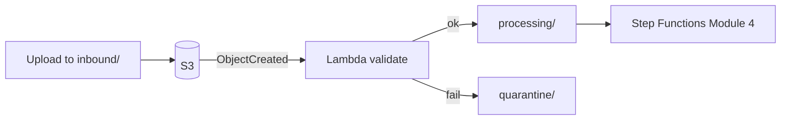

# Module 3 — Event-driven automation

**Week 3 · Instructional module (full content)**  
**Time:** 2.5–3 hours instruction + 4 hours lab  
**Lab:** [Lab 3 — S3 event processor](../labs/lab-03-s3-event-processor.md)  
**AWS stencil diagrams:** [Module 3 diagrams](../diagrams/week-03.md) · [draw.io](../diagrams/week-03-event-driven.drawio)

---

## 3.1 Module overview

Once files land in S3, **business value** comes from validation, routing, enrichment, and handoff to downstream systems. Module 3 introduces **event-driven processing** with **AWS Lambda** and **Amazon S3 event notifications**, with **idempotency** as a first-class design requirement.

---

## 3.2 Learning objectives

1. Contrast **scheduled batch** vs. **event-driven** processing for file pipelines.
2. Configure S3 `ObjectCreated` events (and understand EventBridge alternatives).
3. Implement Lambda handlers that **validate**, **route**, and **quarantine** files.
4. Explain **at-least-once delivery** and implement an idempotency store.
5. Design **quarantine** and **poison message** handling without silent data loss.
6. Structure **JSON logs** with correlation identifiers for Module 4 workflows.

---

## 3.3 Processing pipeline anatomy



| Stage | Responsibility |
|-------|----------------|
| **Land** | Protocol edge; minimal logic |
| **Validate** | Schema, size, AV scan hook, manifest check |
| **Route** | Copy/move to processing or partner-specific queues |
| **Orchestrate** | Multi-step, human approval, SLAs (Module 4) |
| **Deliver** | Connectors, APIs, downstream buses (Modules 5–6) |

Keep **validate** functions fast (&lt; 1–2 minutes); heavy transforms belong in Step Functions or batch (Glue, ECS).

---

## 3.4 Event sources

### 3.4.1 S3 event notifications

| Event | Use |
|-------|-----|
| `s3:ObjectCreated:*` | New uploads |
| `s3:ObjectRemoved:*` | Cleanup audits (less common) |

Filter by **prefix** and **suffix** to avoid invoking on `archive/` or `.tmp` files.

### 3.4.2 EventBridge vs. direct S3→Lambda

| Approach | Pros |
|----------|------|
| **S3 → Lambda** | Simple lab path |
| **S3 → EventBridge → Lambda** | Fan-out, rules across accounts, replay patterns |

Production platforms often standardize on **EventBridge** for decoupling; this course’s Lab 3 uses direct notification for clarity.

---

## 3.5 Idempotency

### 3.5.1 Why duplicates happen

- S3 events are **at-least-once**.
- Partner **re-uploads** same filename.
- Lambda **retries** on timeout or unhandled error.

### 3.5.2 Idempotency key strategies

| Key | Composition | Durability |
|-----|-------------|------------|
| **Event ID** | S3 notification id | Good for duplicate events |
| **Business** | `partner_id + filename + etag` | Survives duplicate uploads |
| **Content** | SHA256 hash | Strong but costs compute |

**DynamoDB table** `baylearn-mft-idempotency`:

| Attribute | Type | Notes |
|-----------|------|-------|
| `event_key` | PK (String) | TTL optional (e.g., 7 days) |
| `processed_at` | String | ISO8601 |
| `status` | String | `SUCCESS`, `QUARANTINE` |

**Pseudologic:**

```
on event:
  if exists(event_key): return success  # already handled
  validate file
  write idempotency record
  copy to target prefix
```

Use **conditional writes** (`attribute_not_exists`) to avoid races.

---

## 3.6 Validation patterns

### 3.6.1 Technical validation (Lab 3)

| Rule | Example |
|------|---------|
| Max size | 100 MB |
| Extension allow list | `.csv`, `.json`, `.xml` |
| Min size | Reject 0-byte |

### 3.6.2 Business validation (production)

| Rule | Example |
|------|---------|
| Manifest | Sidecar JSON lists expected files |
| Schema | CSV column count, JSON schema |
| PGP | Decrypt signature verify (stub in advanced track) |
| AV | ClamAV Lambda layer or vendor scan |

Failed business rules → **quarantine** with reason object:

`s3://bucket/partners/demo/quarantine/file.csv.reason.json`

---

## 3.7 Lambda implementation guide

### 3.7.1 Runtime and permissions

- Python 3.11+ or Node 20 LTS.
- Role permissions: `s3:GetObject` on `inbound/*`, `s3:PutObject` on `processing/*` and `quarantine/*`, `dynamodb:PutItem` on idempotency table, `kms:Decrypt` if SSE-KMS.

### 3.7.2 Sample structure (Python excerpt)

```python
import json
import os
import boto3
from datetime import datetime, timezone

s3 = boto3.client("s3")
ddb = boto3.resource("dynamodb").Table(os.environ["IDEMPOTENCY_TABLE"])

ALLOWED = {".csv", ".json", ".xml"}
MAX_BYTES = 100 * 1024 * 1024

def handler(event, context):
    for record in event.get("Records", []):
        bucket = record["s3"]["bucket"]["name"]
        key = record["s3"]["object"]["key"]
        event_key = record["responseElements"].get("x-amz-request-id", key)

        if not try_claim(event_key):
            continue

        size = record["s3"]["object"].get("size", 0)
        ext = os.path.splitext(key)[1].lower()

        if size == 0 or size > MAX_BYTES or ext not in ALLOWED:
            route(bucket, key, "quarantine")
            log("quarantine", key, reason="validation_failed")
            continue

        route(bucket, key, "processing")
        log("ok", key)

def try_claim(event_key: str) -> bool:
    try:
        ddb.put_item(
            Item={"event_key": event_key, "processed_at": datetime.now(timezone.utc).isoformat()},
            ConditionExpression="attribute_not_exists(event_key)",
        )
        return True
    except ddb.meta.client.exceptions.ConditionalCheckFailedException:
        return False

def route(bucket, key, zone):
    dest = key.replace("/inbound/", f"/{zone}/", 1)
    s3.copy_object(Bucket=bucket, CopySource={"Bucket": bucket, "Key": key}, Key=dest)

def log(status, key, **kwargs):
    print(json.dumps({"status": status, "key": key, **kwargs}))
```

Adapt keys/prefixes to your lab layout.

### 3.7.3 Error handling

| Error type | Behavior |
|------------|----------|
| Transient AWS | Let Lambda retry (async) |
| Validation | Quarantine; do not retry infinitely |
| Unknown | Quarantine + SNS alert (Module 4) |

---

## 3.8 Quarantine operations

Operators need:

1. **Reason code** in sidecar or logs.  
2. **UI/API** to list quarantined objects (Module 6).  
3. **Reprocess** path: move back to `inbound/` with new idempotency key or admin flag.

---

## 3.9 Case study — Duplicate payroll file

Partner uploads `payroll_2026-05-27.csv` twice due to timeout. Without idempotency, two deposits run. **Mitigation:** business key `partner_id + filename + etag` in DynamoDB; second upload short-circuits to logged skip.

---

## 3.10 Knowledge checks

**1.** Why are S3 notifications at-least-once?  
<details><summary>Answer</summary>Distributed eventing may deliver duplicates; consumers must be idempotent.</details>

**2.** When should validation run synchronously at edge?  
<details><summary>Answer</summary>Rarely—only for hard size limits or malware at edge; most validation belongs in Lambda after land.</details>

**3.** What belongs in quarantine vs. deleting?  
<details><summary>Answer</summary>Quarantine preserves evidence for partners and auditors; delete only per retention policy.</details>

---

## 3.11 Key takeaways

- **Land fast, process async** scales better than bloating Transfer workflows.
- **Idempotency is not optional** for file pipelines.
- **Quarantine** is an operator feature, not a failure afterthought.
- Structured logs today become **Step Functions correlation** tomorrow.

---

## 3.12 Deliverables

- [ ] Lab 3 Lambda + logs in `submissions/week-03/`  
- [ ] Quiz 3

**Next module:** [Module 4 — Workflow orchestration](week-04.md)
