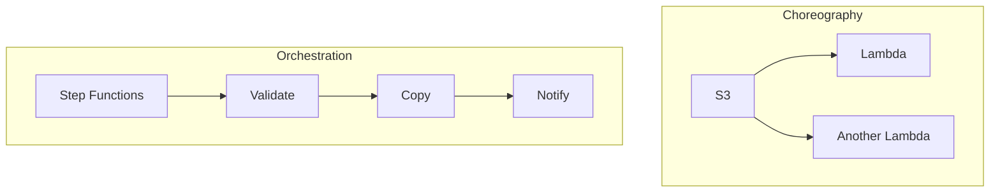
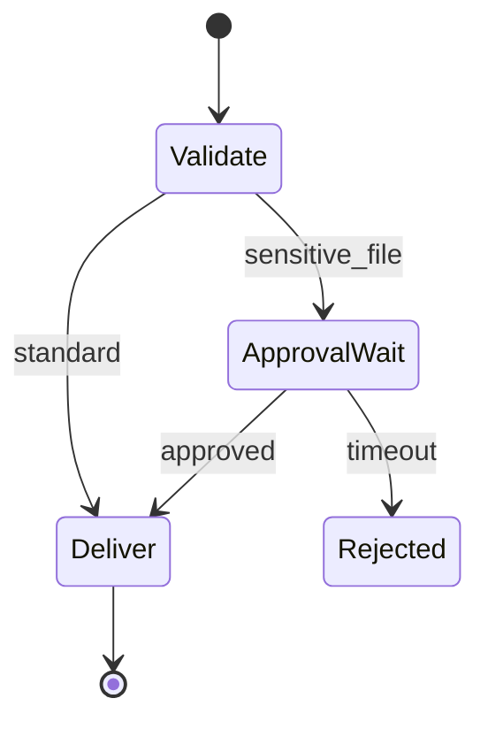

# Module 4 — Workflow orchestration with Step Functions

**Week 4 · Instructional module (full content)**  
**Time:** 2.5–3 hours instruction + 4 hours lab  
**Lab:** [Lab 4 — Step Functions workflow](../labs/lab-04-step-functions-workflow.md)

---

## 4.1 Module overview

Real transfers are **multi-step**: validate, copy, checksum, notify partner, update ERP, archive. Module 4 teaches **AWS Step Functions** to orchestrate Lambdas and AWS SDK integrations with explicit **retries**, **error handling**, and **visibility**.

---

## 4.2 Learning objectives

1. Differentiate **orchestration** vs. **choreography** in file pipelines.
2. Model transfer workflows as **state machines** with clear terminal states.
3. Implement **Retry**, **Catch**, and **Choice** states appropriately.
4. Pass **correlation IDs** across states for operations and audit.
5. Choose **Standard** vs. **Express** workflows for MFT scenarios.
6. Integrate **SNS** notifications for success/failure with human escalation paths.

---

## 4.3 Orchestration vs. choreography

| Style | Description | When |
|-------|-------------|------|
| **Choreography** | Each service reacts to events independently | Simple validate/route (Module 3) |
| **Orchestration** | Central workflow defines order and compensation | Multi-step SLAs, approvals, connector handoff |



Use Step Functions when **order matters** and you need a **single execution history** for auditors.

---

## 4.4 State machine design for MFT

### 4.4.1 Canonical states (Lab 4)

```
StartAt: ValidateFile
  → Choice Valid?
      Yes → CopyToProcessing → NotifySuccess → End
      No  → NotifyFailure → Fail
```

### 4.4.2 Execution input contract

```json
{
  "correlation_id": "550e8400-e29b-41d4-a716-446655440000",
  "bucket": "baylearn-mft-123456789012-landing",
  "key": "partners/demo/inbound/file.csv",
  "partner_id": "demo"
}
```

Every Task should log `correlation_id` unchanged.

### 4.4.3 ASL excerpt — Retry and Catch

```json
{
  "ValidateFile": {
    "Type": "Task",
    "Resource": "arn:aws:lambda:REGION:ACCOUNT:function:ValidateFile",
    "Retry": [{
      "ErrorEquals": ["Lambda.ServiceException", "Lambda.TooManyRequestsException"],
      "IntervalSeconds": 2,
      "MaxAttempts": 3,
      "BackoffRate": 2
    }],
    "Catch": [{
      "ErrorEquals": ["States.ALL"],
      "ResultPath": "$.error",
      "Next": "NotifyFailure"
    }],
    "Next": "CheckValid"
  }
}
```

**Do not** retry validation failures caused by bad data—use Choice on `valid: false` instead.

---

## 4.5 Standard vs. Express workflows

| Type | Duration | History | Best for |
|------|----------|---------|----------|
| **Standard** | Up to 1 year | Full, detailed | Enterprise MFT orchestration, audits |
| **Express** | &lt; 5 minutes | Less verbose | High-volume micro flows |

**Capstone default:** Standard workflows unless you prove sub-minute volume at scale.

---

## 4.6 Advanced patterns (awareness)

| Pattern | Use |
|---------|-----|
| **Map state** | Process batch of files from manifest |
| **Parallel** | Simultaneous checksum + AV scan |
| **Wait + callback** | Human approval for release |
| **Activity task** | On-prem worker integration |

### Human approval gate (conceptual)



---

## 4.7 Notifications and operations

| Outcome | Channel | Content |
|---------|---------|---------|
| Success | SNS / email | correlation_id, key, duration |
| Failure | SNS / PagerDuty | error, quarantine path, partner |
| SLA breach | CloudWatch alarm | executions &gt; threshold |

Operators should never need to read raw ASL during incidents—runbooks link **alarm → dashboard → execution ARN**.

---

## 4.8 Idempotency at workflow level

- Accept `x-idempotency-key` at API (Module 6) → store in DynamoDB before starting execution.  
- Use `StartExecution` with **name** derived from hash of idempotency key (where length limits allow) to prevent duplicate runs.  
- On duplicate, return existing execution ARN.

---

## 4.9 Failure injection exercise

1. Upload invalid file → expect **NotifyFailure** path.  
2. Temporarily deny Lambda IAM → observe **Retry** then **Catch**.  
3. Document execution history screenshots for capstone ops appendix.

---

## 4.10 Case study — End-of-day batch

**Scenario:** 10,000 files after market close.

| Approach | Notes |
|----------|-------|
| Map state over manifest in S3 | Controlled concurrency |
| Express per file | Only if each &lt; 5 min and audit allows |
| Chunked Standard | Multiple executions per partner batch |

Discuss **cost of state transitions** vs. **Lambda fan-out** in office hours.

---

## 4.11 Knowledge checks

**1.** When to use Catch vs. Retry?  
<details><summary>Answer</summary>Retry transient errors; Catch routes business/terminal failures to recovery/notify paths.</details>

**2.** Why Standard for regulated MFT?  
<details><summary>Answer</summary>Longer runs, full history, clearer audit trail for each execution.</details>

**3.** Where should correlation_id originate?  
<details><summary>Answer</summary>At job submission API edge; propagate unchanged through all states.</details>

---

## 4.12 Key takeaways

- Step Functions are the **system of record for process state**; S3 is the **system of record for files**.
- Separate **transient** from **business** failures in ASL.
- **Execution history** is audit gold—design for reviewer readability.
- Lab 4 workflow is the **spine** of capstone Tracks A and B.

---

## 4.13 Deliverables

- [ ] `state-machine.asl.json` + execution proof  
- [ ] Quiz 4

**Next module:** [Module 5 — Connectors & partner models](week-05.md)
