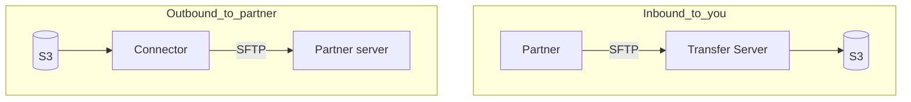
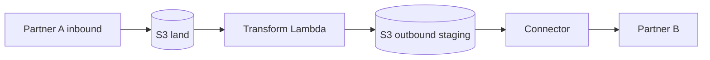

# Module 5 — Connectors & partner routing

**Week 5 · Instructional module (full content)**  
**Time:** 2.5–3 hours instruction + 4 hours lab  
**Lab:** [Lab 5 — SFTP connector](../labs/lab-05-sftp-connector.md)  
**AWS stencil diagrams:** [Module 5 diagrams](../diagrams/week-05.md) · [draw.io](../diagrams/week-05-connectors.drawio)

---

## 5.1 Module overview

Not every partner uploads to **your** SFTP server. Many require **you to push** files to their endpoint or **pull** from theirs. **AWS Transfer Family connectors** automate SFTP/FTPS sessions to remote hosts, integrated with S3 and your orchestration layer.

This module also introduces the **partner matrix**—the operational document every enterprise MFT team maintains.

---

## 5.2 Learning objectives

1. Decide between **managed server**, **connector**, or **hybrid** per partner direction.
2. Configure connectors with **Secrets Manager** and trusted host keys.
3. Execute **S3 → remote SFTP** and **remote SFTP → S3** flows.
4. Document partners in a **partner matrix** (direction, schedule, credentials, network).
5. Explain **egress IP**, **VPC**, and **allow-list** requirements to network teams.
6. Map four canonical patterns: `S3_TO_S3`, `S3_TO_SFTP`, `SFTP_TO_S3`, `SFTP_TO_SFTP`.

---

## 5.3 Server vs. connector decision matrix

| Partner behavior | AWS construct |
|------------------|---------------|
| Partner uploads to you | **Transfer server** (SFTP inbound) |
| You push file to partner SFTP | **Connector** outbound |
| You pull from partner SFTP | **Connector** inbound pull |
| Internal AWS only | S3 replication / EventBridge (no Transfer) |



---

## 5.4 Connector mechanics

### 5.4.1 Lifecycle

1. Create **connector** with URL `sftp://partner.example.com:22`.  
2. Associate **access role** (connector trusts Transfer service).  
3. Store **username/password or SSH key** in Secrets Manager.  
4. Register **trusted host keys** (MITM protection).  
5. Start transfer: `StartFileTransfer` with `SendFilePaths` or `RetrieveFilePaths`.

### 5.4.2 Example CLI (illustrative)

```bash
aws transfer start-file-transfer \
  --connector-id c-abc1234567890abcdef \
  --send-file-paths "/bucket/partners/demo/outbound/payroll.csv" \
  --remote-directory-path "/incoming/"
```

Paths depend on whether using S3 domain connectors; align with lab instructions.

### 5.4.3 IAM and secrets

| Item | Location |
|------|----------|
| Remote password / private key | Secrets Manager secret ARN on connector |
| S3 access | Connector access role (scoped prefixes) |
| Audit | CloudTrail `StartFileTransfer`, execution status in console |

**Never** commit partner credentials to git.

---

## 5.5 Networking and partner allow lists

| Topic | Action |
|-------|--------|
| **Egress IP** | Use static Elastic IP or NAT gateway IP documented for partners |
| **VPC** | Place connector in subnets with route to internet/partner VPN |
| **DNS** | Resolve partner hostname from VPC resolver |
| **Firewall** | Partner opens inbound from your documented IPs only |

Create a **network appendix** in partner onboarding packet—reduces weeks of ticket churn.

---

## 5.6 Partner matrix (required deliverable)

Template: [`templates/partner-matrix.csv`](../../templates/partner-matrix.csv)

| Column | Purpose |
|--------|---------|
| `partner_id` | Stable identifier in IAM prefixes and APIs |
| `direction` | INBOUND, OUTBOUND, BIDIRECTIONAL |
| `protocol` | SFTP, FTPS, AS2 |
| `schedule_utc` | Cron or event-driven |
| `credential_store` | Secrets Manager ARN reference |
| `landing_prefix` | S3 isolation |
| `notes` | Allow lists, SLA, contacts |

**Governance:** Product owners approve new rows; platform team implements.

---

## 5.7 Multi-hop routing



**Idempotency** at each hop; **correlation_id** ties hops in DynamoDB job record.

---

## 5.8 Four transfer patterns (BayRelay alignment)

| Pattern | Description |
|---------|-------------|
| `S3_TO_S3` | Internal copy/replicate between prefixes or buckets |
| `S3_TO_SFTP` | Deliver staged file to partner via connector |
| `SFTP_TO_S3` | Retrieve from partner or server upload already in S3 |
| `SFTP_TO_SFTP` | Remote-to-remote via staging bucket (two-step) |

Capstone Track B often implements at least two patterns with shared job API.

---

## 5.9 Onboarding runbook (template)

1. **Business intake** — partner name, direction, file types, SLAs.  
2. **Security review** — data classification, encryption, retention.  
3. **Network** — allow lists, VPN, host keys.  
4. **IAM/prefix** — create `partners/{id}/` paths.  
5. **Credentials** — Secrets Manager, rotation calendar.  
6. **Test** — sample file, checksum, negative tests.  
7. **Production cutover** — change window, rollback (disable user/connector).  

---

## 5.10 ECS Fargate for large files (Lab 9)

When files exceed Lambda comfort zone (size, duration, CPU), route to **ECS Fargate** workers. Full module: [Module 9 — ECS Fargate](week-09-ecs-fargate.md) · Lab: [Lab 9](../labs/lab-09-ecs-fargate-large-files.md).

---

## 5.11 Case study — Payroll outbound to bank

| Step | Service |
|------|---------|
| Generate payroll file | ERP → S3 `outbound/` (encrypted) |
| Approve | Step Functions wait state (optional) |
| Deliver | Connector `S3_TO_SFTP` |
| Confirm | Partner ACK file → `inbound/ack/` (Module 3 validate) |
| Alert | SNS if ACK missing by SLA |

---

## 5.11 Knowledge checks

**1.** When is a connector required?  
<details><summary>Answer</summary>When you must initiate SFTP/FTPS to a remote partner host rather than receiving uploads on your server.</details>

**2.** Why document egress IP?  
<details><summary>Answer</summary>Partners firewall inbound connections; unpredictable IPs cause production outages.</details>

**3.** Where do host keys belong?  
<details><summary>Answer</summary>Registered on connector configuration; prevents MITM.</details>

---

## 5.12 Key takeaways

- **Direction** determines server vs. connector—not all partners are inbound SFTP.
- **Partner matrix** is operational truth—keep it accurate or incidents multiply.
- **Secrets Manager + scoped IAM** are non-negotiable for outbound credentials.
- Lab 5 plus matrix satisfies **enterprise onboarding** storytelling in capstone.

---

## 5.13 Deliverables

- [ ] Connector demo + `partner-matrix.csv`  
- [ ] Quiz 5

**Next module:** [Module 6 — Self-serve platform](week-06.md)
