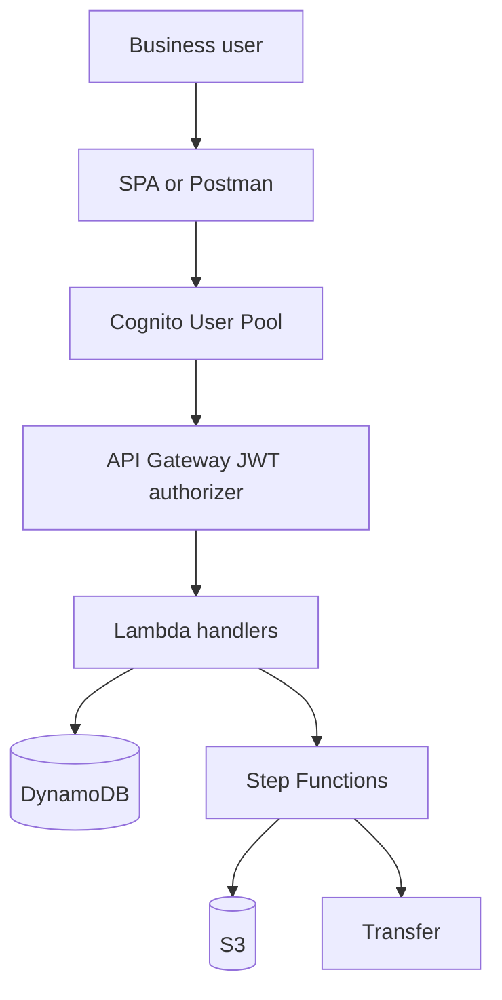
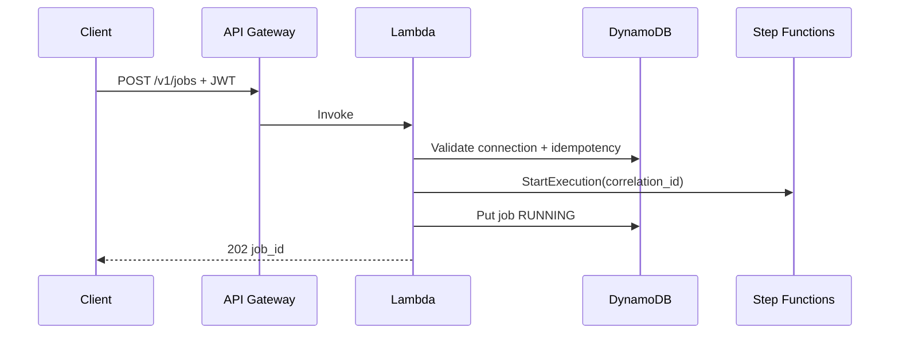
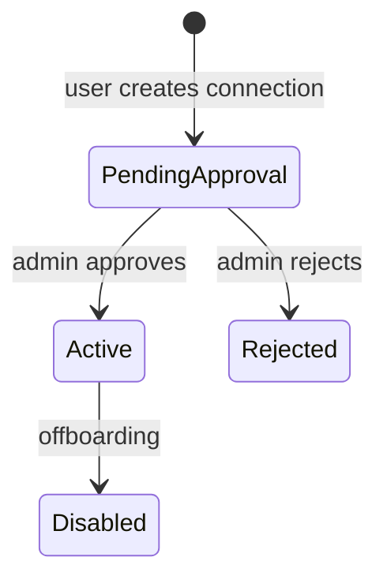

# Module 6 — Self-serve platform experience

**Week 6 · Instructional module (full content)**  
**Time:** 3 hours instruction + 5 hours lab  
**Lab:** [Lab 6 — Self-serve API](../labs/lab-06-self-serve-api.md)

---

## 6.1 Module overview

Operations teams drown in tickets: “Reset SFTP password,” “Did my file arrive?,” “Onboard vendor X.” A **self-serve platform** exposes **approved actions** through authenticated APIs and UI—without giving business users the AWS Console.

Module 6 designs the **connection catalog**, **job submission**, and **authorization model** using **Amazon Cognito**, **API Gateway**, **Lambda**, and **DynamoDB**—patterns aligned with BayAreaLa8s **BayServe**-style self-serve delivery.

---

## 6.2 Learning objectives

1. Define domain entities: **Connection**, **Job**, **Partner**, **User**.
2. Design REST APIs for catalog browse, job submit, and status query.
3. Implement **Cognito JWT** authorization and **owner-scoped** access.
4. Prevent leakage of secrets and cross-tenant data in API responses.
5. Wire `POST /jobs` to Step Functions executions from Module 4.
6. Produce **OpenAPI** documentation suitable for LMS and capstone review.

---

## 6.3 Self-serve principles

| Principle | Implication |
|-----------|-------------|
| **Least exposure** | Users see metadata, not IAM keys or bucket-wide listing |
| **Guardrailed actions** | APIs allow defined jobs only—no arbitrary S3 paths |
| **Auditability** | Every job stores `sub`, `correlation_id`, timestamps |
| **Async by default** | Submit job → receive `job_id` → poll status |
| **Separation of duties** | Admin approves new connections; users only consume |



---

## 6.4 Domain model

### 6.4.1 Connection (catalog entry)

| Field | Type | Notes |
|-------|------|-------|
| `connection_id` | UUID | Primary key |
| `owner_sub` | String | Cognito `sub`; for team models use group claims (advanced) |
| `name` | String | Display name |
| `type` | Enum | `SFTP_INBOUND`, `S3_TO_SFTP`, `SFTP_TO_S3`, `INTERNAL_S3` |
| `status` | Enum | `PENDING_APPROVAL`, `ACTIVE`, `DISABLED` |
| `config` | Map | Non-secret: bucket, prefix, partner_id |
| `created_at` | ISO8601 | |

**Never store** raw SFTP passwords in DynamoDB items returned to clients.

### 6.4.2 Job

| Field | Type | Notes |
|-------|------|-------|
| `job_id` | UUID | |
| `connection_id` | FK | Must be ACTIVE |
| `owner_sub` | String | Must match caller |
| `state` | Enum | `QUEUED`, `RUNNING`, `SUCCEEDED`, `FAILED` |
| `correlation_id` | UUID | Propagate to Step Functions |
| `source_key` | String | Validated against connection prefix |
| `execution_arn` | String | Optional Step Functions ARN |
| `error` | String | Sanitized message only |

### 6.4.3 DynamoDB design (simplified)

**Table `Connections`:** PK `connection_id`, GSI `owner_sub-index` on `owner_sub`.

**Table `Jobs`:** PK `job_id`, GSI `owner_sub-created_at-index`.

Production may use single-table design; labs may use two tables for clarity.

---

## 6.5 API specification

### 6.5.1 Endpoints (minimum)

#### `GET /v1/connections`

Returns connections where `owner_sub == jwt.sub`.

**Response 200:**

```json
{
  "connections": [
    {
      "connection_id": "c-7b2e",
      "name": "Vendor Demo Inbound",
      "type": "SFTP_INBOUND",
      "status": "ACTIVE"
    }
  ]
}
```

#### `POST /v1/connections`

Body: `name`, `type`, `config` (no secrets). Sets `status=PENDING_APPROVAL` unless lab enables auto-approve.

#### `POST /v1/jobs`

Headers: `Authorization: Bearer <jwt>`, optional `x-idempotency-key`.

Body:

```json
{
  "connection_id": "c-7b2e",
  "source_key": "partners/demo/inbound/file.csv"
}
```

**Response 202:**

```json
{
  "job_id": "j-9a1c",
  "correlation_id": "550e8400-e29b-41d4-a716-446655440000",
  "state": "QUEUED"
}
```

#### `GET /v1/jobs/{job_id}`

Returns job if `owner_sub` matches; else **403**.

### 6.5.2 Authorization rules (pseudo)

```
on each request:
  jwt = validate_cognito(token)
  sub = jwt.sub
  if route has job_id:
    job = load(job_id)
    deny if job.owner_sub != sub
  if route creates job:
    conn = load(connection_id)
    deny if conn.owner_sub != sub
    deny if conn.status != ACTIVE
    deny if not source_key.startswith(conn.config.allowed_prefix)
```

---

## 6.6 Cognito setup (lab walkthrough)

### 6.6.1 User pool

- Sign-in: email (or username per org policy).  
- App client: **Authorization code grant** for SPA; or **USER_PASSWORD_AUTH** for Postman-only labs.  
- Hosted UI optional for quick demos.

### 6.6.2 API Gateway JWT authorizer

| Setting | Value |
|---------|-------|
| Issuer | `https://cognito-idp.{region}.amazonaws.com/{userPoolId}` |
| Audience | App client ID |

### 6.6.3 Claims used

| Claim | Use |
|-------|-----|
| `sub` | Owner identifier |
| `email` | Display / audit |
| `cognito:groups` | Role-based admin (stretch) |

---

## 6.7 Lambda handler flow — submit job



**Idempotency:** If `x-idempotency-key` seen, return existing `job_id`.

---

## 6.8 UI vs. API-only

| Mode | Audience |
|------|----------|
| **Postman collection** | Acceptable for course grading |
| **Minimal React SPA** | Better capstone demo |
| **Full BayServe-style UI** | Stretch; reference architecture only |

Minimum demo: login → list connections → submit job → poll status.

---

## 6.9 What must never appear in self-serve UI

- IAM access keys or secret ARNs displayed in full  
- Bucket root listing  
- Other tenants’ connections or jobs  
- Arbitrary shell on Transfer server  
- Unauthenticated job submission  

---

## 6.10 Admin and approval workflow (conceptual)



Implement admin routes with `cognito:groups` claim `platform-admin` (stretch) or manual DynamoDB update in lab.

---

## 6.11 OpenAPI excerpt (deliverable)

```yaml
openapi: 3.0.3
info:
  title: BayLearn MFT Self-Serve API
  version: 0.1.0
paths:
  /v1/connections:
    get:
      security: [{ cognito: [] }]
      summary: List my connections
  /v1/jobs:
    post:
      security: [{ cognito: [] }]
      summary: Submit transfer job
  /v1/jobs/{job_id}:
    get:
      security: [{ cognito: [] }]
      summary: Get job status
components:
  securitySchemes:
    cognito:
      type: http
      scheme: bearer
      bearerFormat: JWT
```

Expand in `submissions/week-06/openapi.yaml`.

---

## 6.12 Case study — Insurance FNOL uploads

**Users:** External adjusters upload claim ZIPs.

| Requirement | Design |
|-------------|--------|
| Identity | Cognito federated to IdP (SSO) |
| Scope | Adjuster sees only assigned `claim_id` prefix |
| Job | `POST /jobs` triggers validate + scan workflow |
| Proof | Job history UI for “received at” timestamp |

---

## 6.13 Knowledge checks

**1.** Why 202 Accepted for job submit?  
<details><summary>Answer</summary>Processing is asynchronous; client polls status.</details>

**2.** How prevent cross-user job read?  
<details><summary>Answer</summary>Authorize `job.owner_sub` against JWT `sub` before response.</details>

**3.** Why pending approval on connections?  
<details><summary>Answer</summary>Prevents unvetted paths/credentials entering production catalog.</details>

---

## 6.14 Key takeaways

- Self-serve is **API product design**, not a console shortcut.
- **Catalog + jobs + authZ** are the minimum viable platform surface.
- Cognito **`sub`** is the tenancy boundary in lab scope.
- Module 6 deliverables are the **face** of capstone Track A.

---

## 6.15 Deliverables

- [ ] OpenAPI + Postman or UI demo  
- [ ] Quiz 6

**Next module:** [Module 7 — Operations, reliability & cost](week-07.md)
