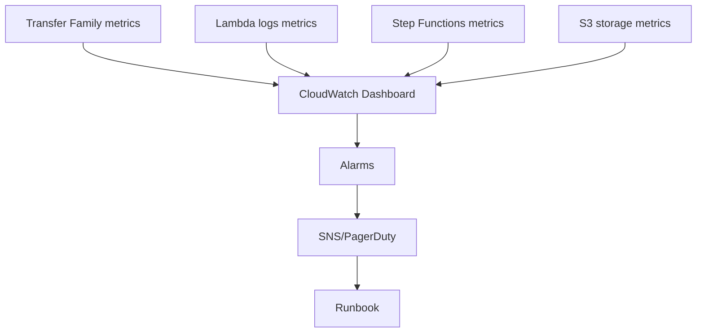
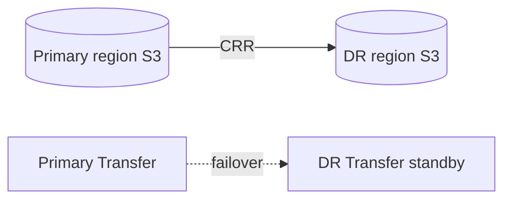

# Module 7 — Operations, reliability & cost

**Week 7 · Instructional module (full content)**  
**Time:** 2.5 hours instruction + 3 hours lab  
**Lab:** [Lab 7 — Observability](../labs/lab-07-observability.md)  
**AWS stencil diagrams:** [Module 7 diagrams](../diagrams/week-07.md) · [draw.io](../diagrams/week-07-observability.drawio)

---

## 7.1 Module overview

Platforms fail in production when **operations are an afterthought**. Module 7 defines **SLOs**, **observability**, **incident response**, **cost governance**, and **DR narratives** for enterprise file transfer on AWS.

You will produce an **operations runbook v0.1** suitable for handoff to an SRE team or capstone reviewers.

---

## 7.2 Learning objectives

1. Define **SLOs** and **SLIs** for file transfer (success rate, latency, completeness).
2. Build **CloudWatch dashboards** spanning Transfer, Lambda, Step Functions, S3.
3. Configure **alarms** with actionable thresholds and runbook links.
4. Standardize **structured logging** and **correlation IDs** for triage.
5. Estimate **cost drivers** and apply optimization levers.
6. Outline **DR** and **rollback** strategies without overpromising RTO/RPO.

---

## 7.3 Service level objectives

### 7.3.1 Example SLIs

| SLI | Measurement |
|-----|-------------|
| **Transfer success rate** | Jobs `SUCCEEDED / (SUCCEEDED + FAILED)` per 24h |
| **Inbound timeliness** | P95 minutes from upload to `processing/` |
| **Outbound timeliness** | P95 minutes from job submit to partner ACK |
| **Data completeness** | Manifest expected count vs. objects landed |

### 7.3.2 Example SLOs (internal platform)

| SLO | Target | Window |
|-----|--------|--------|
| Success rate | 99.5% | 30 days |
| Inbound P95 | &lt; 15 min | 7 days |
| Sev-1 response | 15 min | per incident |

Error budgets: if success &lt; SLO, freeze feature work; focus on reliability (Google SRE model).

---

## 7.4 Observability stack



### 7.4.1 Metrics to chart (Lab 7)

| Source | Metric |
|--------|--------|
| Transfer | `OnUploadExecutionsStarted`, `ChecksumValidationFailed` (as applicable) |
| Lambda | `Errors`, `Duration`, `ConcurrentExecutions` |
| Step Functions | `ExecutionsFailed`, `ExecutionTime` |
| S3 | `BucketSizeBytes`, request metrics if enabled |

### 7.4.2 Structured log schema

```json
{
  "timestamp": "2026-05-27T18:04:11Z",
  "level": "ERROR",
  "correlation_id": "550e8400-e29b-41d4-a716-446655440000",
  "job_id": "j-9a1c",
  "partner_id": "demo",
  "component": "validate-lambda",
  "message": "quarantine: invalid extension",
  "s3_key": "partners/demo/inbound/bad.exe"
}
```

Adopt consistent field names across Lambdas and Step Functions wrappers.

---

## 7.5 Alarms and incident response

### 7.5.1 Starter alarms

| Alarm | Threshold | Action |
|-------|-----------|--------|
| Lambda `Errors` | ≥ 1 / 5 min | Page on-call |
| SFN `ExecutionsFailed` | ≥ 1 / 15 min | Ticket + investigate ARN |
| Transfer server offline | Health check / custom | Critical page |
| S3 bucket size growth | &gt; 20% week/week | Capacity review |

### 7.5.2 Incident: “Partner says file not received”

| Step | Action |
|------|--------|
| 1 | Get `correlation_id` / `job_id` from partner ticket |
| 2 | Find Step Functions execution; check terminal state |
| 3 | Verify S3 staging object exists and checksum |
| 4 | Check connector execution logs / `StartFileTransfer` status |
| 5 | Confirm partner allow list and host key unchanged |
| 6 | Communicate evidence: timestamps, keys, execution ARN |

Document in runbook **Section 4**.

---

## 7.6 Cost model

### 7.6.1 Primary drivers

| Service | Cost pattern |
|---------|--------------|
| **Transfer Family server** | Hourly while **ONLINE** |
| **Connectors** | Usage-based transfers + data OUT |
| **S3** | Storage + requests + lifecycle transitions |
| **Lambda** | Invocations + duration |
| **Step Functions** | State transitions (Standard) |
| **KMS** | API calls; reduce with bucket keys |
| **CloudWatch** | Logs ingestion (control verbosity) |

### 7.6.2 Optimization levers

- Stop Transfer servers in dev sandboxes nights/weekends.  
- Lifecycle to IA/Glacier on `archive/`.  
- Right-size Lambda memory after profiling.  
- Use Express workflows only where audit allows.  
- Sample debug logs; avoid full payload logging in prod.

### 7.6.3 Order-of-magnitude exercise (capstone)

Estimate monthly:

```
Transfer server hours × hourly rate
+ S3 GB-months × tier
+ 1M Lambda invocations × per-invoke
+ 100k Step Functions transitions × rate
= $X–$Y range for executives
```

---

## 7.7 Reliability and DR

### 7.7.1 Failure domains

| Domain | Mitigation |
|--------|------------|
| AZ loss | S3 regional durability; multi-AZ Lambda |
| Region loss | **DR region** bucket replication; DNS/runbook for failover |
| Bad deploy | Blue/green Lambda aliases; Step Functions versions |
| Operator error | Disable connection; Object Lock on archive |

### 7.7.2 DR narrative (conceptual)



**RPO/RPO:** Set with business; labs document **process** not guaranteed minutes.

### 7.7.3 Rollback

- Disable SFTP user / connector  
- Revert Lambda alias  
- Stop Step Functions executions (where safe)  
- Communicate partner pause window  

---

## 7.8 Game day exercise (facilitator)

1. Inject invalid file → verify alarm + quarantine path.  
2. Remove SNS subscription → verify alert gap (then fix).  
3. Walk through runbook timed **MTTR** drill.

---

## 7.9 Partner onboarding ops section

Runbook must include:

- Prerequisites checklist (network, keys, test files)  
- Production cutover window template  
- Hypercare period (extra monitoring 48–72h)  
- Offboarding: disable identity, rotate secrets, archive prefix  

---

## 7.10 Knowledge checks

**1.** Why alarm on Step Functions failures vs. only Lambda?  
<details><summary>Answer</summary>Lambda may succeed while workflow ends Failed; SFN metric captures orchestration outcome.</details>

**2.** Largest avoidable Transfer cost in sandboxes?  
<details><summary>Answer</summary>Leaving servers ONLINE 24/7.</details>

**3.** What goes in structured logs for triage?  
<details><summary>Answer</summary>correlation_id, job_id, partner_id, component, safe message, key references—not secrets.</details>

---

## 7.11 Key takeaways

- **Operate platforms, not endpoints**—dashboards + runbooks are deliverables.
- **Correlation IDs** link partner tickets to AWS executions.
- **Cost and DR** stories prevent executive surprises post-pilot.
- Runbook v0.1 is required for capstone **operations** rubric points.

---

## 7.12 Deliverables

- [ ] Dashboard + alarms (Lab 7)  
- [ ] `runbook.md` in `submissions/week-07/`  
- [ ] Week 7 practical checklist (instructor-signed)

**Next module:** [Module 8 — Capstone delivery](week-08.md)
