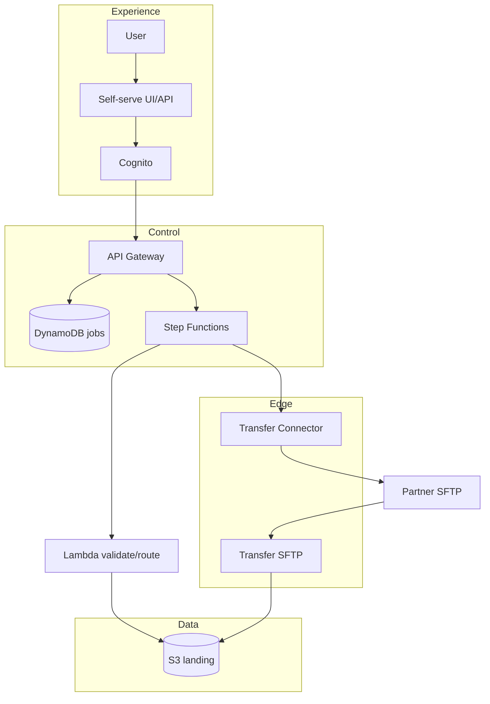

# Module 8 — Capstone delivery & program synthesis

**Week 8 · Instructional module (full content)**  
**Time:** 2 hours instruction + 8+ hours capstone + presentations  
**Lab:** [Lab 8 — Capstone integration](../labs/lab-08-capstone-integration.md)  
**Capstone brief:** [../capstone.md](../capstone.md)

---

## 8.1 Module overview

Week 8 integrates **Modules 1–7** into a **stakeholder-ready capstone**: architecture, demo, security narrative, operations story, and presentation. This module is both **delivery guide** and **program synthesis**—connecting technical work to enterprise outcomes and BayAreaLa8s consulting alignment.

---

## 8.2 Learning objectives

1. Integrate edge, automation, orchestration, connectors, and self-serve into one demo path.
2. Present architecture and tradeoffs to **architect + security** personas.
3. Respond to challenge questions on IAM, idempotency, cost, and DR.
4. Submit a complete **capstone package** per rubric.
5. Articulate **career portfolio** value and next learning paths.

---

## 8.3 Capstone tracks recap

| Track | Focus | Ideal candidate |
|-------|-------|-----------------|
| **A — Self-serve control plane** | Cognito + catalog + jobs + UI/API | Platform product engineers |
| **B — Governed automation hub** | Step Functions + idempotency + audit | Integration/DevOps leads |
| **C — Migration accelerator** | As-is/to-be + phased cutover | Architects migrating MFT |

Select track by **end of Week 5**; hybrid A+B requires instructor approval.

---

## 8.4 End-to-end reference architecture



Your capstone may omit UI if Postman demo is documented—but **authZ** must be shown.

---

## 8.5 Demo script template (`DEMO_SCRIPT.md`)

| Time | Slide / action | Speaker notes |
|------|----------------|---------------|
| 0:00 | Title + problem | “We still move payroll/claims as files; legacy MFT costly.” |
| 0:30 | Architecture | Point to edge, land, automate, self-serve. |
| 2:00 | Login / catalog | Show only authorized connections. |
| 3:00 | Submit job or SFTP upload | Live path; mention correlation_id. |
| 5:00 | Step Functions execution | Success path in console. |
| 6:30 | Security | KMS, IAM prefix, audit logs. |
| 8:00 | Operations | Dashboard + alarm + runbook snippet. |
| 9:00 | Roadmap | Prod hardening, BayRelay agentic ops optional. |
| 10:00 | Q&A | |

Record **5–10 minutes** or present live per cohort policy.

---

## 8.6 Presentation rubric alignment

| Reviewer question | Where to answer |
|-------------------|-----------------|
| How do you isolate partners? | Week 2 prefix + Week 5 matrix |
| What if same file uploads twice? | Week 3 idempotency |
| How do operators detect failure? | Week 7 alarms + runbook |
| How do users self-serve safely? | Week 6 API authZ |
| What does it cost? | Week 7 estimate + capstone spreadsheet |

---

## 8.7 Architecture decision log

Use template: [`templates/capstone-decision-log.md`](../../templates/capstone-decision-log.md)

Minimum **5 ADRs**, examples:

| ID | Decision |
|----|----------|
| ADR-001 | Transfer Family vs EC2 SFTP |
| ADR-002 | SSE-KMS for landing bucket |
| ADR-003 | Standard Step Functions |
| ADR-004 | DynamoDB catalog vs RDS |
| ADR-005 | Public SFTP sandbox only; VPC in prod |

Each ADR: **context, decision, status, consequences**.

---

## 8.8 Security review preparation

Produce `threat-model-summary.md` (1–2 pages):

- Assets: files, credentials, audit logs  
- Trust boundaries: internet partners, internal users, AWS accounts  
- Top 5 mitigations implemented in your build  
- Known gaps / prod backlog  

Expect security reviewers to ask about **secrets**, **tenant isolation**, and **encryption**.

---

## 8.9 Operations handoff package

Include from Week 7:

- Dashboard screenshot JSON export or console URL list  
- Alarm names and thresholds  
- Runbook: incident, onboarding, rollback  
- **Hypercare** suggestion first 72h after prod cutover  

---

## 8.10 IaC expectations

`iac/` folder should include:

```
iac/
  README.md          # how to plan/apply destroy
  main.tf            # or modular layout
  variables.tf
  outputs.tf
  modules/           # optional: transfer, api, workflow
```

Full `terraform apply` not required if **layout + README** explain modules and variables; working apply is bonus points.

---

## 8.11 Peer review protocol (cohort)

| Role | Task |
|------|------|
| **Presenter** | 10 min demo + architecture |
| **Reviewer A** | Security lens: 2 questions |
| **Reviewer B** | Ops lens: 2 questions |
| **Scribe** | Capture ADR gaps |

Feedback form: clarity, demo reliability, security, ops (1–5 each).

---

## 8.12 Program synthesis — what you learned

| Module | Core capability |
|--------|-----------------|
| 1 | Edge + landing zone |
| 2 | Security evidence |
| 3 | Event-driven validate/route |
| 4 | Durable orchestration |
| 5 | Outbound/inbound connectors |
| 6 | Self-serve product surface |
| 7 | Operate and optimize cost |
| 8 | Integrate and communicate |

---

## 8.13 Career and continuing paths

- Portfolio: diagram + demo link + runbook excerpt ([`career-outcomes.md`](../career-outcomes.md))  
- **BayLearn certificate:** ≥ 80% overall, capstone ≥ 70%  
- **Advanced:** BayRelay agentic workshop, private BayAreaLa8s architecture review  

---

## 8.14 Submission checklist

See [../capstone.md](../capstone.md) — verify all 10 items before deadline.

```
submissions/capstone/
  README.md
  architecture/diagram.png
  decision-log.md
  iac/
  demo/DEMO_SCRIPT.md
  demo/recording-link.txt
  security/threat-model-summary.md
  runbook.md
  cost-estimate.md
```

---

## 8.15 Facilitator grading timeline

| Day | Action |
|-----|--------|
| D0 | Submission deadline 23:59 cohort TZ |
| D+2 | Rubric scoring complete |
| D+3 | Feedback released |
| D+14 | Optional resubmit window (policy) |

---

## 8.16 Key takeaways

- Capstone is a **business artifact**, not a homework exercise.
- **Demo reliability** beats feature breadth—rehearse three times.
- Tie every technical choice to **partner onboarding** or **audit** story.
- You now have vocabulary aligned with **BayAreaLa8s** enterprise delivery.

---

## 8.17 Congratulations

Completing this program means you can lead **AWS file transfer modernization** conversations with architecture credibility—from SFTP edge to self-serve control plane.

**Course master document:** [`COURSE.md`](../../COURSE.md)
