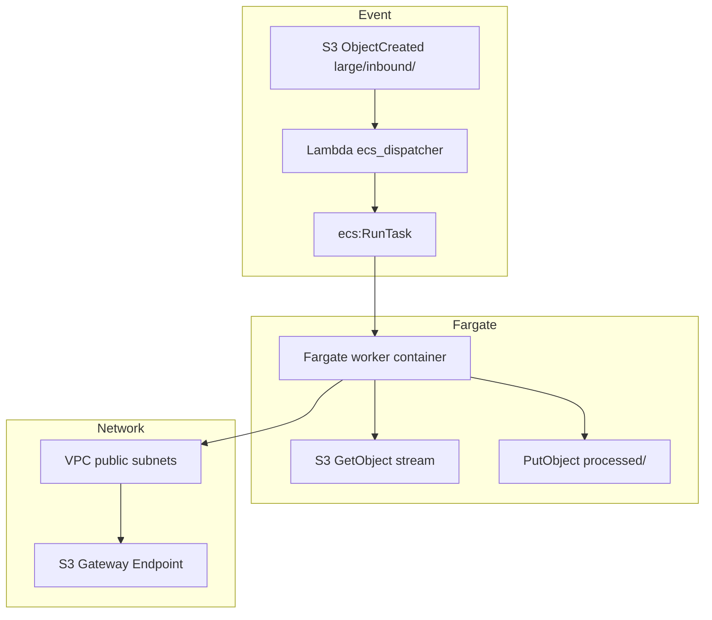

# Module 9 — ECS Fargate for large file transfers

**Stretch module · Lab 9 · 2–2.5 hours instruction**

---

## 9.1 Why this module exists

**AWS Lambda** limits (15-minute timeout, `/tmp` storage, memory-bound CPU) make it a poor fit for:

- Multi-**gigabyte** file transforms (checksum, virus scan, PGP, compression)
- **Long-running** streaming copies
- Sustained **parallel** batch workers

**Amazon ECS on Fargate** runs containers **on demand**: you pay for vCPU/memory **only during the task**, with no EC2 cluster to manage.

---

## 9.2 Lambda vs Fargate decision matrix

| Factor | Lambda | ECS Fargate |
|--------|--------|-------------|
| Max duration | 15 minutes | Hours (task limit) |
| Ephemeral disk | 512 MB–10 GB `/tmp` | Up to 200 GB (platform version dependent) |
| Cold start | Milliseconds | Tens of seconds |
| Cost model | Per ms + requests | Per task vCPU/memory per second |
| Ops model | Function | Task definition + image |
| Best for | Validate, route, API | Heavy/long file jobs |

**Pattern in this course:** Lambda validates and routes **small** inbound files; **large** prefix triggers Fargate.

---

## 9.3 Lab architecture



**No NAT gateway** in the lab VPC — public IP on task + S3 VPC endpoint keeps cost low.

---

## 9.4 Worker responsibilities

The course worker (`app/workers/fargate/worker.py`):

1. Reads `TRANSFER_JOB` JSON from environment.  
2. Downloads source object to temp storage.  
3. Computes **SHA-256**.  
4. Uploads to `large/processed/`.  
5. Writes **manifest** JSON for audit.

Production workers add: streaming hash (no full download), virus scan, PGP, progress to DynamoDB, Transfer connector calls.

---

## 9.5 IAM roles

| Role | Purpose |
|------|---------|
| **Task execution role** | Pull image from ECR, write CloudWatch Logs |
| **Task role** | S3 + KMS on landing bucket |

**Dispatcher Lambda role** additionally needs `ecs:RunTask`, `iam:PassRole`.

---

## 9.6 Teaching demo script

1. Show Lambda timeout/memory slide.  
2. Console: ECS cluster (empty — no running tasks).  
3. Run `./scripts/demo_ecs_large_file.sh` with 10MB file.  
4. ECS → Tasks → show task lifecycle.  
5. S3 → manifest JSON.  
6. CloudWatch Logs → structured JSON lines.  
7. Emphasize: **stop_stack destroys everything**.

---

## 9.7 Step Functions integration (conceptual)

```json
"LargeFileBranch": {
  "Type": "Task",
  "Resource": "arn:aws:states:::ecs:runTask.sync",
  "Parameters": {
    "Cluster": "<cluster-arn>",
    "TaskDefinition": "<task-def-arn>",
    "LaunchType": "FARGATE",
    "NetworkConfiguration": { ... },
    "Overrides": { "ContainerOverrides": [ { "Name": "worker", "Environment": [...] } ] }
  },
  "Next": "NotifySuccess"
}
```

`.sync` waits for task stop — suitable for orchestrated MFT with SLA tracking.

---

## 9.8 Knowledge checks

**1.** Why use a separate S3 prefix for large files?  
<details><summary>Answer</summary>Different processor (Fargate), avoids Lambda limits, clear routing rules.</details>

**2.** Why is there no always-on ECS service in the lab?  
<details><summary>Answer</summary>Cost — RunTask on demand; Transfer Family is the main always-on cost in other labs.</details>

**3.** What does the manifest provide?  
<details><summary>Answer</summary>Audit evidence: hash, size, correlation_id, timestamps.</details>

---

## 9.9 Key takeaways

- Fargate is the **heavy worker** behind the same landing-zone model.  
- **RunTask on demand** + **destroy stack** = teachable without runaway cost.  
- Combine with Step Functions for enterprise orchestration narratives.

**Lab:** [Lab 9 — ECS Fargate](../labs/lab-09-ecs-fargate-large-files.md)
