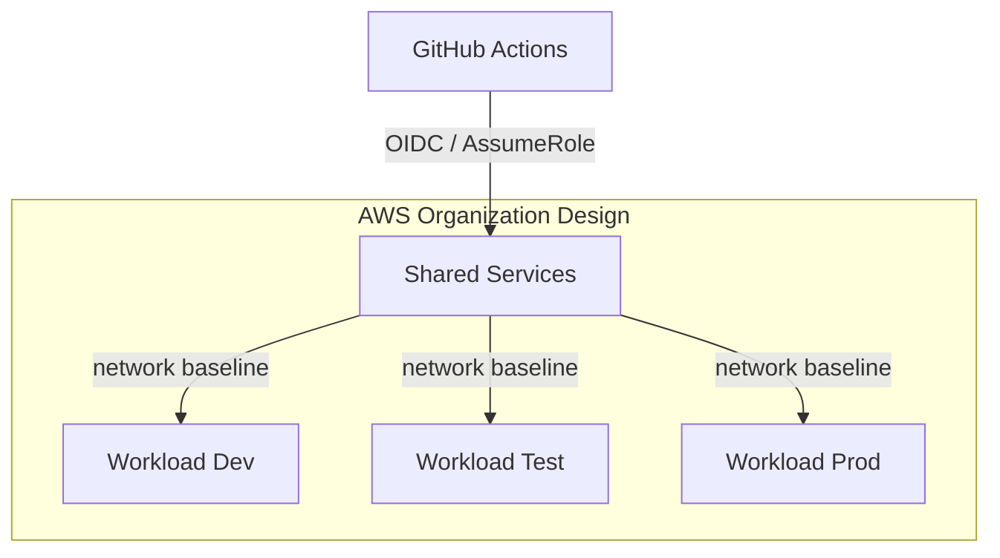

# Account & OU Model — Landing Zone Capstone

## Target (enterprise)

```text
Organization Root
├── Security OU
│   ├── audit
│   └── log-archive
├── Infrastructure OU
│   └── shared-services   ← CI runners, shared VPC, DNS
└── Workloads OU
    ├── workload-dev
    ├── workload-test
    └── workload-prod
```

## This reference implementation (lab)

| Logical account | State key | CIDR | Purpose |
|-----------------|-----------|------|---------|
| shared-services | `capstone/option-01/shared/terraform.tfstate` | 10.40.0.0/16 | Foundation VPC + flow logs |
| workload-dev | `capstone/option-01/workload-dev/terraform.tfstate` | 10.41.0.0/16 | Sample workload VPC |

Production would use **one AWS account ID per row** and cross-account `assume_role` (Week 2).

## State boundaries

- Never share one state file across accounts.
- Lock with DynamoDB (`terraform-locks` or student table).
- Encrypt state at rest (S3 SSE).

## Diagram



See also: `diagrams/png/00-multi-account-summary.png` in the course repo.
