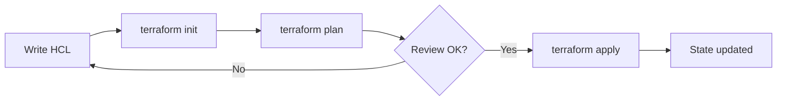

# Week 1 — Lecture: Enterprise Infrastructure as Code Foundations

**Reading time:** ~45 minutes · **Instructor delivery:** ~3 hours with discussion

---

## 1. Why enterprises adopt Infrastructure as Code

### 1.1 The scale problem

A mid-size enterprise might operate:

- 50–500 AWS accounts
- Thousands of EC2 instances, RDS databases, load balancers, and serverless functions
- Dozens of teams shipping weekly

Manual console changes do not scale. They produce:

- **Inconsistent environments** — “works in dev” because someone clicked different settings
- **Slow audits** — nobody knows who changed a security group rule
- **Fragile recovery** — rebuild after incident requires tribal knowledge

**Infrastructure as Code (IaC)** treats infrastructure definitions as software: versioned, reviewed, tested, and deployed through pipelines.

### 1.2 What “enterprise IaC” means (beyond tutorials)

Toy tutorials teach single-file `main.tf` and local state. Enterprises require:

| Capability | Why it matters |
|------------|----------------|
| **Remote state + locking** | Teams cannot corrupt shared state with concurrent applies |
| **Modular design** | VPC logic written once, consumed by 40 teams |
| **Multi-account** | Blast radius isolation, billing, compliance boundaries |
| **CI/CD integration** | Every change is planned, reviewed, and traceable |
| **Governance** | Tags, policies, and guardrails enforced automatically |
| **Operations** | Drift detection, rollback, disaster recovery |

This course teaches that full stack—not just `terraform apply`.

### 1.3 Business outcomes

Executives care about:

- **Velocity** — environments in hours, not weeks
- **Risk reduction** — peer review before production changes
- **Cost control** — tagged resources, teardown automation
- **Compliance** — evidence for SOC2, HIPAA, PCI (who changed what, when)

Your job as an infrastructure engineer is to connect Terraform mechanics to these outcomes.

---

## 2. Terraform in the enterprise landscape

### 2.1 What Terraform is

Terraform is an **declarative** provisioning tool by HashiCorp. You describe desired infrastructure; Terraform figures out how to create, update, or delete resources to match.

**Declarative vs imperative:**

```text
Imperative:  "Create VPC, then subnet, then route table..."
Declarative: "VPC X exists with subnets A,B and route table R."
```

Terraform builds a **dependency graph** from references in HCL and executes changes in safe order.

### 2.2 Core components

| Component | Role |
|-----------|------|
| **Configuration (.tf)** | Desired state written in HCL |
| **Providers** | Plugins that talk to APIs (AWS, Azure, Kubernetes) |
| **State** | Mapping of Terraform addresses → real resource IDs |
| **Plan** | Calculated diff between desired and actual |
| **Apply** | Executes approved plan |

### 2.3 The execution workflow



**`terraform init`**

- Downloads provider plugins
- Configures backend (where state lives)
- Prepares modules

**`terraform plan`**

- Refreshes state from APIs (by default)
- Compares desired vs actual
- Outputs create/update/delete actions

**`terraform apply`**

- Runs plan (unless using saved plan file)
- Mutates infrastructure
- Writes new state

**Never skip plan in production.** Plans are your contract for change advisory boards.

---

## 3. Terraform vs AWS CloudFormation

Both are IaC tools; many enterprises use **both** for different layers.

| Dimension | Terraform | CloudFormation |
|-----------|-----------|----------------|
| **Vendor scope** | Multi-cloud | AWS-native |
| **Language** | HCL (+ JSON export) | YAML/JSON |
| **State** | Managed by you (S3, Terraform Cloud) | AWS-managed stack state |
| **Module ecosystem** | Public registry + private Git | AWS-native modules, SAR |
| **Drift detection** | Plan refresh; third-party tools | Stack drift detection |
| **Day-1 AWS features** | Sometimes lag new services | Often same-day for AWS services |
| **Team skills** | Platform/DevOps generalists | AWS-heavy shops |

**When Terraform wins:** multi-cloud, consistent workflows across AWS+K8s, strong module versioning in Git.

**When CloudFormation wins:** AWS-only, tight Control Tower integration, organizations that mandate native tools.

**Enterprise pattern:** Terraform for application/platform infrastructure; CloudFormation or CDK for org-level landing zone guardrails—or Terraform for everything with strict modules.

---

## 4. HCL essentials for production

### 4.1 File organization

Typical layout:

```text
versions.tf    # terraform + provider version constraints
providers.tf   # provider configuration
variables.tf   # input variables
main.tf        # resources and module calls
outputs.tf     # values exported to humans or other stacks
locals.tf      # computed local values
```

### 4.2 Version constraints (non-negotiable)

```hcl
terraform {
  required_version = ">= 1.5.0"

  required_providers {
    aws = {
      source  = "hashicorp/aws"
      version = "~> 5.0"
    }
  }
}
```

**Why:** Upgrading providers without pinning breaks production at the worst time. Teams pin versions and upgrade deliberately.

### 4.3 Variables and type safety

```hcl
variable "environment" {
  type        = string
  description = "Deployment environment name"
  validation {
    condition     = contains(["dev", "test", "prod"], var.environment)
    error_message = "environment must be dev, test, or prod."
  }
}
```

Validations catch mistakes **before** apply.

### 4.4 Locals and tags

```hcl
locals {
  common_tags = {
    Environment = var.environment
    ManagedBy   = "terraform"
    Course      = "terraform-enterprise"
  }
}
```

Enterprises standardize tags for **cost allocation**, **access control (ABAC)**, and **automation** (our start/stop scripts use `Course=terraform-enterprise`).

### 4.5 default_tags (AWS provider)

```hcl
provider "aws" {
  region = var.aws_region

  default_tags {
    tags = local.common_tags
  }
}
```

Ensures every supported resource inherits baseline tags—reduces audit findings.

---

## 5. State management — the enterprise lifeline

### 5.1 What state contains

Terraform state is JSON storing:

- Resource IDs (e.g. `i-0abc123`)
- Attributes not in .tf files
- Dependency metadata
- Sensitive values (sometimes—**treat state as secret**)

Without state, Terraform cannot know it created `i-0abc123` yesterday—it might try to create a duplicate.

### 5.2 Local state risks

| Risk | Consequence |
|------|-------------|
| State on laptop | Lost laptop = lost infrastructure map |
| No locking | Two applies corrupt state |
| No versioning | Cannot recover from bad apply |
| Not encrypted | Compliance violation |

### 5.3 Remote state on S3 + DynamoDB locking

```hcl
terraform {
  backend "s3" {
    bucket         = "company-terraform-state"
    key            = "environments/prod/network/terraform.tfstate"
    region         = "us-west-2"
    dynamodb_table = "terraform-locks"
    encrypt        = true
  }
}
```

| Feature | Purpose |
|---------|---------|
| **S3 versioning** | Roll back state object after bad apply |
| **Encryption** | Protect secrets at rest |
| **DynamoDB lock** | Prevent concurrent writers |
| **Unique key per stack** | Blast radius separation |

### 5.4 Bootstrap problem

You cannot store the state bucket’s state **in itself** initially. Pattern:

1. Apply `bootstrap/` with **local state** once
2. Migrate or configure backend for workload stacks
3. Never delete bootstrap casually—it holds keys to all other state

### 5.5 State blast radius

**One state file = one failure domain.** Enterprises split:

- Network (VPC) — changes rarely
- Data (RDS) — different approvers
- Application (ECS/Lambda) — frequent deploys

Smaller states = faster plans and safer applies.

---

## 6. Repository structure for teams

### 6.1 Monorepo vs polyrepo

| Model | Pros | Cons |
|-------|------|------|
| **Monorepo** (this course) | Easy cross-module changes, one CI | Large clone, permission complexity |
| **Polyrepo** | Clear ownership per module | Version coordination harder |

### 6.2 Recommended layout (this course)

```text
modules/           # reusable building blocks
labs/shared/environments/dev|test|prod/
labs/week-01/bootstrap/
scripts/aws/       # operational cost controls
```

### 6.3 What not to commit

- `*.tfvars` with secrets
- `.terraform/` directory
- `terraform.tfstate` files
- AWS access keys

Use `.gitignore` and secret scanners in CI.

---

## 7. Infrastructure lifecycle management

### 7.1 Environments

```text
dev  → fast iteration, lower guardrails
test → production-like validation
prod → change windows, approvals, monitoring
```

Same modules, different **input variables** and **backends**.

### 7.2 Change types

| Type | Tooling |
|------|---------|
| Planned change | PR → CI plan → approved apply |
| Emergency fix | Break-glass role + post-incident Terraform reconcile |
| Drift | Detected by plan or drift tooling; remediate via code |

### 7.3 Immutable vs mutable

Terraform is **mutable infrastructure**—it updates resources in place when possible. Some changes force replacement (new resource ID). Teach teams to read plan output:

```text
# forces replacement
```

---

## 8. Week 1 synthesis

Enterprises adopt Terraform not for syntax beauty but for **operational control** at scale. Week 1 foundations—remote state, tagging, repo layout—are prerequisites for everything else in this course.

**Next week:** Multi-account AWS architecture and cross-account access patterns.

---

## Further reading

- [Terraform: What is Terraform?](https://developer.hashicorp.com/terraform/intro)
- [Terraform: State](https://developer.hashicorp.com/terraform/language/state)
- [AWS Prescriptive Guidance: Terraform](https://docs.aws.amazon.com/prescriptive-guidance/latest/terraform-aws-provider-best-practices/introduction.html)
