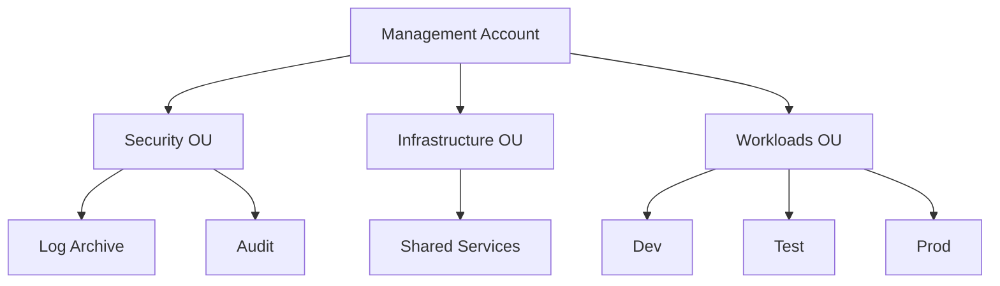
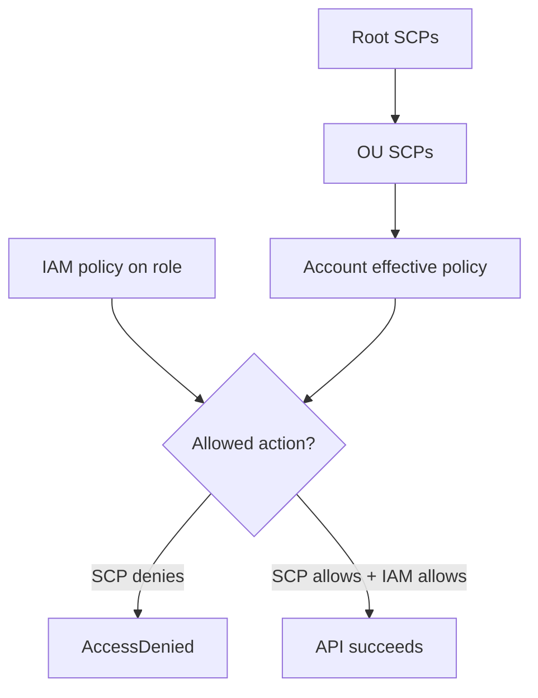
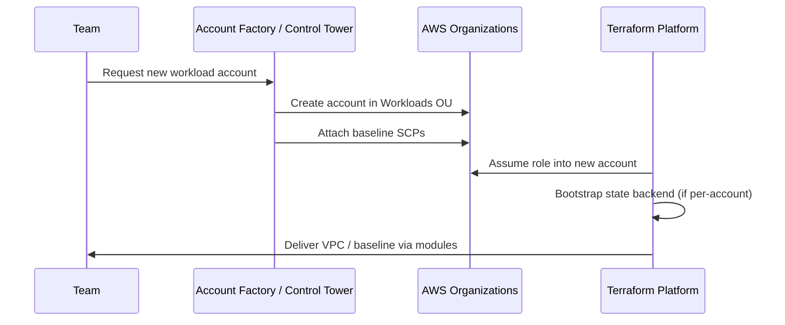
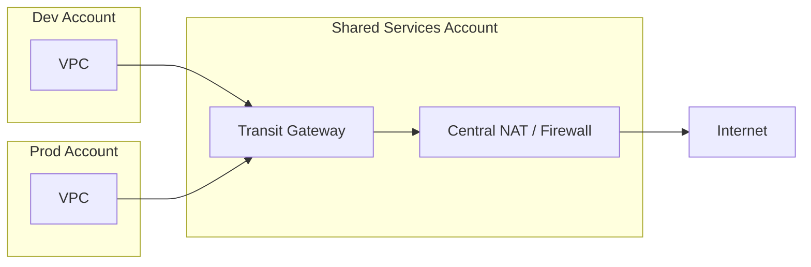
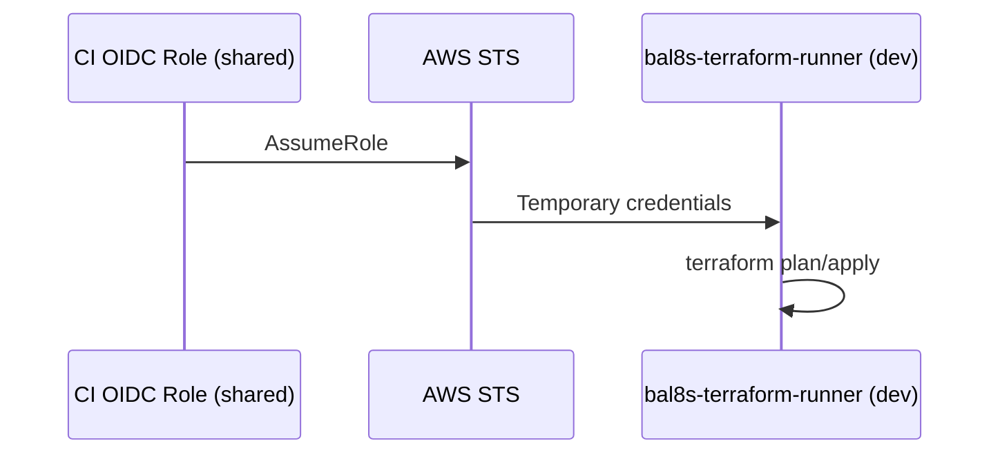
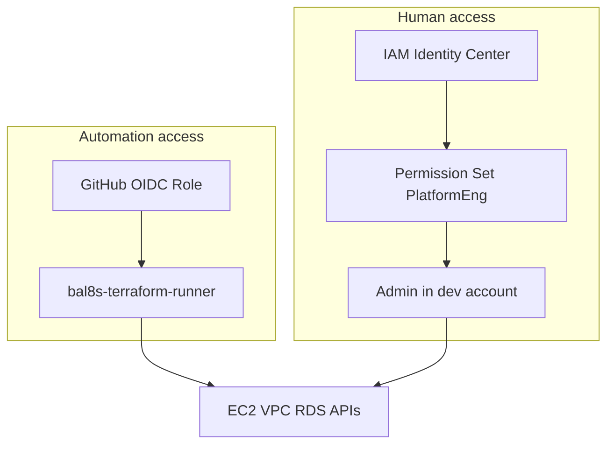

# Week 2 — Lecture: AWS Multi-Account Architecture for Terraform

**Reading time:** ~50 minutes · **Instructor delivery:** ~3 hours with discussion

---

## 1. Why enterprises split AWS into many accounts

### 1.1 The single-account trap

Early cloud adopters often run dev, test, and production in **one AWS account** separated only by VPCs or tags. That works until:

- A misconfigured security group in a “dev” VPC exposes a production database
- A cost anomaly from an experiment burns the entire org budget
- Compliance requires **provable isolation** between PHI/PCI workloads and everything else
- An engineer with broad IAM access can delete production by mistake

**Multiple accounts** turn isolation from a convention into an **AWS boundary**. SCPs, billing, and IAM trust policies enforce separation even when humans make mistakes.

### 1.2 Blast radius as a design principle

| Failure mode | Single account | Multi-account |
|--------------|----------------|---------------|
| Accidental `s3 rb --force` on wrong bucket | May hit prod data | Scoped to one account |
| Compromised CI credential | All environments at risk | Role limited to dev OU only |
| Service quota exhaustion | Blocks entire org | Contained per account |
| Audit scope | Entire account inventory | Account = compliance boundary |

Terraform does not replace account strategy—it **implements** resources *inside* accounts you have already designed. Week 2 teaches you to align Terraform state, backends, and provider configuration with that design.

### 1.3 How this course maps to real enterprises

**BayAreaLa8s — Terraform for Real Enterprises** uses:

- Repository: `bayareala8s/training/Terraform-for-Real-Enterprises`
- Mandatory tag: `Course=terraform-enterprise` (used by [`scripts/aws/`](../../scripts/aws/) for lab cost control)
- Week 1 remote state in S3 + DynamoDB

This week you will **design** a four-account style layout even if your lab runs in a single account—documenting logical separation is a professional skill hiring managers expect.

---

## 2. AWS Organizations fundamentals

### 2.1 Core vocabulary

| Term | Definition |
|------|------------|
| **Organization** | Container for all member accounts; consolidated billing optional |
| **Management account** | Former “master”; creates org, invites accounts, attaches SCPs |
| **Member account** | Standard workload or specialized account |
| **Organizational unit (OU)** | Hierarchy grouping accounts (e.g. Workloads, Security) |
| **SCP** | Service control policy—guardrail on what APIs *can* be used |
| **Control Tower** | AWS landing zone product automating account vending + guardrails |

### 2.2 Typical OU hierarchy

```text
Root (management account)
├── Security OU
│   ├── Log Archive
│   └── Audit / Security Tooling
├── Infrastructure OU
│   └── Shared Services (network hub, DNS, CI runners)
└── Workloads OU
    ├── Non-Production (dev, test)
    └── Production (prod)
```



### 2.3 Consolidated billing

Organizations can consolidate charges to the management account. Finance teams gain:

- **Cost allocation** by linked account
- **Reserved Instance / Savings Plan** sharing (with policies)
- **Budgets and anomalies** per account or OU

Terraform tags (`Environment`, `CostCenter`, `Course`) still matter—accounts are the first line of cost boundaries; tags refine within an account.

---

## 3. Service control policies (SCPs)

### 3.1 SCPs vs IAM policies

| Aspect | IAM policy | SCP |
|--------|------------|-----|
| **Applies to** | Users, roles, groups in one account | Accounts or OUs in org |
| **Effect** | Allow or deny specific actions | Maximum permissions ceiling |
| **Cannot** | Grant access by itself (needs IAM allow) | Grant access—only filter |
| **Use case** | Least privilege for Terraform runner | “No one disables CloudTrail org-wide” |

**Mental model:** SCPs are guardrails on the highway; IAM policies are which car you drive.

### 3.2 Common SCP patterns for Terraform shops

| Policy intent | Example restriction |
|---------------|---------------------|
| Region lock | Deny all except `us-west-2`, `us-east-1` |
| Protect logging | Deny `cloudtrail:StopLogging`, `logs:DeleteLogGroup` on audit account |
| Prevent public S3 | Deny `s3:PutBucketPublicAccessBlock` removal patterns |
| Sandbox safety | Deny expensive services (`ec2:RunInstances` with `p4d` only in prod OU) |

**Terraform implication:** If `terraform apply` fails with `AccessDenied` at the org level, check SCP inheritance before debugging IAM role policies for hours.

### 3.3 SCP inheritance flow



---

## 4. Landing zones and account vending

### 4.1 What is a landing zone?

A **landing zone** is a pre-configured multi-account environment with:

- Identity (SSO / IAM Identity Center)
- Network baseline (hub-spoke, AWS Network Firewall, Transit Gateway)
- Logging (organization CloudTrail, Config aggregators)
- Security services (GuardDuty, Security Hub delegated admin)
- **Account factory** for new teams

Implementations include **AWS Control Tower**, custom CloudFormation/Terraform landing zone accelerators, or partner solutions.

### 4.2 Account vending lifecycle



### 4.3 What Terraform should (and should not) own

| Layer | Often owned by landing zone | Often owned by app/platform Terraform |
|-------|----------------------------|--------------------------------------|
| Organization / OU structure | Yes (Control Tower, AFT) | Rarely—high ceremony |
| Account creation | Account Factory | No |
| VPC hub, TGW | Network team Terraform in shared services | Spoke attachments per account |
| Application ECS/RDS | — | Yes |
| IAM SSO permission sets | Identity team | — |

**Enterprise rule:** Do not let every product team run `aws_organizations_account` in their app pipeline unless governance explicitly delegates that power.

---

## 5. Shared services account patterns

### 5.1 Why centralize services

Some capabilities are **cheaper, safer, or simpler** once per org:

| Service | Shared services rationale |
|---------|---------------------------|
| **Route 53 private zones** | Single DNS namespace across spokes |
| **Egress / NAT** | Centralized inspection, shared NAT gateways |
| **CI/CD runners** | One OIDC trust surface, audited artifacts |
| **Terraform state (optional)** | Central state account with cross-account roles |
| **Artifact registry** | ECR, CodeArtifact for approved images/modules |

### 5.2 Hub-and-spoke networking (conceptual)



Terraform in each spoke account manages spoke VPC resources; **attachments** to TGW may require roles that can modify shared account resources—or a pipeline that runs in the shared account with peer approvals.

### 5.3 State backend placement

Week 1 placed state in **your lab account**. Enterprise patterns:

| Pattern | Pros | Cons |
|---------|------|------|
| **State in each workload account** | Simple IAM—runner in same account | Many buckets to audit |
| **Central state account** | One encryption/KMS story | Cross-account IAM required |
| **Terraform Cloud / HCP** | SaaS RBAC, run history | Vendor dependency, cost |

For this course, continue using your Week 1 bucket with **keys per environment** (`environments/dev`, `environments/test`). In your architecture doc, note which **account ID** would own that bucket in production.

---

## 6. Cross-account IAM for Terraform

### 6.1 The trust chain

Automation (human CLI, GitHub Actions, Jenkins) runs in an **identity account** (or uses SSO) and **assumes a role** in a **workload account**:



### 6.2 Trust policy essentials

Trust policies answer: **Who can assume this role?**

```json
{
  "Version": "2012-10-17",
  "Statement": [{
    "Effect": "Allow",
    "Principal": {
      "AWS": "arn:aws:iam::111111111111:root"
    },
    "Action": "sts:AssumeRole",
    "Condition": {
      "StringEquals": {
        "sts:ExternalId": "unique-per-partner-id"
      }
    }
  }]
}
```

| Element | Purpose |
|---------|---------|
| `Principal.AWS` | Tooling account root, specific role, or federated principal |
| `sts:ExternalId` | Confused deputy protection for third-party access |
| `Condition` on `aws:PrincipalArn` | Restrict to `github-terraform` role only |

Course templates: [`labs/week-02/iam/terraform-runner-trust.json`](../../labs/week-02/iam/terraform-runner-trust.json).

### 6.3 Permission policy — least privilege

The runner role should **not** use `AdministratorAccess` in production. Prefer:

- Scoped actions for resources Terraform manages
- `iam:PassRole` limited to known execution roles
- Deny statements on destructive org actions

Course lab policy: [`labs/week-02/iam/terraform-runner-policy.json`](../../labs/week-02/iam/terraform-runner-policy.json).

### 6.4 Provider configuration

```hcl
provider "aws" {
  region = var.aws_region

  assume_role {
    role_arn     = var.terraform_role_arn
    session_name = "terraform-${var.environment}"
    external_id  = var.assume_role_external_id # if required
  }

  default_tags {
    tags = local.common_tags
  }
}
```

**Session naming** appears in CloudTrail—use `terraform-dev`, `github-pr-1234`, not generic `session`.

### 6.5 Manual lab workflow vs CI (preview Week 4)

| Step | Lab (Week 2) | CI (Week 4) |
|------|--------------|-------------|
| Authentication | `aws sts assume-role` + env vars | GitHub OIDC → `configure-aws-credentials` |
| Plan | Local or Makefile | PR workflow job |
| Apply | Human after review | Protected environment on `main` |

---

## 7. Mapping Terraform to your account model

### 7.1 One state file per boundary

Align with Week 1 guidance:

| Stack | Account | State key example |
|-------|---------|-------------------|
| Network (VPC) | dev | `environments/dev/network/terraform.tfstate` |
| App (compute) | dev | `environments/dev/app/terraform.tfstate` |
| Shared TGW | shared-services | `shared/networking/tgw.tfstate` |

Smaller blast radius beats one mega-state for “all of dev.”

### 7.2 Single-account lab mode (honest documentation)

If you only have one AWS account:

- Use **separate state keys** and `environment` variable values
- Document **residual risks** (IAM admins can cross logical boundaries)
- Never claim production parity in audits without true account separation

### 7.3 Course tagging reminder

All lab resources must remain tagged:

```hcl
Course = "terraform-enterprise"
```

Without this tag, [`scripts/aws/start-stop`](../../scripts/aws/) will not manage your NAT/instance costs.

---

## 8. Governance and operations

### 8.1 CloudTrail organization trail

Org-wide trails land in the **log archive** account. Terraform changes appear as:

- `AssumeRole` from CI principal
- `CreateVpc`, `ModifySecurityGroup`, etc. under assumed role session

Your architecture is only auditable if session names and roles are meaningful.

### 8.2 Break-glass

Emergencies may require console access outside Terraform. Process:

1. Break-glass role with MFA and ticket ID
2. Fix immediate incident
3. **Reconcile**—update Terraform code to match or import changes
4. Post-incident review

### 8.3 Common anti-patterns

| Anti-pattern | Why it fails |
|--------------|--------------|
| One `OrganizationAccountAccessRole` for all Terraform | No least privilege; auditors reject |
| Long-lived access keys in shared account for CI | Key leakage = org-wide risk |
| Applying prod from engineer laptop | No peer review, no CI logs |
| Ignoring SCP denials | “IAM looks fine” but API still blocked |

---

## 9. IAM Identity Center and human access

### 9.1 Why SSO matters for Terraform teams

Enterprises rarely give engineers long-lived IAM users. **IAM Identity Center** (formerly AWS SSO) federates from Okta, Azure AD, or Google Workspace into **permission sets** mapped to accounts and roles.

| Access type | Typical principal | Terraform relevance |
|-------------|-------------------|---------------------|
| Developer | `DeveloperAccess` in dev account | Local plan in dev only |
| Platform | `TerraformPlatform` in shared + workload | Pipeline role design reference |
| Read-only auditor | `ViewOnlyAccess` org-wide | Plan-only reviews, no apply |
| Break-glass | `EmergencyAdmin` with MFA + ticket | Console fix, then code reconcile |

Humans and automation should use **different roles** with different trust policies—even if permissions overlap today.

### 9.2 Permission sets vs cross-account runner



**Teaching point:** Students often conflate “my SSO login” with “CI role.” Week 2 lab uses `sts assume-role` to **simulate** what CI does in Week 4 without mixing human audit trails.

### 9.3 Session duration and credential hygiene

Assumed roles return credentials valid 15 minutes to 12 hours depending on configuration. Terraform long applies may need:

- Shorter applies split into stacks
- `-parallelism` tuning
- CI retry with fresh OIDC token on session expiry

Never commit assumed-role credentials to Git or paste into Slack.

---

## 10. Account factory and Terraform boundaries

### 10.1 Control Tower Account Factory

When accounts are created automatically:

1. Baseline guardrails (Config, CloudTrail, VPC optional) land via Control Tower
2. Account email and OU placement are fixed
3. **Terraform should not fight the factory**—import or data-source existing resources

Document in your architecture which resources are **factory-owned** (read-only to app Terraform) vs **team-owned**.

### 10.2 Custom AFT (Account Factory for Terraform)

Mature platforms use **AFT** to run Terraform per new account—delivering:

- VPC spokes
- IAM baseline roles
- State bucket (if per-account pattern)

Application team Terraform runs **after** AFT completes—coordinate state keys so AFT and app stacks do not share one state file.

### 10.3 Invitation vs organization create account

| Method | Terraform resource | Notes |
|--------|-------------------|-------|
| Invite existing account | `aws_organizations_account` (limited) | Often manual console |
| Create account | Org API via AFT/CT | High privilege—central team only |

**Course scope:** You design accounts in diagrams; you do not require org-admin API access to pass Week 2.

---

## 11. State strategy across accounts (deep dive)

### 11.1 Migrating state when moving accounts

If a workload moves from Account A to Account B (rare but happens during M&A):

1. Freeze applies
2. Export state and resources (or rebuild in B)
3. Update backend key and provider `assume_role`
4. Run plan—expect large churn; use change window

### 11.2 KMS encryption per account

Enterprises use **CMKs** per account or a central security account key policy allowing workload accounts to encrypt state. Terraform S3 backend supports `kms_key_id`.

### 11.3 State access IAM (who can read state)

State contains secrets. IAM on state bucket should allow:

- CI plan role: `s3:GetObject`, `dynamodb:GetItem` (lock)
- CI apply role: `PutObject`, `PutItem`
- Humans: **deny by default**; break-glass read with logging

Week 1 bucket policy review belongs in your Week 2 architecture doc.

---

## 12. Multi-region and multi-provider preview

Some stacks need `provider "aws"` aliases:

```hcl
provider "aws" {
  alias  = "us_east_1"
  region = "us-east-1"
  assume_role { role_arn = var.role_us_east }
}

module "cloudfront_cert" {
  source = "../modules/acm"
  providers = { aws = aws.us_east_1 }
}
```

Multi-account **and** multi-region compound IAM complexity—keep certificates and global services in documented shared accounts.

---

## 13. Week 2 synthesis

Multi-account architecture is the **organizational skeleton** for enterprise Terraform. Your responsibilities this week:

1. **Design** OU/account layout and state mapping
2. **Implement** cross-account trust for a Terraform runner
3. **Prove** `terraform plan` works through assumed role credentials

Week 3 modules will package VPC logic so every account receives identical, versioned building blocks. Week 4 replaces manual `assume-role` exports with **GitHub OIDC** and pipeline gates.

---

## Further reading

- [AWS Organizations documentation](https://docs.aws.amazon.com/organizations/latest/userguide/)
- [AWS Control Tower](https://docs.aws.amazon.com/controltower/latest/userguide/what-is-control-tower.html)
- [IAM tutorial: Delegate access across accounts](https://docs.aws.amazon.com/IAM/latest/UserGuide/tutorial_cross-account-with-roles.html)
- [Terraform AWS provider: assume_role](https://registry.terraform.io/providers/hashicorp/aws/latest/docs#assume_role)
