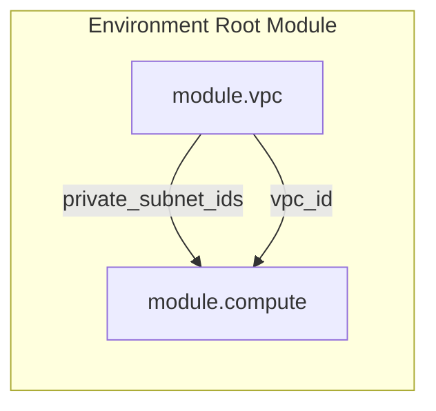
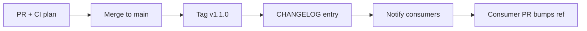

# Week 3 — Lecture: Terraform Modules — Enterprise Design

**Reading time:** ~55 minutes · **Instructor delivery:** ~3 hours with discussion

---

## 1. Why modules separate amateurs from platform teams

### 1.1 The copy-paste crisis

Without modules, every team maintains its own VPC definition. Drift appears within weeks:

- Team A enables VPC flow logs; Team B does not
- Team C uses `/20` CIDRs; Team D overlaps corporate ranges
- Security mandates NACL rules that only exist in one repository

**Modules** encode approved patterns once. Consumers pass **inputs** (environment name, CIDR) and receive **outputs** (subnet IDs, VPC ID) without reimplementing internals.

### 1.2 Module as contract

Think of a module like a published API:

| API concept | Terraform module |
|-------------|------------------|
| Request parameters | Input variables |
| Response payload | Output values |
| Version semver | Git tag / registry version |
| Deprecation notice | CHANGELOG + upgrade guide |
| Breaking change | Major version bump |

Platform engineering’s job is to make the **right thing easy**—secure defaults, sensible variable validations, documented examples.

### 1.3 Course context

This week you work in `bayareala8s/training/Terraform-for-Real-Enterprises`:

- Extend [`modules/vpc/`](../../modules/vpc/)
- Compose with compute in [`labs/shared/environments/`](../../labs/shared/environments/)
- Tag all resources: `Course=terraform-enterprise`

---

## 2. Module anatomy and interfaces

### 2.1 Standard file layout

```text
modules/vpc/
├── README.md          # Human-facing contract + examples
├── versions.tf        # terraform + provider constraints
├── variables.tf       # inputs (the public API)
├── outputs.tf         # values for parent modules / root
├── main.tf            # resources
├── locals.tf          # internal computed values (not exported)
└── CHANGELOG.md       # version history (Week 3 lab)
```

### 2.2 Calling a module

```hcl
module "vpc" {
  source = "../../../../modules/vpc"

  name                 = "${var.project_name}-${var.environment}"
  vpc_cidr             = var.vpc_cidr
  availability_zones   = var.availability_zones
  enable_nat_instance  = var.enable_nat_instance
  tags                 = local.common_tags
}
```

| Argument | Rule |
|----------|------|
| `source` | Required—local path, Git URL, or registry |
| Named arguments | Map to `variable` blocks inside module |
| `providers` | Optional—alias mapping for multi-account |

### 2.3 Input variable design

**Good variables** are typed, described, and validated:

```hcl
variable "vpc_cidr" {
  type        = string
  description = "RFC1918 CIDR for the VPC. Must not overlap corporate WAN ranges."

  validation {
    condition     = can(cidrhost(var.vpc_cidr, 0))
    error_message = "vpc_cidr must be valid CIDR notation."
  }
}

variable "environment" {
  type = string
  validation {
    condition     = contains(["dev", "test", "prod"], var.environment)
    error_message = "environment must be dev, test, or prod."
  }
}
```

| Practice | Rationale |
|----------|-----------|
| Use `type` constraints | Catch errors at `terraform plan` |
| Sensible `default` only for safe options | Required inputs force conscious choice |
| `sensitive = true` for secrets | Redact plan output |
| Avoid `any` unless truly dynamic | Loses validation power |

### 2.4 Outputs as integration points

```hcl
output "vpc_id" {
  description = "ID of the VPC for peering and security group modules."
  value       = aws_vpc.this.id
}

output "private_subnet_ids" {
  description = "Private subnet IDs for compute module placement."
  value       = aws_subnet.private[*].id
}
```

**Export only what consumers need.** Exposing internal route table IDs encourages tight coupling.



---

## 3. Composition patterns

### 3.1 Root module vs child module

| Layer | Responsibility |
|-------|----------------|
| **Root module** | `labs/shared/environments/dev` — wires modules, backends, providers |
| **Child module** | `modules/vpc` — focused resource set |
| **Nested module** | Module calling another module internally |

Root modules should read like **orchestration**, not 2,000 lines of resources.

### 3.2 Passing data: outputs → inputs

```hcl
module "compute" {
  source = "../../../../modules/compute"

  subnet_id   = module.vpc.private_subnet_ids[0]
  vpc_id      = module.vpc.vpc_id
  environment = var.environment
}
```

**Implicit dependencies:** Terraform builds the graph from references—`module.compute` waits for `module.vpc` automatically.

### 3.3 `depends_on` — use sparingly

Prefer reference-based dependencies. Use `depends_on` only when:

- Resource in module B must wait for resource in module A **without** attribute reference
- Bootstrapping ordering (e.g. attachment after route propagation)

Overusing `depends_on` hides the real graph and slows plans.

### 3.4 Count, for_each, and modules

```hcl
module "subnet_pair" {
  for_each = toset(var.availability_zones)
  source   = "./subnet"
  az       = each.key
}
```

Enterprise pattern: `for_each` over stable keys (AZ names, account IDs)—not list indices that shift when reordering.

### 3.5 Anti-patterns

| Anti-pattern | Problem |
|--------------|---------|
| God module (VPC + RDS + ECS) | Cannot version or approve independently |
| 40 undocumented variables | Consumers guess; production incidents |
| Hard-coded account IDs in module | Breaks reuse across environments |
| Circular module references | Terraform cannot plan |

---

## 4. Versioning and release management

### 4.1 Semantic versioning (SemVer)

| Bump | When | Consumer impact |
|------|------|-----------------|
| **MAJOR** | Breaking input/output changes | Must update calling code |
| **MINOR** | Backward-compatible features (new optional variable) | Safe upgrade |
| **PATCH** | Bug fixes, doc only | Safe upgrade |

Example tag: `v1.2.3` on Git; module consumers pin:

```hcl
source = "git::https://github.com/bayareala8s/tf-modules.git//vpc?ref=v1.2.3"
```

### 4.2 Pinning sources in enterprises

| Source type | Example | Typical use |
|-------------|---------|-------------|
| Local path | `../../../../modules/vpc` | Monorepo dev (this course) |
| Git SSH/HTTPS | `git::ssh://git@github.com/org/tf-modules.git//vpc?ref=v1.0.0` | Internal modules |
| Terraform Registry | `app.terraform.io/org/vpc/aws` | Versioned with RBAC |
| S3 / GCS (rare) | Packaged zip | Air-gapped |

**Never** use `ref=main` in production—every apply can pull different code.

### 4.3 Release workflow



### 4.4 Deprecation policy

When removing a variable:

1. **Minor release:** mark variable deprecated in README; emit `terraform console` warning via `lifecycle` precondition if possible
2. **Major release:** remove variable; document migration in CHANGELOG

---

## 5. Publishing modules internally

### 5.1 README as contract

Every published module needs:

- Purpose paragraph
- Minimal working example
- Inputs table (name, type, required, default)
- Outputs table
- Upgrade notes between major versions

### 5.2 CHANGELOG discipline

```markdown
## [1.1.0] - 2026-05-27
### Added
- Optional S3 VPC gateway endpoint (var.enable_s3_endpoint)

## [1.0.0] - 2026-05-20
### Added
- Initial VPC with public/private subnets and NAT instance option
```

### 5.3 Private registry vs Git

| Approach | Pros | Cons |
|----------|------|------|
| **Git tags** | Simple, no extra infra | Harder discovery, no download metrics |
| **Terraform Cloud/Enterprise registry** | RBAC, signing, docs UI | License cost |
| **Artifactory / generic** | Existing artifact processes | Less native Terraform UX |

For BayAreaLa8s labs, Git tags suffice; enterprises at scale adopt private registry.

---

## 6. Testing, validation, and quality gates

### 6.1 Static checks (before AWS API calls)

| Tool | Checks |
|------|--------|
| `terraform fmt` | Formatting consistency |
| `terraform validate` | Syntax + internal consistency |
| `tflint` | AWS-specific lint rules |
| `checkov` / `tfsec` | Security misconfigurations |

Week 4 runs these in CI; Week 3 runs locally on modules.

### 6.2 Integration testing options

| Method | Description |
|--------|-------------|
| **Terratest** (Go) | Deploy real infra in ephemeral account; destroy after |
| **terraform test** (1.6+) | Native `.tftest.hcl` mock and integration tests |
| **Manual plan in CI** | Plan-only on PR against dev account |

Enterprises rarely skip **plan on PR** even when unit tests exist.

### 6.3 Module examples directory

```text
modules/vpc/examples/complete/
├── main.tf
├── variables.tf
└── README.md
```

Examples double as documentation and test fixtures.

---

## 7. Multi-environment consumption

### 7.1 Same module, different tfvars

```text
labs/shared/environments/dev/terraform.tfvars   → vpc_cidr = 10.10.0.0/16
labs/shared/environments/prod/terraform.tfvars  → vpc_cidr = 10.30.0.0/16
```

Root module code is identical; **inputs** differentiate environments.

### 7.2 validate all environments

```bash
make validate   # course Makefile — runs validate in dev/test/prod dirs
```

Catch broken module references before merge.

---

## 8. Enterprise module governance

### 8.1 Module approval board

Typical process:

1. Team proposes module or change in platform repo
2. Security reviews Checkov baseline
3. Network architect approves CIDR/NACL defaults
4. Platform tags release; consumers upgrade on schedule

### 8.2 Allowed module sources

Organizations maintain an allow-list:

- Only `app.terraform.io/company/*` or `git::github.com/company/terraform-modules/*`
- Deny public registry modules without security review

### 8.3 Cost and tagging

Modules should accept `tags` map and merge with internal locals—never override `Course=terraform-enterprise` in student labs; in production, merge `CostCenter`, `Owner`, `DataClassification`.

---

## 9. Module wrappers and thin roots

### 9.1 Wrapper pattern

Large enterprises forbid teams from calling `modules/vpc` directly. Instead they publish **wrappers**:

```hcl
# modules/wrappers/standard-vpc/main.tf
module "vpc" {
  source = "git::https://github.com/bayareala8s/tf-modules.git//vpc?ref=v1.2.0"

  name       = var.name
  vpc_cidr   = var.vpc_cidr
  tags       = merge(var.tags, local.mandatory_tags)
  # Force org defaults:
  enable_flow_logs = true
  enable_nat_instance = false  # org uses NAT Gateway service module instead
}
```

Wrappers encode **policy defaults** while still consuming versioned inner modules.

### 9.2 Thin root modules

Application repos contain only:

```text
environments/prod/
  main.tf      # calls wrapper + app modules
  backend.hcl
  terraform.tfvars
```

Benefits: application teams never fork VPC logic; platform bumps wrapper when inner module updates.

### 9.3 When wrappers hurt

| Problem | Symptom |
|---------|---------|
| Too many layers | Debugging requires tracing three repos |
| Hidden required vars | Wrapper does not expose needed inner variable |
| Version lag | Wrapper pins old inner module for months |

Governance: wrappers must expose passthrough variables for advanced teams with documented exceptions.

---

## 10. Advanced composition: count, for_each, and moved blocks

### 10.1 Module instances with for_each

```hcl
variable "spoke_accounts" {
  type = map(object({
    account_id = string
    cidr       = string
  }))
}

module "spoke_vpc" {
  for_each = var.spoke_accounts
  source   = "../../modules/vpc"

  name     = "spoke-${each.key}"
  vpc_cidr = each.value.cidr
}
```

Outputs aggregate:

```hcl
output "vpc_ids" {
  value = { for k, m in module.spoke_vpc : k => m.vpc_id }
}
```

### 10.2 moved blocks (refactoring without destroy)

Terraform 1.1+ `moved` blocks help rename modules without recreation:

```hcl
moved {
  from = module.old_vpc
  to   = module.vpc
}
```

Enterprise refactors use moved + plan review in CI to prove zero destructive changes.

### 10.3 Provider mapping in nested stacks

When a module needs a specific provider alias:

```hcl
module "vpc" {
  source = "../../modules/vpc"
  providers = {
    aws = aws.workload
  }
}
```

Document required `providers` meta-argument in module README—missing alias causes obscure init errors.

---

## 11. Consumer upgrade workflows

### 11.1 Dependabot for Terraform modules

Some teams use Renovate/Dependabot to open PRs bumping `ref=v1.1.0` → `v1.2.0`. CI plan on PR is mandatory—never auto-merge module bumps without green plan.

### 11.2 Upgrade runbook template

1. Read CHANGELOG for breaking changes
2. Bump `ref` in a feature branch
3. Run `terraform plan` in lowest environment
4. Fix code for renamed variables/outputs
5. Promote through test → prod with approvals

### 11.3 Parallel version support

Platform may support `v1.x` and `v2.x` branches simultaneously for six months—communicate sunset dates in internal Slack and registry docs.

---

## 12. Module metrics and discoverability

### 12.1 What platform teams measure

| Metric | Why |
|--------|-----|
| Adoption count | Which modules matter |
| Mean time to upgrade | Friction signal |
| Failed plans post-release | Quality of release notes |
| Checkov exceptions per module | Security debt |

### 12.2 Documentation site

Private registry or Backstage catalog entries link README, owners (`team-platform@`), and Slack channel—reduces “which VPC module is canonical?” confusion.

### 12.3 Examples as contracts

`examples/complete` should `terraform init && terraform validate` in CI—even if not applied—to prevent documentation rot.

---

## 13. Troubleshooting module failures in teams

### 13.1 "Module not found" and source errors

| Error | Common cause | Fix |
|-------|--------------|-----|
| `Failed to download module` | SSH key missing for private Git | Configure deploy keys or HTTPS token |
| `Unsupported version` | `ref` points to deleted tag | Pin to existing semver tag |
| `Unresolvable module version` | Registry authentication | `terraform login` for private registry |

Always run `terraform init -upgrade` locally when debugging consumer issues—match CI behavior.

### 13.2 Unexpected resource changes after module bump

When a minor release adds **default=true** for a new feature flag, plans may show new resources. Mitigations:

- Release notes must call out new defaults
- Use explicit `feature = false` in consumer until ready
- Platform provides wrapper that sets safe org defaults

### 13.3 Variable type mismatches

Terraform 1.5+ strict typing rejects:

```hcl
# Wrong: string where bool expected
enable_nat = "true"
```

Module README should show correct types; CI `validate` catches before merge.

### 13.4 Collaboration norms

| Role | Responsibility |
|------|----------------|
| Module author | Semver, CHANGELOG, backward compatibility |
| Consumer team | Pin versions, read release notes before bump |
| Security | Checkov baseline on module repo |
| Platform council | Approve new public module sources |

Healthy module ecosystems are **social contracts** backed by automation—not only HCL.

### 13.5 Course lab integration checklist

Before tagging `modules/vpc/v1.0.0` in BayAreaLa8s labs, verify:

1. `terraform fmt -recursive` clean under `modules/vpc`
2. `make validate` passes for dev, test, prod environment roots
3. README inputs/outputs tables match `variables.tf` and `outputs.tf` exactly
4. New optional features default to **off** unless explicitly enabling safer org posture
5. `Course=terraform-enterprise` tag merges correctly via `var.tags` or `default_tags` chain
6. CHANGELOG entry describes consumer-facing changes in plain language

This checklist prevents “tag early, fix later” churn when Week 4 CI plans every module change.

### 13.6 Naming and tagging conventions inside modules

Resource names inside modules should use **name prefixes** from a single `var.name` to avoid collisions when multiple instances coexist via `for_each`:

```hcl
resource "aws_vpc" "this" {
  tags = merge(var.tags, { Name = "${var.name}-vpc" })
}
```

Avoid hard-coding `dev` or `prod` inside module resources—callers pass environment via tags or name. For BayAreaLa8s, ensure `Course = "terraform-enterprise"` survives merges:

```hcl
tags = merge(var.tags, local.module_tags, { Course = "terraform-enterprise" })
```

Document in README whether the module enforces course tags or expects the root `default_tags` provider block to apply them—both patterns are valid if stated clearly.

### 13.7 Intellectual property and licensing

Internal modules should declare license (`Apache-2.0`, proprietary) in README. If teams copy public Registry modules into a private fork, record provenance and version pin—license obligations and security review still apply. Platform teams sometimes maintain a **curated list** of approved upstream modules with hash-pinned sources to prevent typosquatting on the public Registry. Treat module repositories as production code: branch protection, required reviews, and signed tags where policy allows.

---

## 14. Week 3 synthesis

Modules are how enterprises scale Terraform from **one engineer’s stack** to **forty teams on the same guardrails**. Your deliverables:

- A **clear interface** (variables/outputs/README)
- **Composition** wiring VPC to compute
- A **versioned release** consumers can pin

Next week: automate plan/apply with GitHub Actions, OIDC, and approval gates—so module upgrades flow through the same pipeline as application code.

---

## Further reading

- [Terraform: Module overview](https://developer.hashicorp.com/terraform/language/modules)
- [Terraform: Module sources](https://developer.hashicorp.com/terraform/language/modules/sources)
- [Semantic Versioning 2.0.0](https://semver.org/)
- [AWS Prescriptive Guidance: Terraform modules](https://docs.aws.amazon.com/prescriptive-guidance/latest/terraform-aws-provider-best-practices/structure.html)
