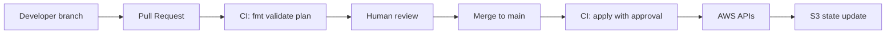
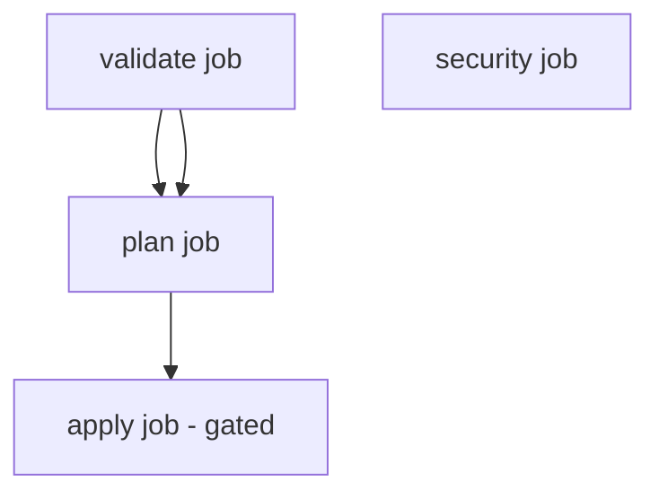
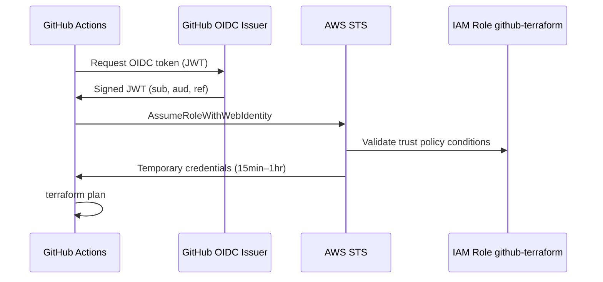
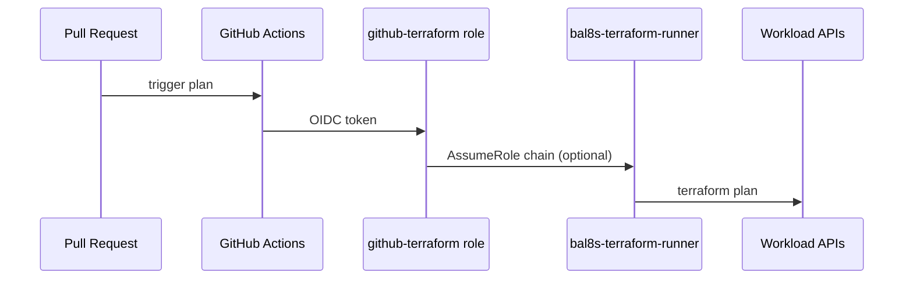

# Week 4 — Lecture: CI/CD Pipelines for Terraform

**Reading time:** ~55 minutes · **Instructor delivery:** ~3 hours with discussion

---

## 1. From laptop applies to GitOps

### 1.1 Why CI/CD is non-negotiable

Week 1 taught remote state. Week 2 taught cross-account roles. Week 3 taught reusable modules. None of that prevents:

- An engineer running `terraform apply` at 2 a.m. without review
- Undetected `terraform.tfvars` secrets pushed to Git
- Provider upgrades breaking production on a laptop with old plugins

**CI/CD for Terraform** means every infrastructure change flows through the same controls as application code: branch, pull request, automated checks, peer review, auditable apply.

### 1.2 GitOps principles for infrastructure

| Principle | Terraform implementation |
|-----------|-------------------------|
| **Git is source of truth** | `.tf` files merged to `main` define desired state |
| **Pull request workflow** | Plans attached to PR comments |
| **Separation of plan and apply** | Plan on PR; apply only on protected branch |
| **Immutable audit trail** | Git history + CI logs + CloudTrail |
| **Least privilege automation** | OIDC short-lived credentials, not static keys |



> **Figure (download):** [PNG](../../diagrams/png/week-04-diagram-01.png) · [SVG](../../diagrams/svg/week-04-diagram-01.svg)


### 1.3 Course repository wiring

**BayAreaLa8s — Terraform for Real Enterprises**

- Workflow template: [`labs/week-04/workflows/terraform-ci.yml`](../../labs/week-04/workflows/terraform-ci.yml)
- OIDC setup: [`labs/week-04/docs/oidc-setup.md`](../../labs/week-04/docs/oidc-setup.md)
- Working directory default: `labs/shared/environments/dev`
- Tag: `Course=terraform-enterprise`

---

## 2. Pipeline stages and gates

### 2.1 Standard stage model

| Stage | Commands / tools | Gate |
|-------|------------------|------|
| **Lint** | `terraform fmt -check`, `tflint` | Fail PR if formatting drift |
| **Validate** | `terraform init -backend=false`, `terraform validate` | Syntax and provider schema |
| **Security** | `checkov`, `tfsec`, custom policies | Block or warn by severity |
| **Plan** | `terraform plan` (remote state + AWS creds) | Post plan to PR; no apply |
| **Apply** | `terraform apply` saved plan or approved run | Manual approval + environment protection |
| **Post** | Drift detection (Week 5), notifications | Operational |

### 2.2 Fail fast vs soft fail

| Tool | Course default | Production recommendation |
|------|----------------|---------------------------|
| `fmt -check` | Hard fail | Hard fail |
| `validate` | Hard fail | Hard fail |
| `checkov` | `soft_fail: true` in lab | Hard fail on HIGH/CRITICAL after baseline |

Document accepted risks in `docs/security/week-04-ci-findings.md`—auditors prefer explicit acceptance over silent ignores.

### 2.3 Saved plan files (optional advanced)

```bash
terraform plan -out=tfplan.binary
terraform apply tfplan.binary
```

Ensures apply executes **exactly** what reviewers approved. Requires artifact storage between jobs and encryption at rest.

---

## 3. GitHub Actions for Terraform

### 3.1 Workflow triggers

```yaml
on:
  pull_request:
    branches: [main]
    paths:
      - "modules/**"
      - "labs/shared/**"
      - ".github/workflows/**"
  push:
    branches: [main]
    paths:
      - "modules/**"
      - "labs/shared/**"
```

**Path filters** reduce noise—docs-only changes should not run full AWS plans.

### 3.2 Job structure (course template)



> **Figure (download):** [PNG](../../diagrams/png/week-04-diagram-02.png) · [SVG](../../diagrams/svg/week-04-diagram-02.svg)


| Job | Purpose |
|-----|---------|
| `validate` | fmt, init (no backend), validate |
| `security` | checkov on `modules/` |
| `plan` | init + plan with AWS creds |
| `apply` | only `main` + environment approval |

### 3.3 Essential actions

```yaml
- uses: actions/checkout@v4
- uses: hashicorp/setup-terraform@v3
  with:
    terraform_version: "1.7.5"
- uses: aws-actions/configure-aws-credentials@v4
  with:
    role-to-assume: ${{ secrets.AWS_ROLE_ARN }}
    aws-region: us-west-2
```

Pin action versions (`@v4`)—`@master` is acceptable only for lab soft-fail tools with eyes open.

### 3.4 Permissions block

```yaml
permissions:
  contents: read
  pull-requests: write   # comment plan on PR
  id-token: write        # required for OIDC
```

Missing `id-token: write` breaks OIDC authentication—symptom: `Not authorized to perform sts:AssumeRoleWithWebIdentity`.

### 3.5 Plan output on pull requests

Use `hashicorp/setup-terraform` built-in wrapper or `terraform plan` piped to PR comment action. Reviewers should see:

- Resource creates/updates/deletes count
- Any `forces replacement` lines
- Error messages from provider

**Teaching moment:** A green `validate` job does not mean a safe plan.

---

## 4. OIDC federation — no long-lived AWS keys in GitHub

### 4.1 The problem with access keys in secrets

| Risk | Consequence |
|------|-------------|
| Key in repo secret exfiltrated | Attacker has AWS API access until rotation |
| Shared key across repos | Blast radius = all repos |
| Rotation toil | Keys expire; pipelines break at holidays |

### 4.2 OIDC flow



> **Figure (download):** [PNG](../../diagrams/png/week-04-diagram-03.png) · [SVG](../../diagrams/svg/week-04-diagram-03.svg)


### 4.3 IAM OIDC provider

| Setting | Value |
|---------|-------|
| Provider URL | `https://token.actions.githubusercontent.com` |
| Audience | `sts.amazonaws.com` |
| Thumbprint | GitHub’s (documented by AWS) |

### 4.4 Trust policy conditions

```json
"Condition": {
  "StringEquals": {
    "token.actions.githubusercontent.com:aud": "sts.amazonaws.com"
  },
  "StringLike": {
    "token.actions.githubusercontent.com:sub": "repo:bayareala8s/training:*"
  }
}
```

Tighten `sub` for production:

- `repo:ORG/REPO:ref:refs/heads/main` for apply role
- `repo:ORG/REPO:pull_request` for plan-only role

### 4.5 Repository configuration

Secret: `AWS_ROLE_ARN` = `arn:aws:iam::ACCOUNT:role/github-terraform`

Workflow:

```yaml
- uses: aws-actions/configure-aws-credentials@v4
  with:
    role-to-assume: ${{ secrets.AWS_ROLE_ARN }}
    aws-region: ${{ env.AWS_REGION }}
```

**Cross-account:** OIDC role in shared services account assumes `bal8s-terraform-runner` in workload accounts (Week 2)—chain roles or use separate workflow matrices per account.

---

## 5. Plan/apply gates and environments

### 5.1 GitHub Environments

Repository → Settings → Environments → `dev`, `prod`

| Setting | Dev | Prod |
|---------|-----|------|
| Required reviewers | 0–1 (lab) | 2+ |
| Wait timer | 0 min | optional cooling |
| Deployment branches | `main` | `main` only |
| Secrets | `AWS_ROLE_ARN_DEV` | `AWS_ROLE_ARN_PROD` |

```yaml
apply:
  if: github.ref == 'refs/heads/main'
  environment: prod
  needs: [plan]
```

### 5.2 Branch protection synergy

| Branch rule | Terraform benefit |
|-------------|-------------------|
| Require PR before merge | No direct push apply |
| Require status checks | CI plan must pass |
| Require CODEOWNERS | Platform team reviews module changes |
| Dismiss stale reviews | Re-plan after new commits |

### 5.3 Who may apply?

| Role | Plan on PR | Apply to prod |
|------|------------|---------------|
| Developer | Yes | No |
| Platform engineer | Yes | With approval |
| CI service principal | Via workflow | Only protected environment |

Humans should not hold static admin keys for routine applies.

### 5.4 Mock backend in early labs

Course `plan` job may use `terraform init -backend=false` when students lack OIDC yet—**document** that production must use remote state init with locking.

---

## 6. Validation and policy-as-code

### 6.1 terraform fmt

Enforces canonical HCL style. Run locally before push:

```bash
terraform fmt -recursive
```

CI: `terraform fmt -check -recursive` from repo root covering `modules/` and `labs/shared/`.

### 6.2 terraform validate

Catches:

- Unknown arguments
- Type mismatches
- Missing required providers

Does **not** catch: AWS permission errors, logic bugs, security misconfigs.

### 6.3 tflint

AWS ruleset examples:

- Invalid instance type in region
- Deprecated resource arguments
- Missing required tags (custom rules)

```bash
cd modules/vpc
tflint --init && tflint
```

### 6.4 checkov

Scans for:

- S3 public access
- Unencrypted EBS
- Overly permissive security groups

Course workflow scans `modules/` with `soft_fail: true` initially—students remediate in Lab 4.3.

### 6.5 OPA / Sentinel (enterprise)

Large orgs embed custom policies:

- “All S3 buckets must have versioning”
- “No `0.0.0.0/0` on port 22”

HashiCorp Sentinel integrates with Terraform Cloud; OPA is common in Kubernetes-adjacent platform teams.

---

## 7. Secrets, variables, and configuration

### 7.1 What belongs in GitHub

| Store in GitHub Secrets | Never store in GitHub |
|-------------------------|----------------------|
| Role ARNs for OIDC | Long-lived `AWS_SECRET_ACCESS_KEY` |
| Terraform Cloud tokens | Master passwords |
| Webhook HMAC secrets | Full `terraform.tfvars` with DB passwords |

Use **AWS Systems Manager Parameter Store** or **Secrets Manager** for application secrets referenced by Terraform data sources.

### 7.2 TF_VAR_ environment variables

```yaml
env:
  TF_VAR_environment: dev
  TF_VAR_owner: ci
```

Maps to `variable "environment"` in Terraform—useful for CI without committing tfvars.

### 7.3 Backend credentials

S3 backend uses OIDC role in CI—the same role needs `s3:GetObject`, `s3:PutObject`, `dynamodb:PutItem` on lock table.

---

## 8. Operational excellence

### 8.1 Pipeline failures students will see

| Error | Likely cause |
|-------|--------------|
| `Error acquiring state lock` | Concurrent apply or stale lock |
| `AccessDenied` on plan | SCP, IAM role, or wrong account |
| `Backend initialization required` | Missing backend config in CI |
| OIDC `Not authorized` | Trust policy `sub` mismatch |

### 8.2 Observability

- GitHub Actions run logs (retention policy)
- CloudTrail for `AssumeRoleWithWebIdentity` and resource APIs
- Optional: Slack/PagerDuty on apply failure

### 8.3 Cost control

CI plans call AWS APIs (refresh). Mitigate:

- `-refresh=false` for doc-only checks (use carefully)
- Separate read-only role for plan
- `make lab-stop` after integration tests

---

## 9. Pull request workflows and plan artifacts

### 9.1 Plan as review artifact

Reviewers need readable plans, not only green checks:

| Practice | Benefit |
|----------|---------|
| Post plan summary as PR comment | Async review across time zones |
| Collapse large plans; highlight `forces replacement` | Focus attention |
| Link to CI job raw log | Forensics when comment truncated |
| Require CODEOWNERS on `modules/` | Platform eyes on shared code |

`hashicorp/setup-terraform` wraps CLI output for GitHub—ensure workflow has `pull-requests: write`.

### 9.2 Comparing plans across commits

When students push new commits, CI re-plans. Reviewers verify **delta narrowed**—not just final green. Teach “plan diff of plans” informally: fewer destroys is progress.

### 9.3 Binary plan artifacts

Advanced pipeline:

```yaml
- run: terraform plan -out=tfplan
- uses: actions/upload-artifact@v4
  with:
    name: tfplan-${{ github.sha }}
    path: labs/shared/environments/dev/tfplan
```

Apply job downloads same artifact—proves apply matches reviewed plan. Encrypt artifacts; short retention.

---

## 10. Matrix builds and monorepo scale

### 10.1 Strategy matrix per environment

```yaml
strategy:
  matrix:
    environment: [dev, test, prod]
steps:
  - run: terraform plan
    working-directory: labs/shared/environments/${{ matrix.environment }}
```

**Caution:** prod plan on every PR may be noisy—use environment-specific workflows or manual `workflow_dispatch` for prod plans.

### 10.2 Path filters (course template)

The course workflow limits triggers to:

```yaml
paths:
  - "modules/**"
  - "labs/shared/**"
```

When `modules/vpc` changes, all dependent environment plans should run—path filters must include module paths affecting stacks.

### 10.3 Nightly full scan

Schedule `cron: '0 6 * * *'` workflow for comprehensive plan across all directories—catches drift and provider updates even without PRs.

---

## 11. Terraform Cloud / HCP vs GitHub Actions

| Capability | GitHub Actions | Terraform Cloud |
|------------|----------------|-----------------|
| VCS integration | Native GitHub | Multi-VCS |
| Remote execution | Self-hosted runners | Managed workers |
| State / RBAC | Bring S3 + IAM | Built-in workspaces |
| Policy | Third-party (Checkov) | Sentinel (paid tiers) |
| Cost | Runner minutes + AWS | Per-seat + RUM |

**Enterprise pattern:** TFC for state and policy; GitHub Actions for org-standard CI—or all-in on Actions with S3 backend as this course teaches.

### 11.1 When to add Terraform Cloud later

Teams hitting pain with DIY locking, audit UI, or workspace RBAC often adopt TFC **without** abandoning modules—migrate state via `terraform init -migrate-state`.

---

## 12. Promotion and environment variables in CI

### 12.1 Promotion is not just apply

Week 5 formalizes promotion; Week 4 sets hooks:

```text
PR → plan dev
merge → apply dev (auto)
manual workflow → plan test → apply test (approval)
manual workflow → plan prod → apply prod (2 approvals)
```

Same module version should flow **forward**—never apply prod before dev succeeded.

### 12.2 GitHub Environments + secrets per account

| Environment | Secret | AWS account |
|-------------|--------|-------------|
| `dev` | `AWS_ROLE_ARN_DEV` | Dev workload |
| `prod` | `AWS_ROLE_ARN_PROD` | Prod workload |

Workflow `environment:` selects role—prevents dev workflow from touching prod credentials.

### 12.3 tfvars in CI

Prefer:

- `terraform.tfvars.example` committed
- GitHub Environment variables for non-secret overrides
- Secrets Manager for database passwords **never** in GitHub

---

## 13. Integrating Week 2 cross-account roles

End-to-end auth chain for BayAreaLa8s:



> **Figure (download):** [PNG](../../diagrams/png/week-04-diagram-04.png) · [SVG](../../diagrams/svg/week-04-diagram-04.svg)


Some orgs use **one** OIDC role with direct permissions; others chain to per-account runners from Week 2. Document which pattern your assignment uses.

### 13.1 Minimum IAM permissions for CI plan vs apply

| Permission area | Plan role | Apply role |
|-----------------|-----------|------------|
| `ec2:Describe*` | Yes | Yes |
| `ec2:RunInstances` | No (optional) | If creating instances |
| `s3:GetObject` on state | Yes | Yes |
| `s3:PutObject` on state | No | Yes |
| `dynamodb:PutItem` lock | No | Yes |
| `iam:CreateRole` | No | Only if managing IAM |

Splitting roles prevents a compromised plan job from acquiring apply-level state write without additional assume.

### 13.2 Auditing CI infrastructure changes

CloudTrail events to monitor:

- `AssumeRoleWithWebIdentity` from GitHub OIDC
- `PutObject` on state bucket keys
- Spike in `Delete` API calls after apply jobs

Correlate `userAgent` and session name with GitHub run URL in runbooks.

---

## 14. Compliance and evidence collection

### 14.1 SOC2 change management mapping

| Control | Evidence from Week 4 pipeline |
|---------|------------------------------|
| Change approval | GitHub PR reviews + environment reviewers |
| Separation of duties | Author ≠ approver for prod apply |
| Testing | CI validate/plan logs |
| Rollback | Git revert + terraform apply (Week 6 deep dive) |

Store CI logs per retention policy (often 1–7 years for regulated clients).

### 14.2 Secret scanning in pipelines

Add `trufflehog` or GitHub secret scanning on push—blocks accidental `AKIA` commits before Terraform runs. Pair with `.gitignore` for `*.tfvars` and pre-commit hooks locally.

### 14.3 Third-party actions supply chain

Pin actions to commit SHA or trusted version tags (`@v4`). Review `hashicorp/setup-terraform` and `aws-actions/configure-aws-credentials` changelogs before bumping—supply-chain attacks target popular actions.

### 14.4 Course workflow checklist (BayAreaLa8s)

Before declaring Week 4 labs complete:

1. `.github/workflows/terraform-ci.yml` exists and triggers on `modules/**` changes
2. `permissions.id-token: write` present when OIDC enabled
3. GitHub Environments `dev` (and optionally `prod`) configured with reviewers
4. `docs/security/week-04-ci-findings.md` lists Checkov/tflint results with fix or accepted risk
5. No `AWS_SECRET_ACCESS_KEY` in repository secrets—only `AWS_ROLE_ARN`
6. After integration tests, run `make lab-stop` so `Course=terraform-enterprise` resources do not incur overnight NAT charges

---

## 15. Week 4 synthesis

CI/CD closes the loop:

1. **Modules** (Week 3) change in Git
2. **Pipeline** validates and plans automatically
3. **Humans** review plan output
4. **Protected apply** updates AWS and state
5. **CloudTrail** proves who changed what

Week 5 adds environment promotion and drift detection—the pipeline’s outputs become operational signals, not just merge requirements.

---

## Further reading

- [GitHub: OpenID Connect with AWS](https://docs.github.com/en/actions/deployment/security-hardening-your-deployments/configuring-openid-connect-to-amazon-web-services)
- [HashiCorp: Automate Terraform with CI/CD](https://developer.hashicorp.com/terraform/tutorials/automation/github-actions)
- [AWS: IAM OIDC identity providers](https://docs.aws.amazon.com/IAM/latest/UserGuide/id_roles_providers_create_oidc.html)
- Course OIDC: [`labs/week-04/docs/oidc-setup.md`](../../labs/week-04/docs/oidc-setup.md)
