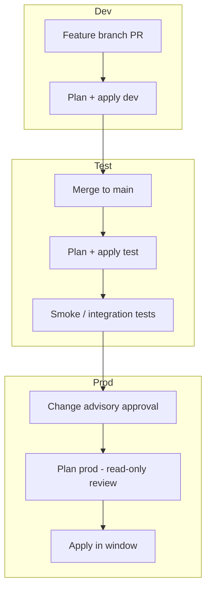
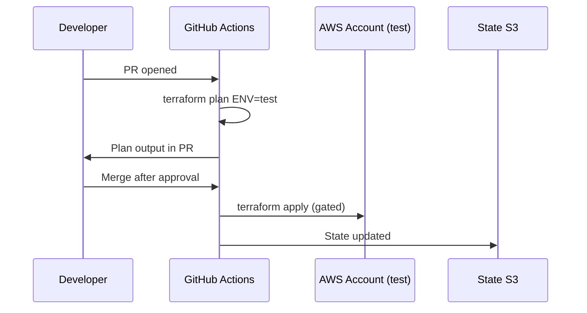
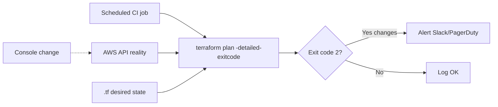
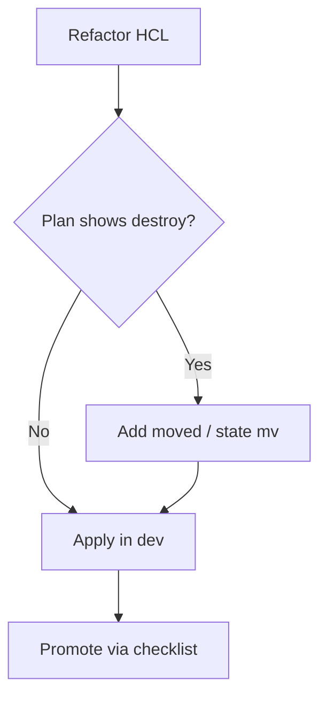

# Week 5 — Lecture: Environment Promotion, Drift & Safe Refactoring

**Reading time:** ~55 minutes · **Instructor delivery:** ~3 hours with discussion

---

## 1. Why promotion is not “copy-paste to prod”

### 1.1 The enterprise reality

Most outages attributed to “Terraform” are actually **process failures**: the right code applied to the wrong environment, with wrong variables, during a change freeze, without a reviewed plan. Environment promotion is the disciplined path that moves **tested intent** from lower environments to production—not a mechanical file copy.

Enterprises typically operate:

| Environment | Purpose | Typical guardrails |
|-------------|---------|-------------------|
| **dev** | Fast iteration, feature branches | Engineers may apply; lower cost; relaxed approvals |
| **test** (staging) | Production-like validation | Peer review; integration tests; same modules as prod |
| **prod** | Customer-facing workloads | Change advisory; maintenance windows; break-glass only |

In this course, `labs/shared/environments/dev|test|prod/` share **modules** but differ in **tfvars**, **backend keys**, and **operational policy**.

### 1.2 Same code, different inputs

The anti-pattern is three unrelated repositories that drift apart. The enterprise pattern is:

```text
modules/vpc/          # single source of truth
environments/dev/     # backend key + tfvars
environments/test/
environments/prod/
```

Promotion means: **a specific Git commit** (or module version tag) that passed test is eligible for prod—plus checklists, not just `terraform apply`.



### 1.3 What must differ per environment

| Dimension | dev | test | prod |
|-----------|-----|------|------|
| State key | `environments/dev/...` | `environments/test/...` | `environments/prod/...` |
| Network CIDR | Non-overlapping RFC1918 | Non-overlapping | Non-overlapping |
| Instance sizes / NAT | Cost-optimized | Near-prod | SLA-driven |
| Approvals | Light | PR + plan artifact | CAB / manager + plan |
| AWS account | Often separate | Separate | Separate (Week 2) |

**Never** share one state file across environments. That couples blast radius and makes rollback ambiguous.

---

## 2. Promotion mechanics in Terraform

### 2.1 Backend isolation

Each environment directory configures:

```hcl
# backend.hcl (example)
bucket         = "student-terraform-state"
key            = "environments/test/terraform.tfstate"
dynamodb_table = "terraform-locks"
encrypt        = true
```

Unique keys ensure plans only touch resources for that environment. CI jobs parameterize `ENV=test` (see course `Makefile`).

### 2.2 Variable files and promotion artifacts

`terraform.tfvars` (gitignored) or CI secrets supply:

- `environment = "test"`
- `vpc_cidr = "10.20.0.0/16"`
- `enable_nat_gateway = false` (course cost control)

Promotion checklist items (operational, not Terraform syntax):

1. Module version pinned in `versions.tf` or module `ref=` tag
2. Plan artifact archived from test apply
3. Diff reviewed for **replacement** (`forces replacement`) resources
4. Rollback commit identified (Week 6)
5. Communications: status page, on-call notified if prod

### 2.3 Plan as the promotion gate

`terraform plan` is the contract between teams:

```bash
make plan ENV=test
# Save output: terraform plan -out=test.promotion.tfplan
```

Saved plans (`terraform apply test.promotion.tfplan`) reduce “plan drift” between review and apply—especially when providers refresh frequently.

| Plan signal | Promotion action |
|-------------|------------------|
| `0 to add, 0 to change, 0 to destroy` | Eligible if config matches policy |
| In-place update | Review blast radius; canary if available |
| `forces replacement` | Requires explicit approver; schedule window |
| Unexpected destroy | **Stop**—investigate drift or wrong workspace |

### 2.4 CI/CD integration (Week 4 recap)

Promotion pipelines should:

- Run `fmt`, `validate`, `tflint`, security scan on PR
- Post plan comment to PR for dev/test
- Require environment protection rules for prod apply
- Never store long-lived AWS keys in Git—OIDC roles (Week 4)



---

## 3. Configuration management vs promotion

### 3.1 Git is the source of truth

Terraform promotion assumes **infrastructure intent lives in Git**. Runtime configuration (secrets, feature flags) may live in Parameter Store, Secrets Manager, or SSM—but not in one engineer’s laptop `tfvars`.

### 3.2 Versioning modules

When teams consume internal modules via Git refs:

```hcl
module "vpc" {
  source = "git::https://github.com/org/terraform-modules.git//vpc?ref=v1.4.2"
}
```

Promotion includes **bumping `ref=`** in lower envs first, then prod after validation. Semantic versioning communicates breaking changes.

### 3.3 Hotfix path

Production emergencies sometimes require console or CLI fixes. Policy:

1. Fix customer impact (break-glass)
2. Open emergency PR reconciling Terraform within SLA (often 24–48h)
3. Run plan to confirm no further changes
4. Post-incident review: why was Terraform bypassed?

Skipping step 2 guarantees **drift** and repeat incidents.

---

## 4. Drift: definition, detection, impact

### 4.1 What drift is

**Drift** occurs when real infrastructure differs from Terraform’s **desired configuration** (`.tf` files) and/or **state**. Common causes:

| Cause | Example |
|-------|---------|
| Console edit | Security group rule added manually |
| Out-of-band automation | Legacy script resized ASG |
| Failed partial apply | Resource exists; state incomplete |
| External dependency | Manual certificate rotation not in code |
| Provider default changes | New default attribute after provider upgrade |

Drift is not always “bad”—sometimes it reveals needed code updates. The failure mode is **unreviewed** drift in production.

### 4.2 How Terraform detects drift

On `terraform plan`, Terraform **refreshes** state from APIs (default behavior) and compares to desired config. Output shows changes required to reconcile.

```text
# aws_security_group.app will be updated in-place
  ~ ingress = [
      - { ... manual rule ... },
    ]
```

Optional tools (driftctl, HCP Terraform drift detection, custom Lambda schedulers) scan at intervals and alert when plan would be non-empty.

### 4.3 Drift severity matrix

| Severity | Example | Response time |
|----------|---------|---------------|
| Low | Tag on non-critical resource | Next sprint |
| Medium | SG rule widening access | 24–72h |
| High | Public exposure, IAM change | Immediate revert or isolate |
| Critical | Data store encryption off | Incident response |

### 4.4 Drift detection architecture



Exit code `2` from `terraform plan -detailed-exitcode` means **changes pending**—useful for automation (handle carefully in CI; read-only credentials).

---

## 5. Drift remediation strategies

### 5.1 Decision tree

| Situation | Preferred action |
|-----------|------------------|
| Console change was wrong | `terraform apply` to revert to code |
| Console change was right | Update `.tf`, then apply |
| Resource exists, not in state | `terraform import` + verify plan clean |
| Resource in state, deleted in AWS | Remove from code or recreate; may need `state rm` |
| State wrong, AWS correct | `state rm` + import, or restore state version (Week 6) |

### 5.2 Refresh-only and apply discipline

`terraform apply -refresh-only` updates state without changing infrastructure—useful when you need state to match AWS before a careful plan. It does **not** replace governance; document when used.

### 5.3 Drift report (course practice)

Students document in `docs/drift-report-week05.md`:

- What changed (plan excerpt)
- Who/what caused drift (hypothesis)
- Remediation chosen
- Prevention: SCP deny on console edits, IAM, nightly plan job

### 5.4 Organizational prevention

| Control | Effect |
|---------|--------|
| SCP: deny `ec2:AuthorizeSecurityGroupIngress` except break-glass role | Reduces SG drift |
| AWS Config rules | Detect noncompliant resources |
| Mandatory PR for all `.tf` changes | Traceability |
| Read-only prod for most engineers | Limits console damage |

Terraform cannot prevent console access by itself—**IAM and SCPs** do.

---

## 6. Safe refactoring

### 6.1 Why refactoring is dangerous

Renaming resources, moving into modules, or splitting state changes **Terraform addresses**. Without migration, Terraform plans **destroy + create**—often changing IDs, DNS names, and causing outages.

### 6.2 `moved` blocks (Terraform ≥ 1.1)

Declare logical moves in configuration:

```hcl
moved {
  from = aws_instance.web
  to   = module.compute.aws_instance.web
}
```

Terraform updates state mapping without destroying the underlying resource (when addresses align correctly).

### 6.3 `terraform state mv`

CLI equivalent for operations teams:

```bash
terraform state mv 'aws_instance.web' 'module.compute.aws_instance.web'
```

Use when `moved` blocks are impractical (one-off surgery). Always:

1. `state pull` backup
2. Plan immediately after—expect minimal or no changes
3. Apply only if plan is acceptable

### 6.4 Splitting state (advanced)

Splitting one stack into two requires:

- `terraform state rm` from source (after export)
- `import` into destination—or `terraform state pull` manipulation (expert only)
- Coordination so dependencies (outputs → remote state) remain valid

Enterprises use **stack boundaries** early to avoid painful splits.

### 6.5 Refactoring checklist

| Step | Action |
|------|--------|
| 1 | Design target module layout |
| 2 | Identify resources with `forces replacement` risk |
| 3 | Choose `moved` vs `state mv` |
| 4 | Test in dev; plan must be clean or only in-place |
| 5 | Promote to test → prod |



---

## 7. Workspaces, directories, and promotion anti-patterns

### 7.1 Terraform workspaces vs environment directories

Enterprises overwhelmingly prefer **directory-per-environment** (this course) over **workspace switching** for prod/test separation:

| Approach | Pros | Cons |
|----------|------|------|
| **Directories + separate backends** | Clear CI mapping; distinct IAM; auditable paths | Some duplication of `backend.hcl` |
| **Workspaces (single backend)** | Less folder duplication | Easy to apply wrong workspace; shared backend key mistakes |

If you use workspaces, enforce naming conventions and CI parameters (`TF_WORKSPACE=test`) with human-readable confirmation prompts in prod pipelines.

### 7.2 Anti-patterns that cause promotion incidents

| Anti-pattern | Why it fails |
|--------------|--------------|
| Cherry-pick `.tf` without module version bump | Test didn’t validate same artifact |
| Manual prod `tfvars` edit not in Git | Untracked prod skew |
| Shared state key with different var files | Unpredictable destroys |
| “Hotfix in prod only” without backport | Permanent drift |
| Skipping plan because “it worked in dev” | Provider refresh differences |

### 7.3 Promotion metrics platform teams track

| Metric | Target direction |
|--------|------------------|
| Mean time from merge to test apply | Decrease |
| % prod applies with archived plan | Increase toward 100% |
| Drift plan non-zero duration | Decrease |
| Refactors causing replacement | Decrease |

---

## 8. Deep dive: drift operations at scale

### 8.1 Scheduled read-only plans

Production CI role with **read-only** IAM can run nightly:

```bash
terraform plan -detailed-exitcode -no-color > plan.txt
```

Pipeline opens ticket if exit code 2. Teams triage during business hours—avoid auto-apply from drift jobs.

### 8.2 Classifying plan noise

Not every diff is drift:

| Plan change | Often actually |
|-------------|----------------|
| Tag-only | Missing `default_tags` alignment |
| Read-only attribute | Provider schema refresh |
| New data source | Code change, not drift |

Train reviewers to read **resource address** and **action** (`~`, `+`, `-`).

### 8.3 Import and import blocks (Terraform 1.5+)

When adopting existing resources:

```hcl
import {
  to = aws_instance.adopted
  id = "i-0abc123"
}
```

Run plan to generate remaining attributes; promotion of imports follows same checklist—imports are high-risk changes.

### 8.4 Communication template for drift incidents

1. Summary: what diverged, environments affected
2. Customer impact: none / potential / active
3. Remediation: revert vs adopt
4. Prevention: ticket for SCP or CI job
5. Owner and ETA

---

## 9. Deep dive: refactoring in enterprise monorepos

### 9.1 `removed` blocks (Terraform 1.7+)

When removing resources from configuration without destroy:

```hcl
removed {
  from = aws_instance.legacy

  lifecycle {
    destroy = false
  }
}
```

Use during decommission programs with explicit lifecycle control—coordinate with promotion freeze windows.

### 9.2 Testing refactors

| Test | Pass criteria |
|------|---------------|
| Dev plan after `moved` | No unexpected destroy |
| Test apply | Smoke tests green |
| Prod plan | Peer review + CAB |

### 9.3 Module version promotion table (example)

| Stage | Module ref | Applied by |
|-------|------------|------------|
| dev | `feat/vpc-labels` branch | Feature PR |
| test | `v1.5.0-rc1` tag | Platform team |
| prod | `v1.5.0` tag | Change window |

---

## 10. Week 5 synthesis

Promotion is **governance + mechanics**: shared modules, isolated state, reviewed plans, and environment-specific variables. Drift is inevitable in large orgs; mature teams **detect early**, **remediate deliberately**, and **prevent recurrence** with IAM and automation. Safe refactoring protects customers from accidental replacements.

**Labs:** Promote to test, simulate drift, remediate and document.

**Next week:** When applies fail and state must be recovered—rollback and disaster recovery.

### 10.1 Course lab integration

Week 5 labs in [`labs/week-05/`](../../labs/week-05/) mirror enterprise workflows:

| Lab | Enterprise skill |
|-----|------------------|
| 5.1 Promotion | Same modules, different backends—foundation for prod cutover |
| 5.2 Drift | Plan literacy for operations reviews |
| 5.3 Remediate | Runbook discipline expected in on-call rotations |

Use `make plan ENV=test` and archive output—this habit becomes audit evidence in regulated industries.

### 10.2 Promotion email template (example)

**Subject:** Prod apply – VPC module v1.4.2 – Change CHG-12345

- **Commit:** `abc1234` on `main`
- **Test plan:** attached `test-plan-20250527.txt` (0 add, 2 change, 0 destroy)
- **Prod plan:** attached `prod-plan-20250527.txt` (0 add, 2 change, 0 destroy)
- **Rollback:** revert commit `def5678` per runbook
- **Window:** 2025-05-28 02:00–04:00 UTC
- **Approver:** Platform lead

Formal communication reduces “someone applied the wrong branch” incidents.

### 10.3 Comparison: Terraform Cloud drift vs DIY

| Capability | HCP Terraform drift | DIY scheduled plan |
|------------|---------------------|-------------------|
| Setup | Integrated with workspaces | GitHub Actions + OIDC |
| Cost | Per-resource pricing | CI minutes + engineering time |
| Audit | Built-in run history | Artifact storage in S3 |

Enterprises choose DIY when they already standardized on GitHub Actions (Week 4). Choose HCP when they want SaaS governance without maintaining runners.

### 10.4 tfvars and secrets in promotion

Promotion pipelines should inject secrets at runtime from vaults—never promote `terraform.tfvars` files containing database passwords between environments. Use different secret ARNs per environment; same **module**, different **data sources**.

### 10.5 Quick reference card (printable)

| Command | Purpose |
|---------|---------|
| `make plan ENV=test` | Pre-promotion validation |
| `terraform plan -out=plan.tfplan` | Saved plan for audit |
| `terraform apply plan.tfplan` | Apply reviewed plan only |
| `terraform state mv` | Refactor addresses |
| `moved {}` | Declarative refactor in HCL |

Keep this card near CI monitors during change windows.

---

## Further reading

- [Terraform: Manage resources — moved](https://developer.hashicorp.com/terraform/language/modules/develop/refactoring)
- [AWS Prescriptive Guidance: Terraform testing and promotion](https://docs.aws.amazon.com/prescriptive-guidance/latest/terraform-aws-provider-best-practices/)
- [driftctl documentation](https://docs.driftctl.com/)
