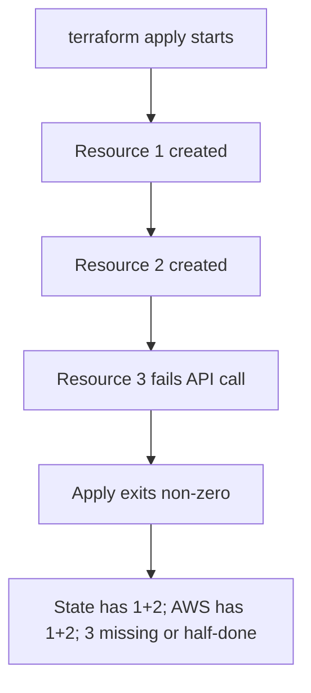
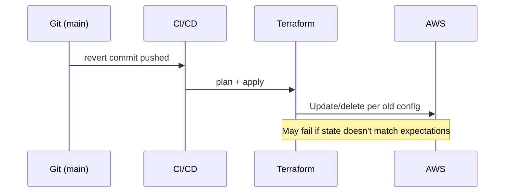
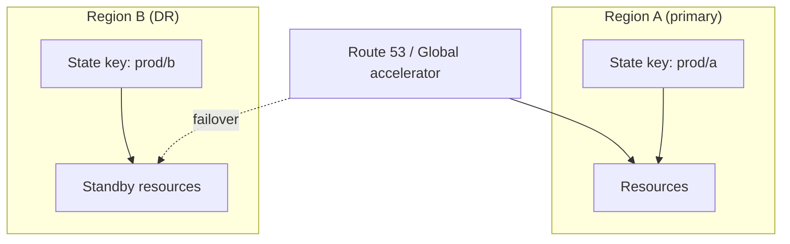
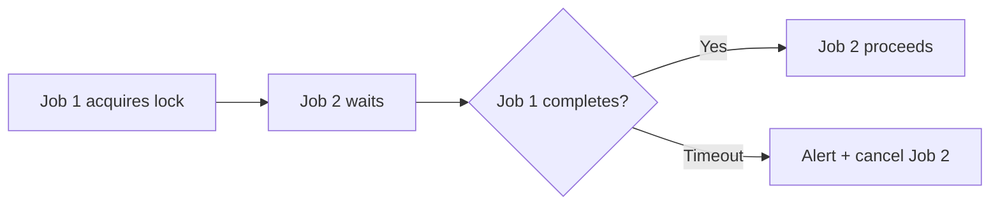

# Week 6 — Lecture: Rollback, State Recovery & Disaster Recovery

**Reading time:** ~55 minutes · **Instructor delivery:** ~3 hours with discussion

---

## 1. When Terraform fails

### 1.1 Failed apply is normal at scale

At enterprise scale, applies fail for predictable reasons:

| Failure class | Example | Typical outcome |
|---------------|---------|-----------------|
| **Invalid configuration** | Bad AMI ID, unsupported instance type | No resources or partial |
| **API limits / throttling** | EC2 `RequestLimitExceeded` | Partial create |
| **Dependency timeout** | RDS not available in time | Rollback of dependent resources |
| **Permissions** | IAM policy missing new action | Mid-apply denial |
| **Provider bugs** | Rare provider regression | Inconsistent state |

Terraform records progress in **state** as it goes. A failed apply may leave:

- Some resources created in AWS
- State entries for created resources
- **Tainted** resources marked for recreation on next apply

### 1.2 Partial apply mental model



> **Figure (download):** [PNG](../../diagrams/png/week-06-diagram-01.png) · [SVG](../../diagrams/svg/week-06-diagram-01.svg)


**Your first action:** do not panic-apply again. Run `terraform plan` and read carefully.

### 1.3 Tainted resources

Terraform **taints** resources that failed during apply so the next apply replaces them:

```bash
terraform untaint 'module.compute.aws_instance.lab'  # only if you verified resource is healthy
```

Blind `untaint` without validation can hide real problems.

### 1.4 Error messages worth memorizing

| Message theme | Meaning |
|---------------|---------|
| `Error acquiring the state lock` | Another job holds DynamoDB lock; wait or break-glass unlock |
| `Resource already exists` | State/AWS mismatch; import or import block |
| `Provider produced inconsistent result` | Often retry; may need provider pin upgrade |
| `context deadline exceeded` | Timeout—increase or split apply |

---

## 2. Separating concerns: AWS vs state vs Git

### 2.1 Three sources of truth

| Layer | Holds | Rollback lever |
|-------|--------|----------------|
| **Git** | Desired HCL | `git revert`, redeploy old commit |
| **State** | Mapping addresses → IDs | S3 version restore, `state` commands |
| **AWS** | Actual resources | Console/CLI delete, or Terraform destroy |

Healthy operations keep Git and state aligned with AWS. Incidents often break **two** of three.

### 2.2 What Git rollback does and does not do

**Git revert** to a previous commit and re-apply:

- **Does:** Change desired config to older definition; Terraform plans backward changes
- **Does not:** Automatically delete resources added after that commit if code no longer mentions them (may need `terraform destroy` targeted or `removed` blocks in 1.7+)
- **Does not:** Fix corrupted state by itself



> **Figure (download):** [PNG](../../diagrams/png/week-06-diagram-02.png) · [SVG](../../diagrams/svg/week-06-diagram-02.svg)


### 2.3 State rollback

Restoring an older **state file** from S3 versioning makes Terraform “think” infrastructure matches that snapshot. Dangerous if AWS was also changed—plans may be destructive or wrong.

**Rule:** Restore state only when you understand AWS reality (inventory, read-only plan, or maintenance window).

---

## 3. State recovery toolkit

### 3.1 Inspection commands

```bash
terraform state list
terraform state show 'module.vpc.aws_vpc.this'
terraform state pull > backup.json
```

Use `state list` after incidents to see what Terraform believes it manages.

### 3.2 Mutating state (careful)

| Command | Use case |
|---------|----------|
| `terraform state rm ADDR` | Remove address from state without destroying AWS (orphan management) |
| `terraform state mv SRC DST` | Refactoring addresses |
| `terraform import ADDR ID` | Adopt existing AWS resource |
| `terraform refresh` | Update state attributes from AWS (deprecated patterns; prefer plan refresh) |

### 3.3 S3 versioning for state buckets

Course bootstrap enables versioning on the state bucket. Each `apply` writes a new state object version.

```bash
aws s3api list-object-versions \
  --bucket YOUR-STATE-BUCKET \
  --prefix environments/dev/terraform.tfstate
```

Restore workflow (sandbox only, with approval):

1. Identify timestamp before bad apply
2. Copy prior version to current key (or use console “Restore”)
3. `terraform plan` — expect large diff if AWS moved forward
4. Reconcile deliberately—may need code change instead of state restore

| Scenario | Prefer |
|----------|--------|
| Bad apply 5 minutes ago, no manual AWS edits | State version restore + plan |
| Team edited AWS heavily | Fix code + import/rm, not blind state restore |
| State file corrupted JSON | Restore version; validate with `terraform state pull` |

### 3.4 Locking issues

Stale locks from crashed CI:

```bash
terraform force-unlock LOCK_ID
```

Requires break-glass policy—document who may run it and audit afterward.

---

## 4. Rollback strategies in production

### 4.1 Strategy comparison

| Strategy | Speed | Risk | When to use |
|----------|-------|------|-------------|
| **Forward fix** | Medium | Lower if plan small | Bug in latest commit only |
| **Git revert + apply** | Medium | Medium | Known good commit; state healthy |
| **Redeploy previous artifact** | Fast with CI | Medium | Saved plan from last release |
| **State restore** | Fast | **High** | State corruption; AWS static |
| **Restore from backup (RDS etc.)** | Slow | Data-specific | Data plane incident, not IaC |

### 4.2 Saved plan rollback

If CI archives `plan.tfplan` per release:

```bash
terraform apply release-2025-05-01.tfplan
```

Ensures apply matches reviewed plan—excellent for regulated industries.

### 4.3 Course rollback script

`scripts/terraform/rollback-plan.sh` supports dry-run planning against `HEAD~1`:

```bash
./scripts/terraform/rollback-plan.sh --env dev --ref HEAD~1
```

Use in runbooks; prod requires approvals identical to normal apply.

### 4.4 Communication during rollback

1. Incident commander assigned
2. Customer impact assessed
3. Terraform changes tracked in ticket
4. Post-incident: update runbook, add plan check, module pin

---

## 5. Disaster recovery for Terraform operations

### 5.1 What “DR” means for platform teams

Application DR (multi-AZ, cross-region replicas) is related but distinct. **Terraform DR** asks:

- Can we still **run plans and applies** during a regional outage?
- Can we **recover state** if bucket is deleted or encrypted with lost KMS key?
- Do we have **offline backups** of critical modules and variable schemas?

### 5.2 RTO / RPO for state

| Metric | Definition | Enterprise target (example) |
|--------|------------|---------------------------|
| **RPO** | Max acceptable state data loss | 0 (versioning) to 15 min |
| **RTO** | Time to restore operations | 1–4 hours |

S3 **cross-region replication** on state buckets, **MFA delete** protection, and **least privilege IAM** are common patterns.

### 5.3 Backend loss scenarios

| Event | Mitigation |
|-------|------------|
| Accidental bucket delete | MFA delete, SCP deny `s3:DeleteBucket` |
| Ransomware / malicious encrypt | Versioning + replication + separate account backup |
| DynamoDB lock table gone | Recreate table; locks ephemeral |
| KMS key disabled | Multi-key strategy; break-glass key policy |

### 5.4 Multi-region infrastructure DR (preview for capstone)

Capstone option 3 explores **active-passive** stacks:

- Primary region state key + secondary region stack
- Failover runbook: DNS, RDS promotion, or traffic shift—not only `terraform apply`

Terraform defines **steady state**; failover may combine Terraform + runbooks + other tools.



> **Figure (download):** [PNG](../../diagrams/png/week-06-diagram-03.png) · [SVG](../../diagrams/svg/week-06-diagram-03.svg)


---

## 6. Runbooks and observability

### 6.1 Runbook essentials

`docs/runbooks/terraform-recovery.md` should include:

- On-call contact and severity definitions
- Failed apply triage steps
- State backup/restore commands (sandbox vs prod)
- Lock break-glass procedure
- Git revert + CI re-apply workflow
- Escalation to HashiCorp/AWS support

### 6.2 Monitoring

| Signal | Tooling |
|--------|---------|
| Apply failures | CI alerts, Terraform Cloud notifications |
| State bucket changes | CloudTrail `PutObject` on state prefix |
| Lock duration | Custom metric if locks > 30 min |
| Drift | Scheduled plan jobs (Week 5) |

### 6.3 Game days

Quarterly **game days** simulate:

- Corrupt state file (restore version)
- Failed apply with invalid AMI
- CI role credential expiration

Students complete a **tabletop** in the assignment—no production required.

---

## 7. Import, removed blocks, and reconciliation edge cases

### 7.1 When apply says “already exists”

Terraform may fail because AWS has a resource Terraform doesn’t know about. Recovery:

1. Confirm resource should be managed
2. `terraform import ADDRESS ID` or import block
3. Plan—fill remaining arguments in HCL
4. Apply if plan clean

**Do not** import into wrong address—destroys wrong resource on next apply.

### 7.2 Orphaned resources

`state rm` leaves AWS resource running unmanaged. Track orphans in CMDB; either import back or destroy via runbook outside Terraform.

### 7.3 Provider upgrade incidents

Provider upgrades can propose widespread attribute changes. Mitigation:

- Pin versions
- Upgrade in dev → test → prod
- Read provider upgrade guides
- Keep plan artifacts for comparison

---

## 8. CI/CD failure modes and recovery

### 8.1 Pipeline stops mid-apply

| Step | Action |
|------|--------|
| 1 | Mark pipeline failed; block downstream deploys |
| 2 | Engineer runs plan locally with same commit + vars |
| 3 | Compare to last good state version timestamp |
| 4 | Forward fix or revert per runbook |

### 8.2 Credential expiration mid-apply

OIDC sessions expire; long applies may fail. Split stacks, increase timeout, or use role chaining with adequate session duration—document in platform standards.

### 8.3 Concurrent pipelines

Two applies to same state cause lock errors. Enforce **mutex** in CI (environment concurrency group `terraform-prod`).



> **Figure (download):** [PNG](../../diagrams/png/week-06-diagram-04.png) · [SVG](../../diagrams/svg/week-06-diagram-04.svg)


---

## 9. Business continuity for platform teams

### 9.1 Running Terraform when state is read-only available

If apply is blocked but state readable:

- Engineers can still **inventory** via `state list` and AWS console
- Manual break-glass changes require ticket; reconcile later
- Communicate RTO for restoring apply capability

### 9.2 Offline backups

Monthly export of:

- State bucket replication bucket inventory
- Git tags for module versions in prod
- Variable schema documentation (not secret values)

### 9.3 Insurance for state platform

| Control | Benefit |
|---------|---------|
| MFA delete on state bucket | Prevents rash deletion |
| Object lock (WORM) | Ransomware resilience |
| Separate audit account for replication | Compromised workload account can’t delete backups |

---

## 10. Incident documentation standards

Post-incident reports should capture:

- Terraform version, provider version, commit SHA
- Plan file attachment (redacted)
- State version ID if restored
- Timeline of `apply`, `plan`, manual AWS changes
- Action items: module fix, CI guard, game day scenario

---

## 11. Week 6 synthesis

Failed applies are operational events, not career endings. Experts stabilize AWS, inspect state, choose **forward fix vs revert vs state restore**, and document everything. DR for Terraform centers on **state availability** and **repeatable recovery runbooks**.

**Labs:** Induce failure, recover state, complete rollback runbook.

**Next week:** Security, compliance, and governance—least privilege, tagging, Checkov.

### 11.1 Course lab integration

| Lab | Skill |
|-----|-------|
| 6.1 Failed deploy | Read plan after non-zero exit; no blind re-apply |
| 6.2 State recovery | `state pull`, S3 versions—instructor-supervised |
| 6.3 Rollback | Git + `rollback-plan.sh` dry run |

Document findings in `docs/runbooks/terraform-recovery.md`—capstone reviewers expect this file to exist or be referenced.

### 11.2 Terraform 1.5+ plan flags for operations

| Flag | Use |
|------|-----|
| `-refresh-only` | Align state without changes |
| `-destroy` | Controlled teardown (change window) |
| `-target` | **Break-glass only**—document why; can cause drift |

Targeting teaches dependency risk: untargeted resources won’t update; later full plan may be large.

### 11.3 Lock ID hygiene

When `force-unlock` is used, log:

- Lock ID
- Job URL that failed
- Approver name
- Post-unlock plan result

Auditors treat unexplained unlocks as seriously as unexplained prod console logins.

### 11.4 Disaster recovery tabletop script (facilitator)

**Inject (minute 0):** “Primary region S3 state endpoint timing out.”

**Discussion prompts:**

1. Can we still deploy? (apply blocked vs read state)
2. When do we fail over to replica bucket?
3. Who declares incident severity?
4. What customer communication is required?

**Expected outcomes:** Documented RTO, replication enabled, runbook owner assigned.

### 11.5 Relationship between application DR and Terraform DR

Application teams may failover databases while Terraform state still describes primary region resources. After failover, Terraform plans may be large—**freeze Terraform changes** during application DR unless platform leads coordinate. Capstone option 3 should address this coordination explicitly.

### 11.6 Evidence retention for compliance

Retain plan logs and state version IDs per your org retention policy (often 1–7 years for regulated). S3 lifecycle rules on plan artifact buckets prevent unbounded storage cost.

### 11.7 Mental model summary

Think of operations as three synchronized timelines:

```text
Git history:     ... v1.2 (good) — v1.3 (bad) — v1.3-revert ...
State versions:  ... obj ver 41 — ver 42 (bad apply) — restore ver 41 ...
AWS resources:   ... actual EC2, VPC, SG ...
```

Recovery picks **which timeline to align** first. Usually: stabilize AWS customer impact → align Git → plan → apply → verify state version matches post-apply reality.

### 11.8 When to escalate to HashiCorp or AWS support

| Symptom | Escalate |
|---------|----------|
| State file JSON corruption | Platform + restore version |
| Provider panic stack trace | Provider issue tracker |
| IAM Deny on service-linked role | AWS support |
| Repeated lock without CI job | Security—possible token theft |

Document ticket IDs in post-incident reports.

### 11.9 Practice questions for labs

Before Lab 6.2, students should answer: “If I restore state version N but AWS is at version N+1, will the next plan show creates or destroys?” Expected: likely updates or destroys to reconcile—explains danger of blind restore.

### 11.10 Cross-week operations narrative

Week 5 taught drift detection; Week 6 teaches recovery when detection was too late or apply itself failed. Together they form the **operate** phase of the Terraform lifecycle: promote (5) → fail or drift (5–6) → recover (6) → harden (7) → prove in capstone (8). In interviews, describe this lifecycle as a single story rather than isolated lab exercises.

### 11.11 State file sensitivity drill

Have students open a redacted `state pull` JSON and identify three sensitive attributes (IPs, ARNs, possibly passwords in user_data). This reinforces encryption, bucket policy, and why state access is limited to platform roles—connects forward to Week 7 IAM tightening.

### 11.12 Course Makefile reminder

From the repository root, `make plan ENV=dev` wraps backend initialization and var-files consistently—use the same wrappers during recovery exercises so students do not accidentally point at the wrong state key while stressed during a simulated incident.

---

## Further reading

- [Terraform: State CLI](https://developer.hashicorp.com/terraform/cli/state)
- [Terraform: Troubleshooting](https://developer.hashicorp.com/terraform/tutorials/configuration-language/troubleshooting)
- [AWS S3 Versioning](https://docs.aws.amazon.com/AmazonS3/latest/userguide/Versioning.html)
