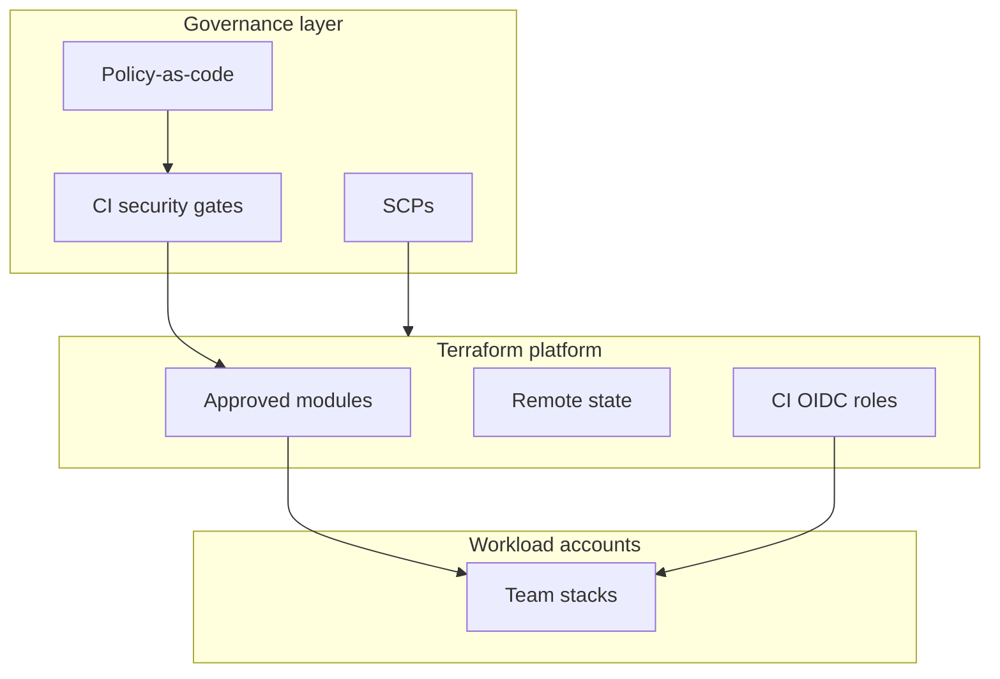
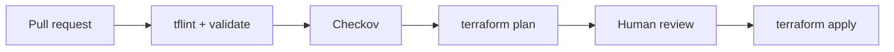
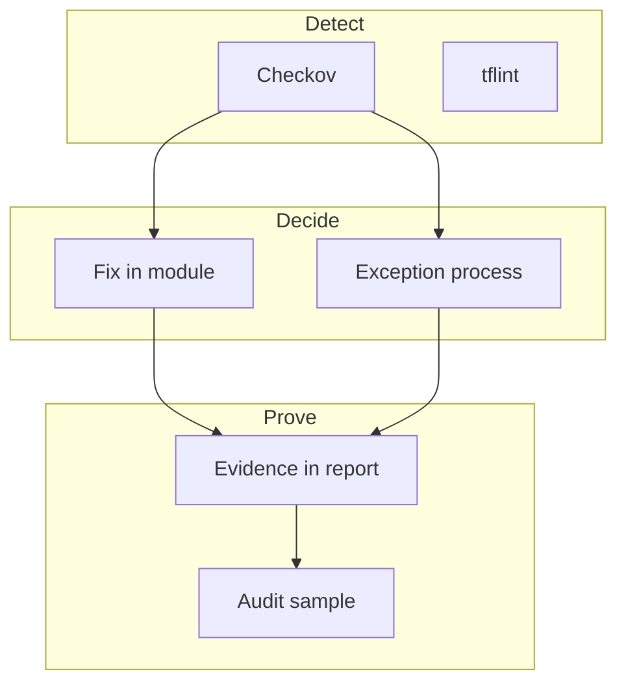

# Week 7 — Lecture: Security, Compliance & Governance

**Reading time:** ~55 minutes · **Instructor delivery:** ~3 hours with discussion

---

## 1. Security in enterprise Terraform programs

### 1.1 Threat model overview

Terraform touches the **most privileged** automation in your cloud estate. Threats include:

| Threat | Example | Mitigation |
|--------|---------|------------|
| **Secret leakage** | AWS keys in Git | Secret scanning, OIDC, no long-lived keys |
| **Over-privileged CI role** | `AdministratorAccess` for plan | Least privilege IAM (Lab 7.1) |
| **State exposure** | Public S3 bucket | Encryption, block public access, IAM boundaries |
| **Supply chain** | Malicious module from internet | Private registry, signed modules, code review |
| **Drift / console bypass** | Manual SG change | SCPs, Config, scheduled plan (Week 5) |
| **Tampered plans** | Apply without reviewed plan | Saved plans, branch protections |

Security is not a Week 7 bolt-on—it is how weeks 1–6 were designed to be operated.

### 1.2 Shared responsibility

| Party | Responsibility |
|-------|----------------|
| **Cloud provider** | Physical security, hypervisor, managed service patches |
| **Your org** | IAM, data classification, network segmentation, logging |
| **Platform team** | Terraform modules, guardrails, CI policies |
| **Application teams** | Correct module usage, no secrets in tfvars |



---

## 2. IAM least privilege for automation

### 2.1 Humans vs machines

| Principal | Typical access | Notes |
|-----------|----------------|-------|
| **Developer** | Read-only prod plan via CI; full dev | No direct prod apply |
| **CI role** | Scoped create/update/delete for approved services | Session tags for audit |
| **Break-glass admin** | Time-bound, ticketed, logged | Post-incident review |

Week 2 introduced cross-account roles; Week 7 **tightens** the policy JSON students created.

### 2.2 Anti-patterns

```json
"Action": "ec2:*",
"Resource": "*"
```

Convenient in labs; **unacceptable** in production. Replace with:

- Actions required by modules actually used
- Resources scoped by tag or ARN path where possible
- `Condition` blocks for `aws:RequestedRegion`, `aws:PrincipalTag`

### 2.3 Plan vs apply permissions

Some enterprises split:

| Phase | Permissions |
|-------|-------------|
| **Plan** | Read-only `Describe*`, `List*`, `Get*` |
| **Apply** | Write actions on approved resource types |

Terraform Cloud/Enterprise and custom CI can enforce this split. AWS IAM policy for read-only plan is substantial but smaller than admin.

### 2.4 OIDC for GitHub Actions (Week 4)

Trust policy binds CI to your org/repo:

```json
"Condition": {
  "StringEquals": {
    "token.actions.githubusercontent.com:sub": "repo:org/repo:ref:refs/heads/main"
  }
}
```

Eliminates static `AWS_ACCESS_KEY_ID` in GitHub secrets for AWS.

### 2.5 IAM Access Analyzer

Optional lab step: enable **Access Analyzer** to find unused permissions granted to the Terraform role. Continuous least-privilege refinement.

---

## 3. Tagging strategy and compliance

### 3.1 Why tags matter

Tags are not decoration—they drive:

- **Cost allocation** — Finance chargeback by `CostCenter`, `Environment`
- **Automation** — Course `make lab-stop` uses `Course=terraform-enterprise`
- **ABAC** — IAM policies with `aws:PrincipalTag/Team` matching `aws:ResourceTag/Team`
- **Compliance evidence** — Prove prod data stores have `DataClassification=confidential`

### 3.2 Course standard tags

| Tag | Purpose |
|-----|---------|
| `Course` | `terraform-enterprise` — lab automation |
| `Project` | `bayareala8s-tf-course` |
| `ManagedBy` | `terraform` |
| `Environment` | `dev` / `test` / `prod` |
| `Owner` | Team or individual email slug |

Enforce via:

```hcl
provider "aws" {
  default_tags {
    tags = local.common_tags
  }
}

variable "owner" {
  validation {
    condition     = length(var.owner) > 0
    error_message = "Owner tag required."
  }
}
```

### 3.3 Tag policy at scale

AWS **Tag Policies** (Organizations) and **Service Control Policies** can deny `RunInstances` without required tag keys. Terraform should **pre-validate** to fail fast in CI rather than at API denial.

### 3.4 Tagging vs drift

Manual tag edits cause plan noise. Decide:

- **Enforced tags** — Terraform reverts drift
- **Optional tags** — `lifecycle { ignore_changes = [tags["CreatedBy"]] }` (use sparingly)

---

## 4. Static analysis: Checkov and friends

### 4.1 Shift-left security

**Static analysis** scans `.tf` before apply:

| Tool | Focus |
|------|--------|
| **Checkov** | Policy-as-code, CIS benchmarks, misconfigurations |
| **tfsec** | AWS/Azure security (now Bridgecrew ecosystem) |
| **tflint** | Linting, provider-specific mistakes |
| **terraform validate** | Syntax and internal consistency |

Course standard: **Checkov** with `labs/week-07/.checkov.yml`.

### 4.2 Example Checkov findings

| Check ID theme | Finding |
|----------------|---------|
| S3 public access | Bucket ACL allows public read |
| Encryption | EBS volume unencrypted |
| SG rules | `0.0.0.0/0` on sensitive port |
| IAM | Wildcard actions in inline policy resource |

### 4.3 Handling failures

Not every finding is actionable immediately:

```yaml
# .checkov.yml
skip-check:
  # CKV_AWS_130 - accepted: NAT instance pattern for cost lab; ticket BAL8S-42
  - CKV_AWS_130
```

**Document** skips with ticket ID and expiry review date—auditors will ask.

### 4.4 CI integration

```yaml
- name: Checkov
  run: |
    checkov -d modules/ -d labs/shared/ --framework terraform \
      --soft-fail-on SKIP  # or hard-fail for prod branches
```

Hard-fail on `main` for prod paths; soft-fail on feature branches optional.



---

## 5. Policy-as-code and organizational guardrails

### 5.1 Layers of policy

| Layer | Technology | Binds |
|-------|------------|-------|
| **Organization** | SCPs | Account ceiling—what’s impossible |
| **Account** | IAM permission boundaries | Role maximum |
| **Pipeline** | OPA, Sentinel, Checkov | What Terraform may propose |
| **Runtime** | AWS Config, Security Hub | Detect live violations |

Terraform cannot override an SCP. Design modules within organizational guardrails.

### 5.2 OPA / Conftest (conceptual)

Rego policies test `terraform plan` JSON:

```rego
deny[msg] {
  some i
  resource := input.resource_changes[i]
  resource.type == "aws_s3_bucket"
  not resource.change.after.server_side_encryption_configuration
  msg := "S3 bucket must be encrypted"
}
```

Enterprises gate merges if `conftest test` fails on plan output.

### 5.3 Sentinel (Terraform Cloud/Enterprise)

HashiCorp Sentinel enforces policies on plans before apply in HCP Terraform. Similar outcomes to OPA with HCL-like Sentinel language.

### 5.4 Secrets in Terraform

| Pattern | Guidance |
|---------|----------|
| **Never** commit secrets | `.gitignore`, pre-commit hooks |
| **Sensitive variables** | `sensitive = true`; redacted in logs |
| **State** | Encrypted backend; treat as secret |
| **External secrets** | SSM Parameter Store, Secrets Manager data sources |

Use **short-lived** credentials everywhere possible.

---

## 6. Compliance frameworks and evidence

### 6.1 Mapping controls to Terraform practices

| SOC2 theme | Terraform practice |
|------------|-------------------|
| CC6.1 Logical access | IAM roles, no shared users |
| CC6.6 Encryption | `encrypt = true` on state; KMS on resources |
| CC7.2 Monitoring | CloudTrail, CI logs, plan artifacts |
| CC8.1 Change management | PR + plan + approval |

### 6.2 Evidence collection

For audits, retain:

- Git PR history with plan comments
- CI build logs (retention policy)
- Terraform state versioning (who changed infrastructure map)
- Security scan reports (`docs/security/week-07-validation-report.md`)

### 6.3 HIPAA / PCI pointers

Regulated workloads require:

- Network segmentation modules peer-reviewed
- No PHI in resource names or tags
- Separation of prod/non-prod accounts (Week 2)

Terraform is **one control** among many—not certification by itself.

---

## 7. Building a governance operating model

### 7.1 Roles

| Role | Responsibility |
|------|----------------|
| **Platform engineering** | Modules, CI templates, state platform |
| **Security architecture** | Policy libraries, exception process |
| **Application team** | Consume modules; request new capabilities |
| **Internal audit** | Sample evidence quarterly |

### 7.2 Exception process

1. Team requests skip of Checkov rule or SCP waiver
2. Risk assessment and compensating controls
3. Time-bound approval (90 days)
4. Re-scan at expiry

### 7.3 Secrets scanning and supply chain

#### Pre-commit and CI secret scanners

Tools like `gitleaks`, `trufflehog`, or GitHub secret scanning block commits containing patterns like `AKIA`. Pair with `.gitignore` for `*.tfvars` and education—scanners are not sufficient alone.

#### Module provenance

| Risk | Mitigation |
|------|------------|
| Typosquat module source | Allow-list registry namespaces |
| Unpinned Git module `ref=` | Pin to commit SHA or semver tag |
| Unsigned modules | Private registry with signing (advanced) |

### 7.4 Encryption expectations

| Asset | Control |
|-------|---------|
| State at rest | S3 SSE-KMS or SSE-S3 |
| RDS/EBS | `encrypted = true` in modules |
| Secrets | Secrets Manager, not variables in Git |
| CI logs | Redact `TF_LOG` in shared runners |

Checkov rules such as unencrypted EBS are common audit findings—fix in modules, not per-resource firefighting.

### 7.5 Network and exposure controls in IaC

Static analysis should flag:

- `0.0.0.0/0` on admin ports
- Public S3 ACLs
- Security groups referencing `0.0.0.0/0` for ingress on 22/3389

Modules should encode **secure defaults**; application teams opt-in to exposure with review.

### 7.6 Terraform Cloud / Enterprise policy (overview)

Organizations using HCP Terraform may enforce **Sentinel** or **OPA** policies on plans before apply. Same outcomes as Checkov in GitHub Actions—centralized policy library, audit dashboard, soft-mandatory vs hard-mandatory policies.

### 7.7 Building the security validation report

Course report `docs/security/week-07-validation-report.md` should include:

| Section | Content |
|---------|---------|
| Scope | Paths scanned (`modules/`, `labs/shared/`) |
| Tooling | Checkov version, config file |
| Summary | Pass/fail counts by severity |
| Remediations | Fixed in PR vs accepted risk |
| CI integration | Job name, branch rules |



### 7.8 Week 7 synthesis

Governance turns Terraform from a scripting tool into an **auditable platform**. Least privilege IAM, mandatory tags, static analysis, and layered policies reduce incident frequency and audit friction.

**Labs:** Harden IAM, enforce tags, produce Checkov report.

**Next week:** Capstone—integrate all practices into a demonstrable enterprise solution.

### 7.9 IAM policy construction worked example

Replace:

```json
"Action": "ec2:*",
"Resource": "*"
```

With scoped statements (illustrative—adjust to your modules):

```json
{
  "Effect": "Allow",
  "Action": [
    "ec2:Describe*",
    "ec2:CreateTags",
    "ec2:RunInstances",
    "ec2:TerminateInstances",
    "ec2:CreateSecurityGroup",
    "ec2:AuthorizeSecurityGroupIngress",
    "ec2:RevokeSecurityGroupIngress"
  ],
  "Resource": "*",
  "Condition": {
    "StringEquals": {
      "aws:RequestedRegion": "us-west-2"
    }
  }
}
```

Iterate: apply in dev, read `AccessDenied` in CloudTrail, add minimal action—**least privilege is iterative**, not one-shot.

### 7.10 Tag enforcement in CI (optional pattern)

```hcl
variable "owner" {
  type = string
  validation {
    condition     = can(regex("^[a-z0-9-]+$", var.owner))
    error_message = "Owner must be lowercase slug for ABAC."
  }
}
```

CI can run `terraform validate` on PR—fails before AWS API call.

### 7.11 Capstone security expectations

Capstone security review must reference Week 7 artifacts:

- IAM policy attached or linked
- Checkov summary (pass/fail, exceptions)
- Confirmation: no `.tfvars` secrets in Git history (`git log -p` spot check)

### 7.12 CIS AWS benchmark alignment (themes)

| CIS theme | Terraform practice |
|-----------|-------------------|
| IAM | No wildcards; MFA for humans |
| Logging | CloudTrail, VPC flow logs in modules |
| Networking | No unrestricted admin ports in SG modules |
| Storage | S3 public access block, encryption |

Checkov maps many checks to CKV_AWS_* IDs—reference IDs in exception tickets.

### 7.13 Cost of governance tooling

| Tool | Cost model | Value |
|------|------------|-------|
| Checkov | Open source | Fast PR feedback |
| Bridgecrew/Prisma | SaaS | Central dashboards |
| AWS Config | Per-rule pricing | Runtime detective control |

Platform teams should articulate **ROI**: one prevented public S3 bucket may exceed annual tool cost.

### 7.14 Human factors

Developers bypass governance when it blocks urgent fixes without break-glass. Design **fast exception path** (30-minute approval) alongside strict default—otherwise shadow IT returns to console.

### 7.15 Weekly security review agenda (platform team)

1. New Checkov failures on `main`
2. Open IAM Access Analyzer findings
3. Expiring policy exceptions
4. Untagged resource report from Config
5. Failed prod plans / drift tickets

Fifteen minutes weekly prevents month-end audit fire drills.

### 7.16 Sample security validation report outline

```markdown
# Week 07 Validation Report
## Scope
## Tools and versions
## Summary (pass/fail by severity)
## Remediated findings
## Accepted risks (ticket, expiry)
## CI integration status
## Recommendations
```

Students should paste anonymized Checkov output excerpts—not entire JSON if it includes account-specific ARNs.

### 7.17 Connecting to BayAreaLa8s course outcomes

By Week 7 you should articulate how Terraform supports **BayAreaLa8s** enterprise outcomes: auditability, cost control via tags, and secure automation—not merely resource creation. Capstone security reviewers will ask for this narrative explicitly.

### 7.18 tfsec vs Checkov (when to use both)

Some teams run **both** tools because rule sets differ slightly. Standardize on one for course labs (Checkov) but document in enterprise designs that duplicate findings should be deduplicated in the ticket system—developers ignore alerts when every PR shows fifty redundant failures.

### 7.19 Service Control Policy example (narrative)

An SCP might deny `s3:PutBucketPublicAccessBlock` modification except security account—Terraform modules must not attempt to weaken public access blocks. When plan fails with `AccessDenied`, teach developers to check SCP **before** requesting IAM admin access.

### 7.20 Pre-capstone security gate

Before starting Week 8, complete:

- [ ] IAM policy updated (Lab 7.1)
- [ ] Tags verified (Lab 7.2)
- [ ] Checkov report filed (Lab 7.3)
- [ ] No open `skip-check` without ticket

Capstone repos that skip Week 7 artifacts typically lose points on the Security rubric row.

### 7.21 Reading the Checkov CLI output

Learn severity prefixes: `Passed`, `Failed`, `Skipped`. Focus remediation on **Failed** checks with CRITICAL or HIGH in policy metadata. Low-severity informational checks can be scheduled for module refactors rather than blocking Friday releases—document severity handling in platform standards.

### 7.22 Tag keys and finance integration

Finance systems often require `CostCenter` and `Environment` keys spelled exactly. Terraform validations should use `contains()` on allowed values lists synced with finance CSV exports quarterly—prevents typos like `env=prod` vs `Environment=prod`.

### 7.23 Lab file references

Week 7 hands-on work maps directly to [`labs/week-07/LAB-01-iam.md`](../../labs/week-07/LAB-01-iam.md), [`LAB-02-tagging.md`](../../labs/week-07/LAB-02-tagging.md), and [`LAB-03-compliance.md`](../../labs/week-07/LAB-03-compliance.md). The `.checkov.yml` in that folder is the canonical skip-list example—copy patterns, not blind copies, into your capstone repository.

### 7.24 Closing reminder

Security governance is never “done”—it evolves with new AWS services, new Checkov rules, and new attack patterns. Schedule quarterly policy reviews the same way you schedule provider upgrades. Teams that treat Week 7 as a checkbox week rediscover the same audit findings twelve months later. Invest the time to write a thorough validation report—it becomes the capstone security appendix with minimal extra effort. Reference [`04-hands-on-labs.md`](04-hands-on-labs.md) for step-by-step lab procedures and submission expectations. Complete all three labs before attempting the Week 7 written assignment control matrix. Review [`07-knowledge-check.md`](07-knowledge-check.md) before the weekly quiz. Instructor timing and demos are in [`06-instructor-notes.md`](06-instructor-notes.md).

---

## Further reading

- [Checkov documentation](https://www.checkov.io/)
- [AWS IAM best practices](https://docs.aws.amazon.com/IAM/latest/UserGuide/best-practices.html)
- [Terraform: Sensitive data](https://developer.hashicorp.com/terraform/language/state/sensitive-data)
