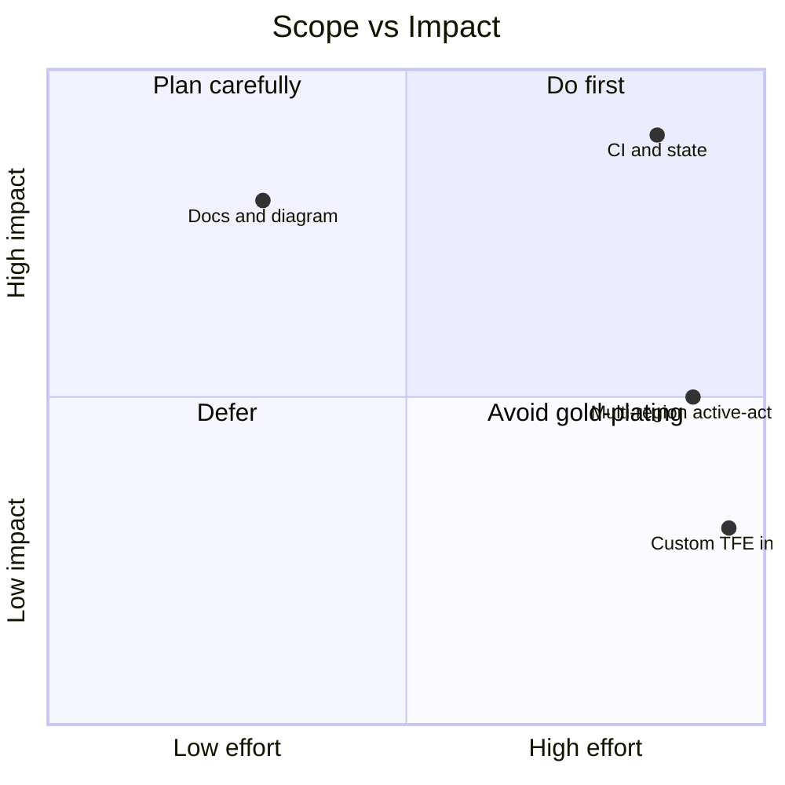
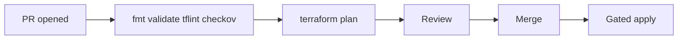

# Week 8 — Lecture: Capstone Integration & Delivery

**Reading time:** ~50 minutes · **Kickoff delivery:** ~1 hour + independent build time

---

## 1. Capstone purpose

The capstone is not a larger lab—it is a **structured demonstration** that you can design, implement, secure, and operate Terraform the way BayAreaLa8s enterprises expect. You integrate:

| Week | Capability demonstrated in capstone |
|------|-------------------------------------|
| 1 | Remote state, backends, tagging baseline |
| 2 | Multi-account or clear account boundaries |
| 3 | Reusable, versioned modules |
| 4 | CI/CD: plan on PR, gated apply |
| 5 | Promotion path dev → test/prod; drift awareness |
| 6 | Recovery/rollback considered in runbooks |
| 7 | IAM least privilege, Checkov, security report |

Full requirements and rubric: **[`../../capstone/README.md`](../../capstone/README.md)**.

---

## 2. Choosing your capstone track

### 2.1 Decision guide

| If you care most about… | Choose |
|-------------------------|--------|
| Org design, OUs, guardrails | **Option 1 — Enterprise Landing Zone** |
| Network platform, shared observability | **Option 2 — Shared Services Platform** |
| RTO/RPO, regional failure | **Option 3 — Multi-Region DR** |
| Developer experience, module factory | **Option 4 — Internal Terraform Platform** |

All options share the **same deliverable categories**; depth differs by track.

### 2.2 Option summaries

**Option 1 — Enterprise Landing Zone**

- OU/account model (design document acceptable for cohort scope)
- Shared networking or security baseline (VPC, flow logs, or equivalent)
- Remote state per account or environment
- CI/CD with plan on PR

**Option 2 — Shared Services Platform**

- Hub VPC or simplified transit pattern
- Centralized logging or monitoring (CloudWatch, flow logs)
- Outputs for spoke/workload consumers (subnets, attachment pattern, or documented interface)

**Option 3 — Multi-Region DR**

- Primary and secondary region resources (active-passive acceptable)
- State and config strategy for failover
- Failover / failback runbook (tabletop acceptable)

**Option 4 — Internal Terraform Platform**

- Module library (≥2 modules) with versioning
- Golden path documentation for service teams
- CI template or workflow reusable by consumers

### 2.3 Scope management



> **Figure (download):** [PNG](../../diagrams/png/week-08-diagram-01.png) · [SVG](../../diagrams/svg/week-08-diagram-01.svg)


Ship a **narrow, excellent** story over a broad, broken demo.

---

## 3. Integration checklist (weeks 1–7)

### 3.1 Architecture artifacts

| Artifact | Minimum quality |
|----------|-----------------|
| Logical diagram | Accounts, state, CI, major services |
| Network diagram | CIDRs, subnets, traffic flow (if networking track) |
| README | How to clone, init, plan, apply, destroy |

### 3.2 Terraform quality bar

| Criterion | Excellent signal |
|-----------|------------------|
| Modularity | ≥2 modules with clear inputs/outputs |
| Versioning | Provider pins; module `ref=` or registry version |
| State | S3 + DynamoDB; unique keys per env/stack |
| No secrets | OIDC or role assumption; no keys in Git |

### 3.3 CI/CD bar



> **Figure (download):** [PNG](../../diagrams/png/week-08-diagram-02.png) · [SVG](../../diagrams/svg/week-08-diagram-02.svg)


Document what is **automated** vs **manual approval** (prod).

### 3.4 Operations bar

- Reference `make lab-stop` or equivalent cost control
- Mention drift detection approach (scheduled plan or policy)
- Link or include recovery runbook excerpt (Week 6)

### 3.5 Security and cost bar

| Deliverable | Content |
|-------------|---------|
| **Security review** | IAM, encryption, public exposure, secrets |
| **Cost analysis** | Pricing Calculator table or tagged estimate |

Reuse Week 7 report template where possible.

---

## 4. Presentation excellence

### 4.1 Timing (15–20 minutes)

| Section | Minutes |
|---------|---------|
| Problem & business context | 2 |
| Architecture walkthrough | 5 |
| Live or recorded Terraform / CI demo | 5 |
| Security & cost highlights | 3 |
| Lessons learned & next steps | 2 |
| Q&A buffer | 3 |

### 4.2 Demo strategies

| Approach | Pros | Cons |
|----------|------|------|
| **Live PR → plan** | Highest credibility | Network/auth risk |
| **Recorded video** | Reliable | Less interactive |
| **Hybrid** | Live intro + recording | Prep time |

**Always** have screenshots if live demo fails.

### 4.3 Rubric alignment (30% course grade)

From [`../../capstone/README.md`](../../capstone/README.md):

| Criterion | Excellent (4) | Proficient (3) | Needs work (2) |
|-----------|---------------|----------------|----------------|
| **Architecture** | Clear multi-account/env design, justified tradeoffs | Sound design, minor gaps | Unclear boundaries |
| **Terraform quality** | Modular, versioned, documented | Works, some duplication | Monolithic |
| **CI/CD & ops** | Full PR workflow, drift/rollback considered | Plan/apply automated | Manual only |
| **Security** | Least privilege, no secrets in Git, guardrails | Mostly secure | Critical gaps |
| **Docs & demo** | Runbooks, diagrams, confident demo | Adequate README | Incomplete |

Self-score against rubric before presenting.

### 4.4 Suggested 7-day timeline

| Day | Task |
|-----|------|
| 1–2 | Finalize option; update architecture diagram |
| 3–4 | Implement core infrastructure |
| 5 | Wire CI/CD and security checks |
| 6 | Cost + security writeups |
| 7 | Presentation rehearsal and submission |

---

## 5. Repository layout and submission

### 5.1 Recommended structure

See [`../../labs/week-08/LAB-capstone.md`](../../labs/week-08/LAB-capstone.md):

```text
capstone/
├── README.md
├── architecture/
├── terraform/
│   └── environments/...
├── .github/workflows/
└── docs/
    ├── security-review.md
    └── cost-analysis.md
```

### 5.2 Submission package

- GitHub repository URL
- Slide deck or PDF
- Optional recorded demo link (cohort-dependent)

### 5.3 Cost cleanup

```bash
make lab-stop
# After course completion:
make destroy ENV=dev
```

Do **not** destroy bootstrap state bucket until all environments are destroyed.

---

## 6. Peer review and professional narrative

### 6.1 Peer review prompts

When reviewing classmates, comment on:

1. Is state isolation clear per environment/account?
2. Would you approve this IAM policy for CI?
3. Does the demo prove CI plan, not only local apply?
4. One improvement suggestion tied to rubric criteria

### 6.2 Portfolio framing

Capstone README and diagrams are portfolio artifacts. Describe **business outcome** first, Terraform second.

### 6.3 Week 8 synthesis

The capstone validates that you can operate Terraform as **platform engineers**—not tutorial authors. Depth in one track beats superficial coverage of all AWS services.

---

## 7. Track-specific implementation guidance

### 7.1 Option 1 — Enterprise Landing Zone (expanded)

**Minimum viable scope for cohort:**

- Design doc: OU tree (even if not fully deployed in AWS Organizations)
- One shared VPC or security baseline module applied in two accounts or prefixes
- Separate state keys: `environments/platform/` vs `environments/workload/`
- CI: plan on PR for both

**Stretch goals:**

- SCP diagram (deny root user, restrict regions)
- AWS Control Tower alignment narrative

**Demo storyline:** “We separated network platform from application workloads so blast radius and approvers differ.”

### 7.2 Option 2 — Shared Services Platform (expanded)

**Minimum viable scope:**

- Hub VPC module with public/private subnets
- Flow logs to CloudWatch or S3
- Outputs: `vpc_id`, `private_subnet_ids`, routing documentation for spokes

**Stretch goals:**

- Transit Gateway attachment stub (document-only acceptable)
- Central dashboard for VPC flow log metrics

**Demo storyline:** “Product teams consume subnets via outputs—no copy-paste VPC code.”

### 7.3 Option 3 — Multi-Region DR (expanded)

**Minimum viable scope:**

- Primary region: full stack
- Secondary region: networking + critical data replica or placeholder with documented failover
- Runbook table: step, owner, tooling (Terraform vs manual DNS)

**Stretch goals:**

- Route 53 health check failover (lab-sized)
- State replication strategy paragraph

**Demo storyline:** Tabletop walkthrough of regional failure—honest about what is automated vs manual.

### 7.4 Option 4 — Internal Terraform Platform (expanded)

**Minimum viable scope:**

- Two modules (e.g. `vpc`, `compute` or `ecs-cluster`) with `README`, `variables`, `outputs`, version tag
- `docs/golden-path.md`: clone → init → plan → apply for service team
- `.github/workflows/terraform-template.yml` reusable via `workflow_call` or documented copy

**Stretch goals:**

- Private registry mock (Git tags as versions)
- Example consumer repo folder

**Demo storyline:** “Service team opened PR using template—plan posted in 6 minutes.”

---

## 8. Grading alignment workshop

### 8.1 Mapping weeks to rubric rows

| Rubric row | Primary weeks | Capstone evidence |
|------------|---------------|-------------------|
| Architecture | 2, 5, 8 | Diagrams, account boundaries |
| Terraform quality | 1, 3, 8 | Modules, pins, README |
| CI/CD & ops | 4, 5, 6, 8 | Workflow file, runbook link |
| Security | 7, 8 | IAM JSON, Checkov report |
| Docs & demo | 1–8 | Presentation, ops section |

### 8.2 Common instructor adjustments

| Situation | Adjustment |
|-----------|------------|
| Strong code, weak demo | Require recorded backup; cap Docs at 3 |
| Strong demo, weak security | Security row 2 until IAM fixed |
| Team project | Same rubric; note individual contribution in reflection |

### 8.3 Questions students should prepare for

1. Why this state split?
2. What happens if apply fails mid-way?
3. How do you detect drift in prod?
4. What did you deliberately defer to phase 2?
5. What is monthly cost and how do tags support chargeback?

---

## 9. Post-capstone operations narrative

Even after course end, document:

- **Ownership** — who maintains modules
- **Upgrade cadence** — provider/module bumps quarterly
- **Exception registry** — Checkov skips with expiry
- **Destroy order** — workloads → shared → bootstrap bucket last

Students who articulate phase 2 operations score higher on **Docs & demo** and **CI/CD & ops** than those who only show resources exist.

---

## 10. Week 8 closing synthesis

Treat the capstone as an **operational proposal**, not a screenshot gallery. Reviewers ask: “Could I hand this to on-call Friday night?” Integrate recovery, security, promotion, and CI into one coherent story—that is Terraform for real enterprises.

### 10.1 Sample presentation slide outline (12 slides)

1. Title + team + option selected
2. Business problem (metrics if fictional OK)
3. Current state vs target state
4. Architecture diagram (logical)
5. Network/platform diagram
6. State & account strategy
7. CI/CD flow screenshot
8. Promotion path (dev→test→prod)
9. Security highlights (IAM, Checkov)
10. Cost table + tag strategy
11. Demo screenshot or live
12. Lessons learned + phase 2

### 10.2 Repository hygiene checklist before submit

- [ ] `.gitignore` includes `*.tfvars`, `.terraform/`, `backend.hcl` if local secrets
- [ ] `README` has init/plan/apply instructions
- [ ] No `AKIA` strings in Git history
- [ ] Modules have variable descriptions
- [ ] `versions.tf` pins providers

### 10.3 Peer review rubric (student form)

| Question | Score 1–4 |
|----------|-----------|
| Could I operate this from README alone? | |
| Is CI plan evidenced? | |
| Would I trust this IAM in dev? | |
| Is scope realistic? | |

### 10.4 Full capstone rubric reference

See [`../../capstone/README.md`](../../capstone/README.md) for official **30% grade** criteria and timeline table (Days 1–7).

### 10.5 Integrating course Makefile and scripts

Document in capstone README:

```bash
make init ENV=dev
make plan ENV=dev
make lab-stop    # cost control
```

Link Week 6 recovery runbook and Week 5 promotion checklist—reviewers reward **cross-week linking** over isolated perfection in one area.

### 10.6 Failure modes in capstone demos

| Failure | Recovery |
|---------|----------|
| SSO expired | `aws sso login` |
| Lock held | Show lock message; don’t force-unlock live |
| Plan wants destroy | Explain before apply; have screenshot backup |
| Checkov red | Show documented exception |

Practicing failure recovery is a differentiator in Q&A.

### 10.7 After submission: destroy order

1. `make destroy` for workload environments (dev, test, capstone)
2. Verify empty state keys
3. Destroy bootstrap only when instructed—contains all state history

Students who destroy bootstrap first lose ability to cleanly destroy child resources—common course-end mistake.

### 10.8 Capstone option decision matrix (expanded)

| Your background | Suggested option |
|-----------------|------------------|
| Networking interest | Option 2 Shared Services |
| Org design / compliance | Option 1 Landing Zone |
| SRE / resilience | Option 3 Multi-Region DR |
| Developer advocacy | Option 4 Internal Platform |

| Time budget | Minimum scope |
|-------------|---------------|
| 10 hours | One account, two modules, CI plan, README + diagram |
| 12+ hours | Multi-env promotion + security report + live demo |

### 10.9 Instructor evaluation notes (for students)

Understand graders look for **integration evidence**, not AWS service count. A perfect VPC with no CI scores lower than a modest VPC with working GitHub Actions plan on PR and linked runbooks.

### 10.10 Alumni portfolio tips

- Lead README with problem statement and metrics
- Link architecture diagram above fold
- Describe your specific contribution if team project
- Mention Checkov and least privilege explicitly—keywords recruiters search

### 10.11 Eight-week integration map (study aid)

| Week | Capstone touchpoint |
|------|---------------------|
| 1 | Remote state, tags in all resources |
| 2 | Account diagram, cross-account if applicable |
| 3 | Module library quality |
| 4 | CI workflow file in repo |
| 5 | Promotion doc or dev/test dirs |
| 6 | Recovery runbook link |
| 7 | security-review.md + Checkov |
| 8 | Presentation tying narrative together |

Use this table in your reflection essay for `05-assignment.md`.

### 10.12 Q&A preparation

Prepare answers for: “What would you do differently with unlimited time?” and “What production risk remains in your design?” Honest phase-2 answers score better than claiming perfection.

### 10.13 Cohort collaboration norms

Teams are allowed when the cohort permits—split rubric rows explicitly in README (who built CI vs modules). Individual reflection in `05-assignment.md` must remain solo. Presentations should credit contributors without hiding weak individual understanding in Q&A.

### 10.14 Linking capstone to employer narratives

Translate capstone README into resume bullet: “Designed Terraform platform with S3 remote state, GitHub Actions plan-on-PR, Checkov gates, and multi-environment promotion—reduced manual console changes.” Quantify if you measured plan time or resource counts.

### 10.15 Official capstone deliverables checklist

From [`../../capstone/README.md`](../../capstone/README.md), ensure submission includes: Terraform repositories with clean layout; CI/CD pipelines; architecture diagrams; cost analysis; security review; final presentation. Missing any category caps the related rubric row at **Proficient (3)** even if other areas excel.

### 10.16 Closing reminder

The capstone ends the BayAreaLa8s Terraform for Real Enterprises journey—your README should read like documentation written for the engineer who replaces you on call, not like homework submitted for a grade. That mindset difference separates portfolio-ready work from forgettable demos. Start your capstone README the day you select an option—do not wait until Day 6. Follow [`04-hands-on-labs.md`](04-hands-on-labs.md) for milestones and [`../../labs/week-08/LAB-capstone.md`](../../labs/week-08/LAB-capstone.md) for technical checklist items. Submit self-assessment in [`05-assignment.md`](05-assignment.md) with your presentation materials. Review [`07-knowledge-check.md`](07-knowledge-check.md) for capstone integration review questions. Instructors: see [`06-instructor-notes.md`](06-instructor-notes.md) for presentation scheduling and grading tips.

**Primary references:**

- [`../../capstone/README.md`](../../capstone/README.md)
- [`04-hands-on-labs.md`](04-hands-on-labs.md)
- [`05-assignment.md`](05-assignment.md)

---

## Further reading

- [AWS Well-Architected Framework](https://docs.aws.amazon.com/wellarchitected/latest/framework/welcome.html)
- [Terraform: Recommended practices](https://developer.hashicorp.com/terraform/cloud-docs/recommended-practices)
