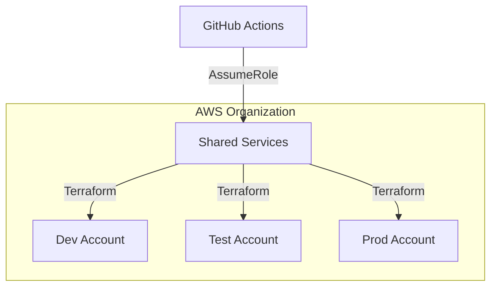

# Lab 2.1 — Multi-Account Architecture Design

**Duration:** 2 hours · **Week 2**

## Objectives

- Document an OU/account model for dev, test, prod, and shared services
- Map Terraform state files to account boundaries

## Steps

### 1. Study reference architecture

```text
Organization Root
├── Security OU
│   └── audit, log-archive (optional)
├── Infrastructure OU
│   └── shared-services (networking, CI)
└── Workloads OU
    ├── dev
    ├── test
    └── prod
```

### 2. Create architecture diagram

Use draw.io, Lucidchart, or Mermaid in `docs/architecture/week-02-accounts.md`:



### 3. Complete account matrix

| Account | ID (placeholder) | Purpose | State backend key |
|---------|------------------|---------|-------------------|
| shared | 111111111111 | CI, Terraform runner | bootstrap |
| dev | 222222222222 | Developer sandboxes | environments/dev |
| test | 333333333333 | Pre-prod | environments/test |
| prod | 444444444444 | Production | environments/prod |

### 4. Single-account lab mode

If you only have one AWS account, document **logical** separation:

- Same account, different `environment` tag and state keys (as in this repo)
- Note production risks of single-account multi-env

## Deliverable

`docs/architecture/week-02-accounts.md` with diagram and matrix.

## Next

[Lab 2.2 — Cross-Account IAM](LAB-02-cross-account-iam.md)
